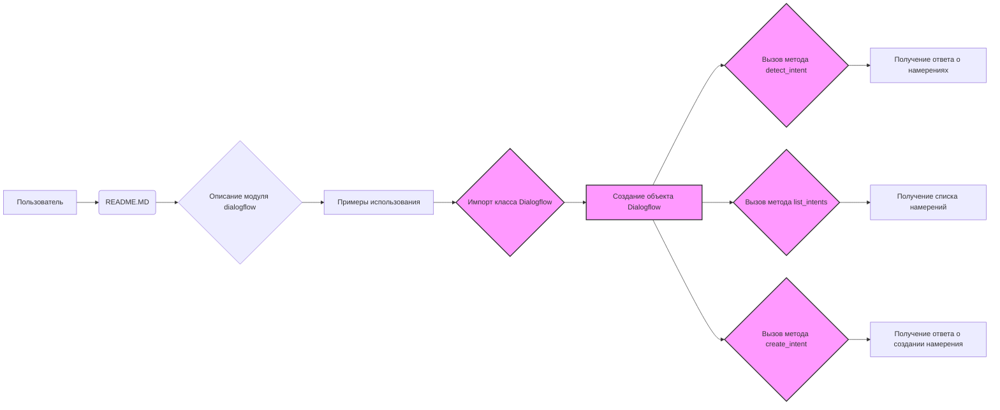

# Анализ кода `README.MD`

## <алгоритм>

1.  **Начало**: Пользователь обращается к `README.MD` файлу в директории `src/ai/dialogflow`.

2.  **Обзор**: Пользователь получает общую информацию о модуле `dialogflow`:
    *   Модуль предназначен для интеграции с Dialogflow, платформой для создания диалоговых AI.
    *   Модуль предоставляет возможности для понимания естественного языка (NLU).
    *   Описаны основные функции: распознавание намерений, извлечение сущностей, управление контекстом, интеграция с различными платформами и поддержка вебхуков.

3.  **Пример использования**: Пользователю демонстрируется пример кода на Python:
    *   Импортируется класс `Dialogflow` из `src.ai.dialogflow`.
    *   Инициализируется объект `Dialogflow` с `project_id` и `session_id`.
    *   Вызывается метод `detect_intent` для определения намерения пользователя на основе фразы "Hello".
    *   Вызывается метод `list_intents` для получения списка всех намерений.
    *   Вызывается метод `create_intent` для создания нового намерения с указанными параметрами (отображаемое имя, обучающие фразы и текстовое сообщение).
    *   Предоставляется закомментированный пример использования метода `delete_intent`.

4. **Поток данных**:
    *   Пользователь изучает `README.MD`.
    *   Пример кода демонстрирует, как создать экземпляр класса `Dialogflow`.
    *   Методы класса `Dialogflow` отправляют запросы к API Dialogflow.
    *   Ответы API возвращаются в виде объектов, содержащих информацию о распознанных намерениях, сущностях, и т.д.

## <mermaid>

**Объяснение зависимостей в `mermaid` диаграмме:**

*   `A` (Пользователь) – представляет человека, взаимодействующего с файлом `README.MD`.
*   `B` (README.MD) – файл, содержащий документацию модуля.
*   `C` (Описание модуля dialogflow) – узел, представляющий описание возможностей и назначения модуля.
*   `D` (Примеры использования) – узел, содержащий примеры кода.
*   `E` (Импорт класса Dialogflow) – блок, показывающий импорт класса для работы с Dialogflow.
*   `F` (Создание объекта Dialogflow) – блок, отображающий инициализацию экземпляра класса.
*   `G` (Вызов метода detect_intent) –  метод для обнаружения намерения.
*   `H` (Получение ответа о намерениях) - получение ответа от Dialogflow API.
*   `I` (Вызов метода list_intents) - метод для получения списка намерений.
*   `J` (Получение списка намерений) - получение списка намерений.
*   `K` (Вызов метода create_intent) - метод для создания нового намерения.
*   `L` (Получение ответа о создании намерения) - получение ответа об успешном создании нового намерения.

**Импорт зависимостей:**

В примере кода импортируется `Dialogflow` из `src.ai.dialogflow`. Это означает, что модуль `dialogflow` содержит класс `Dialogflow`, который используется для взаимодействия с Dialogflow API.

## <объяснение>

**Импорты:**

*   `from src.ai.dialogflow import Dialogflow`: Импортирует класс `Dialogflow` из модуля `src.ai.dialogflow`. Этот класс, предположительно, является основным интерфейсом для взаимодействия с API Dialogflow. Он предоставляет методы для обнаружения намерений, создания и удаления намерений и т.д.

**Классы:**

*   `Dialogflow`:
    *   **Роль**: Класс `Dialogflow` инкапсулирует логику взаимодействия с Dialogflow API.
    *   **Атрибуты**: Вероятно, хранит `project_id` и `session_id`, которые используются для аутентификации и отслеживания сессии.
    *   **Методы**:
        *   `__init__(project_id, session_id)`: Конструктор, инициализирующий объект с идентификатором проекта и сессии.
        *   `detect_intent(text)`: Отправляет текст в Dialogflow API для определения намерения.
        *   `list_intents()`: Получает список всех намерений в проекте.
        *   `create_intent(display_name, training_phrases_parts, message_texts)`: Создает новое намерение с указанными параметрами.
        *   `delete_intent(intent_id)`: Удаляет намерение по его идентификатору.

**Функции:**

*   Пример кода в `README.MD` демонстрирует использование методов класса `Dialogflow`.
*   `detect_intent`:
    *   **Аргументы**: Текст для анализа.
    *   **Возвращает**: Ответ от Dialogflow API с информацией о распознанном намерении.
    *   **Назначение**: Позволяет определить намерение пользователя на основе введенного текста.
    *   **Пример**: `dialogflow_client.detect_intent("Hello")` возвращает объект с информацией о намерении, распознанном для фразы "Hello".
*   `list_intents`:
    *   **Аргументы**: Нет.
    *   **Возвращает**: Список объектов, представляющих все намерения в проекте.
    *   **Назначение**: Позволяет получить список всех доступных намерений.
    *   **Пример**: `dialogflow_client.list_intents()` возвращает список всех намерений в проекте.
*   `create_intent`:
    *   **Аргументы**: `display_name` (отображаемое имя намерения), `training_phrases_parts` (список обучающих фраз), `message_texts` (список текстовых ответов).
    *   **Возвращает**: Ответ от Dialogflow API с информацией о созданном намерении.
    *   **Назначение**: Позволяет программно создавать новые намерения.
    *   **Пример**: `dialogflow_client.create_intent(display_name="NewIntent", training_phrases_parts=["new phrase", "another phrase"], message_texts=["This is a new intent"])` создает новое намерение с указанными параметрами.
*   `delete_intent`:
    *   **Аргументы**: `intent_id` (идентификатор намерения).
    *   **Возвращает**: Нет (или подтверждение операции).
    *   **Назначение**: Удаляет указанное намерение.
    *   **Пример**: `dialogflow_client.delete_intent("your-intent-id")` удаляет намерение с указанным идентификатором.

**Переменные:**

*   `project_id`: Идентификатор проекта Dialogflow. Строка. Используется для аутентификации запросов к API Dialogflow.
*   `session_id`: Идентификатор сессии. Строка. Используется для отслеживания диалога.
*   `dialogflow_client`: Объект класса `Dialogflow`. Используется для вызова методов API Dialogflow.
*   `intent_response`:  Переменная, в которую сохраняется ответ от метода `detect_intent`, обычно содержит объект с распознанным намерением.
*    `intents` :  Переменная, в которую сохраняется список всех намерений от метода `list_intents`.
*   `new_intent`: Переменная, в которую сохраняется ответ от метода `create_intent`, обычно содержит объект с информацией о созданном намерении.

**Потенциальные ошибки и области для улучшения:**

*   В примере кода отсутствует обработка ошибок. Необходимо добавить обработку исключений при взаимодействии с API Dialogflow, чтобы предотвратить некорректную работу программы.
*   В `README.MD` указан закомментированный пример вызова `delete_intent`. Было бы полезно добавить проверку наличия `intent_id`, прежде чем вызывать этот метод.
*   Примеры использования методов в `README.MD` показывают только простые случаи. Возможно, стоит добавить более сложные примеры, демонстрирующие работу с сущностями и контекстом.
*   `README.MD` не содержит информации о том, как установить и настроить библиотеку Dialogflow для Python, а так же как получить ключи доступа к API.

**Взаимосвязь с другими частями проекта:**

*   Модуль `dialogflow` находится в директории `src/ai`. Это означает, что он является частью модуля искусственного интеллекта (AI) проекта `hypo`.
*   Модуль `dialogflow` предположительно используется в других частях проекта для обработки диалогов с пользователем и выполнения действий на основе распознанных намерений.

**Цепочка взаимосвязей:**

Пользователь -> `README.MD` -> (пример кода) -> `src.ai.dialogflow.Dialogflow` -> Dialogflow API -> Ответы API -> (использование в других частях проекта)