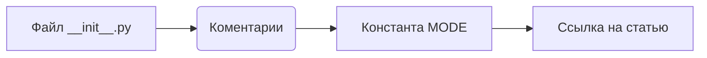
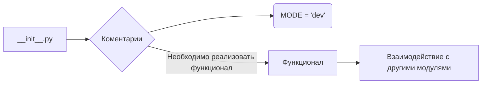

1. <input code>

```python
## \file hypotez/src/ai/dialogflow/__init__.py
# -*- coding: utf-8 -*-
#! venv/Scripts/python.exe
#! venv/bin/python/python3.12

"""
.. module: src.ai.dialogflow 
	:platform: Windows, Unix
	:synopsis:

"""
MODE = 'dev'

"""
	:platform: Windows, Unix
	:synopsis:

"""


"""
	:platform: Windows, Unix
	:synopsis:

"""


"""
  :platform: Windows, Unix

"""
"""
  :platform: Windows, Unix
  :platform: Windows, Unix
  :synopsis:
"""MODE = 'dev'
  
""" module: src.ai.dialogflow """

""" HERE SHOULD BE A DESCRIPTION OF THE MODULE OPERATION ! 
https://habr.com/ru/articles/346606/
"""
```

2. <algorithm>

Этот файл `__init__.py` является инициализационным модулем для пакета `dialogflow` в проекте `hypotez`.  Из-за отсутствия реального кода, алгоритм работы определить невозможно.  Файл содержит только комментарии, константу `MODE` и ссылку на статью.  В отсутствие действий,  никаких данных не передаются.



3. <mermaid>



4. <explanation>

* **Импорты:**  Нет импортов. Файл, скорее всего, содержит начальные настройки для дальнейшего развития пакета `dialogflow`.
* **Классы:** Нет классов.
* **Функции:** Нет функций.
* **Переменные:** Наиболее важная переменная - `MODE = 'dev'`. Она скорее всего, определяет режим работы,  'dev' указывает на режим разработки.   В реальном коде, она будет использована для выбора соответствующих конфигураций.
* **Возможные ошибки или области для улучшений:**  Наиболее важный недостаток - отсутствие функциональности.  В файле `__init__.py` должна присутствовать реализация функций/классов, которые будут отвечать за логику работы. Отсутствие кода делает невозможным анализ ошибок и предложений по улучшениям.  Также комментарии типа `""" HERE SHOULD BE A DESCRIPTION OF THE MODULE OPERATION ! """` должны быть заменены описанием функциональности.


**Цепочка взаимосвязей:**

Этот модуль является частью пакета `ai.dialogflow`, который, вероятно, интегрируется в проект `hypotez` для взаимодействия с сервисом диалогового управления (Dialogflow).  Без дополнительного кода сложно понять, как он будет взаимодействовать с другими частями проекта.  Назначение пакета `ai.dialogflow` должно быть прописано в его документации.


**Заключение:**

Файл `__init__.py`  является начальным пунктом для дальнейшей разработки.  Он требует реализации функций и классов, которые будут выполнять конкретные задачи для взаимодействия с Dialogflow.  Важные комментарии к коду и описания функциональности не хватает.