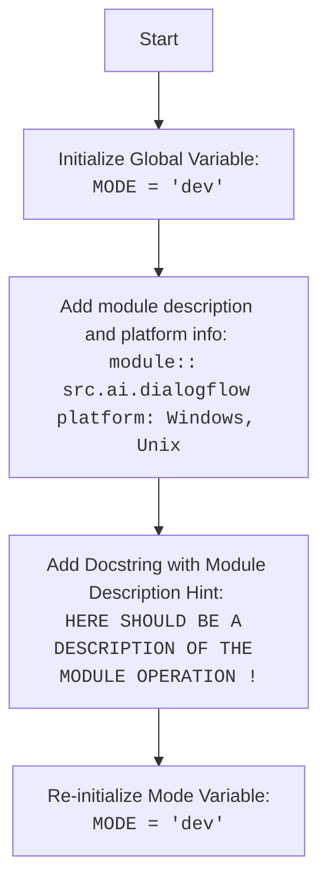

## <алгоритм>

1. **Инициализация режима:**
   - Задается глобальная переменная `MODE` и присваивается ей значение `'dev'`.
   - Пример: `MODE = 'dev'`
2. **Описание модуля:**
   - Добавляются строки-комментарии с информацией о модуле, платформе и синопсисом.
   -  Примеры:
      - `.. module:: src.ai.dialogflow`
      - `:platform: Windows, Unix`
      - `:synopsis:`
3. **Документация модуля:**
    - Добавляется комментарий-заглушка с предложением добавить описание модуля и ссылкой на статью habr для примера.
    - Пример: `""" HERE SHOULD BE A DESCRIPTION OF THE MODULE OPERATION ! \nhttps://habr.com/ru/articles/346606/\n"""`
4.  **Повторная инициализация режима:**
     - Происходит повторное определение переменной `MODE` и присваивается ей значение `'dev'`. Это избыточно и может привести к путанице.
     - Пример: `MODE = 'dev'`

## <mermaid>

**Объяснение зависимостей `mermaid`:**

В данном коде нет импортов, поэтому диаграмма `mermaid` показывает только последовательность действий, которые выполняются в коде, а именно:
1.  **`Start`**: Начало выполнения скрипта.
2.  **`InitializeMode`**: Инициализация переменной `MODE` в `'dev'`.
3.  **`ModuleDescription`**: Добавление комментариев с описанием модуля, платформы и синопсиса.
4.  **`AddDocString`**: Добавление комментария-заглушки, с предложением добавить описание модуля и ссылкой.
5.  **`ReInitializeMode`**: Повторная инициализация переменной `MODE` в `'dev'`.

## <объяснение>

**Импорты:**
- В данном коде нет импортов, что делает его автономным в этом отношении.

**Классы:**
- В коде нет классов.

**Функции:**
- В коде нет функций.

**Переменные:**
- `MODE`:
  - Тип: Строка (str)
  - Назначение: Указывает режим работы модуля (в данном случае 'dev' - режим разработки).
  - Использование: Может использоваться в других частях проекта для определения поведения модуля в зависимости от режима работы.

**Потенциальные ошибки и области для улучшения:**

1.  **Избыточное переопределение `MODE`:** Переменная `MODE` объявляется дважды с одинаковым значением `'dev'`. Это избыточно и может привести к путанице.  Один из объявлений следует удалить.
2.  **Отсутствие описания модуля:** В коде есть комментарий-заглушка, указывающая на необходимость описания модуля. Необходимо добавить подробное описание функциональности модуля, его назначения и работы.
3.  **Отсутствие функциональности:** Модуль в текущем виде не выполняет никаких операций, кроме инициализации переменной. Необходимо добавить функциональность, соответствующую назначению модуля.
4.  **Отсутствие документации:** Необходимо добавить подробные docstrings для модуля, переменных, функций и классов, чтобы обеспечить понимание и правильное использование кода.
5.  **Дублирование комментариев:** Комментарии к модулю и платформе повторяются. Нужно структурировать документацию более эффективно.

**Цепочка взаимосвязей с другими частями проекта:**

-  Модуль `src.ai.dialogflow`  входит в состав пакета `src.ai`, который вероятно отвечает за функциональность, связанную с искусственным интеллектом. `src` является корневым каталогом проекта.
-  Переменная `MODE` может использоваться другими частями проекта, например, `src.main.py` для определения условий запуска, конфигурации и т.д. В зависимости от значения MODE может происходить загрузка различных настроек или модулей.
- Этот модуль, при добавлении функциональности, может взаимодействовать с другими модулями пакета `src.ai`, такими как `src.ai.nlu`, `src.ai.ml`, и другими.

**Дополнительные замечания:**
- Код имеет избыточное объявление переменной `MODE` и не содержит реальной функциональности.
- Необходимо добавить более подробное описание модуля, его назначение и логику работы.
-  Следует использовать docstring для документирования кода.