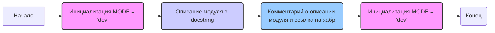

## Анализ кода `hypotez/src/ai/dialogflow/__init__.py`

### 1. <алгоритм>

1. **Инициализация режима:**
   - Устанавливается переменная `MODE` в значение `'dev'`. Это, вероятно, указывает на то, что модуль сейчас работает в режиме разработки.
   - **Пример:** `MODE = 'dev'`

2. **Описание модуля:**
   - Модуль имеет docstring, который указывает на его расположение (`src.ai.dialogflow`), платформы (`Windows, Unix`) и описание (`synopsis`).
   -  Имеется комментарий с указанием, что должно быть описание работы модуля и ссылка на статью на хабре.

3. **Повторная инициализация режима**
    - Переменная MODE повторно инициализируется значением 'dev'.
    - **Пример:** `MODE = 'dev'`

**Поток данных:**

- Инициализируется переменная `MODE`.
- Docstrings и комментарии просто описывают модуль.
- Повторно инициализируется переменная `MODE`

### 2. <mermaid>

**Анализ зависимостей:**

- **`graph LR`**: Определяет, что диаграмма будет графом, и направление связей будет слева направо.
- **`A[Начало]`**: Начальный узел графа, представляющий начало выполнения кода.
- **`B(Инициализация MODE = 'dev')`**: Узел, представляющий инициализацию переменной `MODE` в значение `'dev'`. Стиль узла задан через `style B fill:#f9f,stroke:#333,stroke-width:2px`.
- **`C(Описание модуля в docstring)`**: Узел, представляющий описание модуля в docstring. Стиль узла задан через `style C fill:#ccf,stroke:#333,stroke-width:2px`.
- **`D(Комментарий о описании модуля и ссылка на хабр)`**: Узел, представляющий комментарий, указывающий на описание работы модуля и ссылку на статью на хабре. Стиль узла задан через `style D fill:#9cf,stroke:#333,stroke-width:2px`.
- **`E(Инициализация MODE = 'dev')`**: Узел, представляющий повторную инициализацию переменной `MODE` в значение `'dev'`. Стиль узла задан через `style E fill:#f9f,stroke:#333,stroke-width:2px`.
- **`F(Конец)`**: Конечный узел графа, представляющий конец выполнения кода.
- **`-->`**: Обозначает поток данных или выполнение команд.

Диаграмма демонстрирует последовательность инициализации переменных и обработки комментариев.

### 3. <объяснение>

**Импорты:**

- В данном файле нет явных импортов. Однако, docstring модуля указывает на его расположение в пакете `src.ai.dialogflow`, подразумевая, что он может взаимодействовать с другими модулями внутри этого пакета или других пакетов в директории `src`.
- Путь к файлу `/hypotez/src/ai/dialogflow/__init__.py` указывает, что модуль является частью системы искусственного интеллекта, и конкретно отвечает за взаимодействие с Dialogflow (сервисом от Google для создания чат-ботов).

**Классы:**

- В данном файле нет объявленных классов.

**Функции:**

- В данном файле нет объявленных функций.

**Переменные:**

- **`MODE`**: Строковая переменная, используемая для определения режима работы модуля. В данном случае, она инициализируется и повторно устанавливается в значение `'dev'`, что указывает на режим разработки. Это позволяет использовать различные настройки или поведение в зависимости от режима работы модуля.
    - **Тип:** `str`
    - **Использование:** Управление режимом работы модуля.

**Детальное объяснение:**

Файл `__init__.py` в Python используется для того, чтобы отметить директорию как пакет. Содержимое файла может быть пустым, но часто в него добавляют инициализирующие значения или импорты, которые могут понадобиться всему пакету.
В данном случае, код устанавливает переменную `MODE` в значение `'dev'`. Это может быть использовано для определения поведения модуля в зависимости от того, работает ли он в режиме разработки или нет.
Наличие `docstring` и комментария - попытка описать модуль,  необходимо доработать.
Повторное определение переменной `MODE` в конце файла является ошибкой и не имеет смысла. Вероятно, оно должно быть только в начале.

**Потенциальные ошибки и области для улучшения:**

1.  **Избыточность кода:** Повторная инициализация переменной `MODE` в конце файла. Это лишний код и должен быть удален.
2.  **Отсутствие описания:** Отсутствует описание модуля и его функциональности. Необходимо добавить описание, чтобы понимать назначение и роль модуля в системе. Необходимо заполнить информацию о модуле, как указано в комментариях.
3.  **Отсутствие импортов:** В текущем файле нет импортов, что необычно для модуля, который является частью более крупной системы. Следует проверить и добавить нужные импорты.

**Взаимосвязи с другими частями проекта:**

- Учитывая расположение модуля (`src.ai.dialogflow`), можно предположить, что он взаимодействует с другими модулями в пакете `src.ai`, а также с сервисом Dialogflow.
- Вероятно, модуль используется для обработки сообщений, полученных от пользователей, и взаимодействует с Dialogflow для определения интентов и сущностей.
- Он может предоставлять интерфейс для других частей проекта, которые могут использовать функциональность Dialogflow.
- Модуль может работать с модулем `src.core.settings`, чтобы получить параметры конфигурации.

В заключении, код `hypotez/src/ai/dialogflow/__init__.py` нуждается в доработке. Необходимо добавить описание модуля, убрать дублирование инициализации переменной MODE и добавить импорты. Также, важно понимать, как этот модуль взаимодействует с другими частями проекта и сервисом Dialogflow.