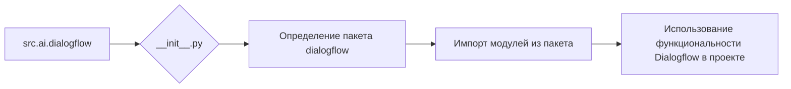

### **Анализ кода `hypotez/src/ai/dialogflow/__init__.py`**

#### **1. <алгоритм>**:
Файл `__init__.py` в Python используется для обозначения директории как пакета. В данном случае, файл `hypotez/src/ai/dialogflow/__init__.py` указывает, что директория `dialogflow` является пакетом, который может содержать модули и подпакеты, связанные с интеграцией Dialogflow в проект `hypotez`.

**Блок-схема:**
1.  **Начало**: Директория `dialogflow` существует.
2.  **Инициализация**: Файл `__init__.py` присутствует в директории `dialogflow`.
3.  **Определение пакета**: Python интерпретирует директорию `dialogflow` как пакет.
4.  **Импорт модулей/подпакетов**: Другие части проекта могут импортировать модули и подпакеты из `dialogflow`.

#### **2. <mermaid>**:

**Объяснение диаграммы:**

*   `src.ai.dialogflow`: Корневая директория пакета.
*   `__init__.py`: Файл, который инициализирует пакет `dialogflow`.
*   `Определение пакета dialogflow`: Указывает, что директория `dialogflow` является пакетом.
*   `Импорт модулей из пакета`: Другие части проекта импортируют модули из пакета `dialogflow`.
*   `Использование функциональности Dialogflow в проекте`: Функциональность Dialogflow используется в других частях проекта.

#### **3. <объяснение>**:

*   **Расположение файла**: `hypotez/src/ai/dialogflow/__init__.py` указывает, что файл находится в пакете `dialogflow`, который является частью подсистемы `ai` (искусственного интеллекта) в проекте `hypotez`.
*   **Импорты**: В данном коде нет явных импортов, но наличие файла `__init__.py` позволяет другим частям проекта импортировать модули и классы из пакета `dialogflow`.
*   **Классы**: В данном файле нет классов.
*   **Функции**: В данном файле нет функций.
*   **Переменные**: В данном файле нет переменных.

**Потенциальные ошибки и области для улучшения**:

*   В текущем виде файл `__init__.py` содержит только метаданные и не выполняет никакой полезной работы, кроме обозначения директории как пакета.
*   Необходимо добавить в пакет `dialogflow` модули, классы и функции, реализующие логику интеграции с Dialogflow.
*   Добавить обработку ошибок и логирование для отслеживания возможных проблем при интеграции с Dialogflow.

**Взаимосвязи с другими частями проекта**:

*   Предполагается, что пакет `dialogflow` будет использоваться другими частями проекта `hypotez`, требующими интеграции с Dialogflow. Например, для обработки естественного языка, понимания намерений пользователей и т.д.