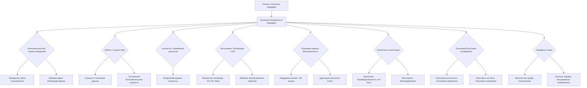

## <алгоритм>

1. **Описание:** Данный код представляет собой текстовое описание возможностей и принципов работы платформы Dialogflow от Google. Он не содержит исполняемого кода, а скорее является информационным ресурсом, объясняющим, что такое Dialogflow и как его можно использовать.

2. **Блок-схема (концептуальная):**
   ```mermaid
   graph LR
       A[Начало: Описание Dialogflow] --> B(Основные возможности Dialogflow);
       B --> C{Интеллектуальный анализ намерений (Intent Detection)};
       C --> D[Намерения (Intents)];
       C --> E[Примеры фраз (Training Phrases)];
       B --> F{Работа с сущностями (Entity Recognition)};
       F --> G[Сущности (Entities)];
       F --> H[Системные и пользовательские сущности];
       B --> I{Контексты (Contexts)};
       I --> J[Входные и выходные контексты];
        B --> K{Интеграции};
        K --> L[Многочисленные платформы];
        K --> M[Webhook];
        B --> N{Языковые модели};
        N --> O[Поддержка множества языков];
        N --> P[Адаптация под конкретные языки];
        B --> Q{Аналитика и мониторинг};
        Q --> R[Аналитика];
        Q --> S[Мониторинг];
        B --> T{Голосовые и текстовые интерфейсы};
        T --> U[Голосовые ассистенты];
        T --> V[Текстовые чат-боты];
        B --> W{Бесплатный и платный тарифы};
        W --> X[Бесплатный тариф];
        W --> Y[Платные тарифы];
       
       
   ```

**Примеры для каждого логического блока:**

- **Намерения (Intents)**: Например, "Заказать пиццу", "Узнать погоду", "Забронировать столик".
- **Примеры фраз (Training Phrases)**: Для намерения "Заказать пиццу" это могут быть: "Хочу заказать пиццу", "Пицца, пожалуйста", "Доставьте мне пиццу".
- **Сущности (Entities)**: В фразе "Закажи пиццу с пепперони и грибами", "пепперони" и "грибы" — это сущности (виды начинки).
- **Контексты**: После того как пользователь сказал "Я хочу заказать пиццу", контекст может быть установлен, и последующие вопросы могут относиться к деталям заказа пиццы.
- **Платформы**: Google Assistant, Facebook Messenger, Slack, Telegram.
- **Webhook**: Например, для интеграции с базой данных или внешним API для получения информации о меню ресторана.

## <mermaid>



**Объяснение `mermaid`:**

Диаграмма `mermaid` представляет собой блок-схему, описывающую структуру и функционал Dialogflow.

- **Основные блоки**:
    - `Начало: Описание Dialogflow` - Начальная точка.
    - `Основные возможности Dialogflow` - Главный узел, от которого расходятся все остальные блоки.
- **Функциональные блоки:**
    - `Интеллектуальный анализ намерений`:  Объясняет процесс распознавания целей пользователя.
    - `Работа с сущностями`:  Объясняет процесс извлечения ключевых данных из фраз.
    - `Контексты`:  Объясняет управление состоянием разговора.
    - `Интеграции`:  Показывает, с какими платформами может взаимодействовать Dialogflow.
    - `Языковые модели`:  Демонстрирует поддержку различных языков.
    - `Аналитика и мониторинг`:  Показывает инструменты анализа и отслеживания.
    - `Голосовые и текстовые интерфейсы`:  Отображает, что Dialogflow подходит для голосовых и текстовых интерфейсов.
    - `Тарифные планы`:  Объясняет наличие разных тарифов.

- **Стрелки:** Стрелки показывают поток информации или зависимости между различными блоками.
    
## <объяснение>

### Импорты
В данном коде отсутствуют импорты, поскольку это текстовое описание, а не исполняемый код Python.

### Классы
В данном коде нет классов. Это текстовый документ, описывающий функциональность платформы Dialogflow.

### Функции
В данном коде нет функций. Это текстовый документ, описывающий функциональность платформы Dialogflow.

### Переменные
В данном коде нет переменных. Это текстовый документ, описывающий функциональность платформы Dialogflow.

### Потенциальные ошибки и области для улучшения
- **Отсутствие кода:** Данный код не является исполняемым кодом. Это информационное описание.
- **Обновление информации**: Информация о возможностях, интеграциях и тарифах Dialogflow должна периодически проверяться и обновляться, так как платформа постоянно развивается.

### Цепочка взаимосвязей с другими частями проекта
Так как это описание Dialogflow, оно будет связано со всеми частями проекта, где используется Dialogflow. В частности, оно связано с кодом и конфигурациями, используемыми для создания диалоговых интерфейсов, а также с другими частями проекта, которые могут использовать данные, полученные из Dialogflow.