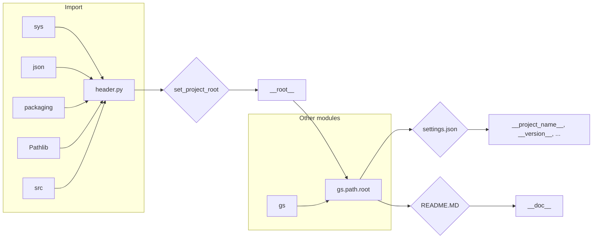

# <input code>

```python
## \file hypotez/src/ai/dialogflow/header.py
# -*- coding: utf-8 -*-
#! venv/Scripts/python.exe
#! venv/bin/python/python3.12

"""
.. module: src.ai.dialogflow 
	:platform: Windows, Unix
	:synopsis:

"""
MODE = 'dev'


import sys
import json
from packaging.version import Version

from pathlib import Path
def set_project_root(marker_files=('pyproject.toml', 'requirements.txt', '.git')) -> Path:
    """
    Finds the root directory of the project starting from the current file's directory,
    searching upwards and stopping at the first directory containing any of the marker files.

    Args:
        marker_files (tuple): Filenames or directory names to identify the project root.
    
    Returns:
        Path: Path to the root directory if found, otherwise the directory where the script is located.
    """
    __root__:Path
    current_path:Path = Path(__file__).resolve().parent
    __root__ = current_path
    for parent in [current_path] + list(current_path.parents):
        if any((parent / marker).exists() for marker in marker_files):
            __root__ = parent
            break
    if __root__ not in sys.path:
        sys.path.insert(0, str(__root__))
    return __root__


# Get the root directory of the project
__root__ = set_project_root()
"""__root__ (Path): Path to the root directory of the project"""

from src import gs

settings:dict = None
try:
    with open(gs.path.root / 'src' / 'settings.json', 'r') as settings_file:
        settings = json.load(settings_file)
except (FileNotFoundError, json.JSONDecodeError):
    ...

doc_str:str = None
try:
    with open(gs.path.root / 'src' / 'README.MD', 'r') as settings_file:
        doc_str = settings_file.read()
except (FileNotFoundError, json.JSONDecodeError):
    ...


__project_name__ = settings.get("project_name", 'hypotez') if settings  else 'hypotez'
__version__: str = settings.get("version", '')  if settings  else ''
__doc__: str = doc_str if doc_str else ''
__details__: str = ''
__author__: str = settings.get("author", '')  if settings  else ''
__copyright__: str = settings.get("copyrihgnt", '')  if settings  else ''
__cofee__: str = settings.get("cofee", "Treat the developer to a cup of coffee for boosting enthusiasm in development: https://boosty.to/hypo69")  if settings  else "Treat the developer to a cup of coffee for boosting enthusiasm in development: https://boosty.to/hypo69"
```

# <algorithm>

**Шаг 1:**  `set_project_root()`:
* Начинает поиск корневой директории проекта с текущей директории файла (`__file__`).
* Перебирает родительские директории до тех пор, пока не найдет папку содержащую `marker_files`: `pyproject.toml`, `requirements.txt`, `.git`.
* Если корневая директория найдена, она добавляется в `sys.path`.
* Возвращает найденную корневую директорию.

**Пример:** Если файл `header.py` находится в `hypotez/src/ai/dialogflow`, поиск будет проходить вверх по дереву:
```
hypotez/src/ai/dialogflow/header.py -> hypotez/src/ai/ -> hypotez/src/ -> hypotez/
```
При этом функция возвращает директорию `hypotez`.

**Шаг 2:**  Извлечение настроек из `settings.json` и `README.MD`:
* Вызывается `gs.path.root` (предполагается, что `gs` предоставляет методы работы с путями).
* Читает содержимое `settings.json` в переменную `settings` с использованием `json.load()`, обрабатывая исключения `FileNotFoundError` и `json.JSONDecodeError`.
* Читает содержимое `README.MD` в переменную `doc_str`. Обрабатывает исключения `FileNotFoundError` и `json.JSONDecodeError`.

**Шаг 3:**  Инициализация переменных `__project_name__`, `__version__`, `__doc__` и т.д.:
*  Создает переменные, связанные с проектом, используя значения из `settings`, если они есть, в противном случае используя значения по умолчанию.

**Шаг 4:**  Возвращает значения для последующего использования в других частях проекта.


# <mermaid>



# <explanation>

**Импорты:**

* `sys`:  Для работы со системными переменными, в том числе добавления пути к модулям в `sys.path`.
* `json`: Для работы с JSON-файлами, чтение и парсинг настроек проекта из `settings.json`.
* `packaging.version`:  Для работы с версиями. (не используется напрямую, но импортируется в проекте).
* `pathlib`: Для работы с путями к файлам.
* `src.gs`: Предполагается, что это модуль, предоставляющий доступ к файловым путям проекта (возможно, для работы с файловой системой).

**Классы:**

Нет классов.

**Функции:**

* `set_project_root(marker_files)`:  Ищет корень проекта, начиная от текущего файла, возвращает путь к корневой директории проекта.
    * `marker_files`: Кортеж файлов или папок, которые указывают на расположение корня проекта.
    * Возвращаемое значение: `Path` к корневой директории проекта.


**Переменные:**

* `MODE`: Строковая переменная, вероятно, определяющая режим работы приложения.
* `__root__`: `Path` к корневой директории проекта, используется для получения относительных путей к ресурсам.
* `settings`: Словарь, содержащий настройки проекта, загруженные из `settings.json`.
* `doc_str`: Строка, содержащая содержимое файла `README.MD`.
* `__project_name__`, `__version__`, `__doc__`, `__details__`, `__author__`, `__copyright__`, `__cofee__`:  Строки, хранящие информацию о проекте, полученную из файла `settings.json` или со значениями по умолчанию.


**Возможные ошибки и улучшения:**

* **`gs.path.root`:**  Необходимо понимать, как `gs.path.root` определен. Без этой информации сложно оценить надежность кода. Важно убедиться, что он корректен и вычисляет правильный корень проекта.
* **Обработка исключений:** Обработка `FileNotFoundError` и `json.JSONDecodeError` — это хороший подход, но стоит рассмотреть более подробную обработку и логирование ошибок для отладки.
* **Переменные с подчеркиваниями:** Использование двойных подчеркиваний (`__`) для имен переменных (`__root__`) может указывать на то, что они предназначены для внутреннего использования в этом модуле.
* **Зависимость от `gs`:** Необходимо понимать функциональность `gs` и убедиться, что она корректно взаимодействует с файловой системой.


**Связь с другими частями проекта:**

Функция `set_project_root` и использование `gs`  указывают на то, что данный файл (`header.py`) является частью более крупного проекта, который полагается на эти модули для управления путями к файлам и получением настроек. Файлы `settings.json` и `README.MD` являются необходимыми для работы кода и, вероятно, содержат важные данные о проекте.