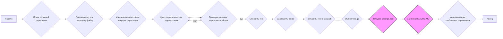

## <алгоритм>

**1. `set_project_root(marker_files)`:**

   - **Начало**: Функция принимает кортеж `marker_files` (по умолчанию `('pyproject.toml', 'requirements.txt', '.git')`) как маркеры для поиска корневой директории проекта.
   - **Инициализация**:
      - `current_path` присваивается абсолютный путь к директории, где находится файл `header.py`.
      - `__root__` инициализируется как `current_path`.
      *Пример:* Если `header.py` находится в `/home/user/project/src/ai/dialogflow/`, то `current_path` будет `/home/user/project/src/ai/dialogflow/`.
   - **Поиск родительских директорий**:
      - Итерируется по всем родительским директориям, включая текущую.
      - Для каждой директории проверяется, существует ли в ней хотя бы один из файлов из `marker_files`.
      *Пример:* Проверяется наличие `pyproject.toml`, `requirements.txt`, или `.git` в `/home/user/project/src/ai/dialogflow/`, затем в `/home/user/project/src/ai/`, затем в `/home/user/project/src/`, и так далее.
   - **Обновление корневой директории**:
       - Если маркерный файл найден, `__root__` обновляется до родительской директории, содержащей маркер. Цикл завершается.
       *Пример:* Если `.git` найден в `/home/user/project/`, то `__root__` станет `/home/user/project/`, и цикл прервется.
   - **Добавление в `sys.path`**:
        - Если `__root__` не находится в списке путей поиска модулей (`sys.path`), то `__root__` добавляется в начало `sys.path`. Это позволяет импортировать модули из корневой директории.
   - **Возврат**: Возвращает `__root__`, путь к корневой директории проекта.

**2. Инициализация `__root__`**:
   - Вызывает `set_project_root()` без аргументов, результат сохраняется в глобальной переменной `__root__`.

**3. Импорт `src.gs`**:
   - Импортируется модуль `gs` из пакета `src`, вероятно, содержит глобальные настройки или пути.

**4. Загрузка настроек из `settings.json`**:
   - Пытается открыть файл `settings.json`, расположенный в `/src/` относительно `__root__`.
   - Если файл успешно открыт, его содержимое загружается в переменную `settings` как словарь `dict`.
   - Если файл не найден или невалидный JSON, то `settings` остается `None`.
  *Пример:* если `__root__` равен `/home/user/project/` , то загружаемый файл `/home/user/project/src/settings.json`

**5. Загрузка содержимого из `README.MD`**:
  - Аналогично с settings.json, читает содержимое `README.MD` и сохраняет в `doc_str`.

**6. Инициализация глобальных переменных:**
   - `__project_name__` устанавливается из настроек, либо `hypotez` по умолчанию.
   - `__version__` устанавливается из настроек, либо пустая строка по умолчанию.
   - `__doc__` устанавливается из `doc_str`, либо пустая строка по умолчанию.
   - `__details__` устанавливается как пустая строка.
   - `__author__` устанавливается из настроек, либо пустая строка по умолчанию.
   - `__copyright__` устанавливается из настроек, либо пустая строка по умолчанию.
   - `__cofee__` устанавливается из настроек, либо строка с информацией для доната разработчику по умолчанию.

## <mermaid>

**Описание зависимостей:**

1.  **`sys`**: Используется для доступа к `sys.path` и модификации путей поиска модулей.
2.  **`json`**: Используется для чтения данных из файла `settings.json`
3.  **`packaging.version.Version`**: Используется для управления версиями(не используется напрямую, импортируется).
4.  **`pathlib.Path`**: Используется для работы с путями к файлам и директориям.
5.  **`src.gs`**: Предположительно, содержит глобальные переменные или пути, которые необходимы для определения расположения файлов настроек.

## <объяснение>

### Импорты:

*   **`sys`**: Модуль предоставляет доступ к некоторым переменным и функциям, используемым интерпретатором Python. В данном случае используется для модификации `sys.path`, чтобы добавить корневую директорию проекта в список путей поиска модулей. Это необходимо для возможности импортировать модули из проекта при запуске скриптов.
*   **`json`**: Модуль используется для работы с JSON-файлами. Здесь используется для чтения данных настроек из `settings.json`.
*    **`packaging.version.Version`**: импортируется, но в данном фрагменте кода не используется.
*   **`pathlib`**: Модуль предоставляет удобный способ работы с путями к файлам и директориям. Используется для определения абсолютных путей к файлам и их родительским директориям.

### Функции:

*   **`set_project_root(marker_files)`**:
    *   **Аргументы**:
        *   `marker_files` (tuple): Кортеж строк, представляющих имена файлов или директорий, которые служат маркерами корневой директории проекта.
    *   **Возвращаемое значение**:
        *   `Path`: Объект Path, представляющий путь к корневой директории проекта.
    *   **Назначение**:
        *   Находит корневую директорию проекта, начиная с директории, в которой находится текущий файл, и поднимаясь вверх по иерархии директорий, пока не найдет один из файлов-маркеров.
        *   Добавляет найденную корневую директорию в список путей поиска модулей (`sys.path`), чтобы можно было импортировать модули проекта.
    *   **Примеры**:
        *   `set_project_root()`: Находит корневую директорию, используя маркеры по умолчанию.
        *   `set_project_root(marker_files=('setup.py',))`: Находит корневую директорию, используя только файл `setup.py` в качестве маркера.

### Переменные:

*   **`MODE`**: Строка, определяющая режим работы приложения (`'dev'` - режим разработки). Не используется в данном фрагменте кода.
*   **`__root__`**: Объект `Path`, представляющий абсолютный путь к корневой директории проекта. Определяется функцией `set_project_root`.
*   **`settings`**: Словарь (`dict`), содержащий настройки проекта, загруженные из файла `settings.json`. Может быть `None`, если файл не найден или его содержимое не является валидным JSON.
*   **`doc_str`**: Строка, содержащая содержимое файла `README.MD`. Может быть `None`, если файл не найден или не может быть прочитан.
*    **`__project_name__`**: Строка, название проекта, по умолчанию - `hypotez`.
*   **`__version__`**: Строка, содержащая версию проекта.
*   **`__doc__`**: Строка, содержащая документацию проекта.
*   **`__details__`**: Строка, содержащая детали проекта.
*    **`__author__`**: Строка, содержащая автора проекта.
*   **`__copyright__`**: Строка, содержащая информацию об авторских правах проекта.
*   **`__cofee__`**: Строка, содержащая сообщение с информацией для доната разработчику.

### Классы:

*   В данном фрагменте кода нет определения классов.

### Потенциальные ошибки и области для улучшения:

*   **Обработка ошибок**:  Обработка ошибок `FileNotFoundError` и `json.JSONDecodeError` в блоках `try-except` заключается только в пропуске исключения с помощью `...`. Это может привести к проблемам, если, например, файл `settings.json` не будет найден. Возможно, лучше добавить логирование или сообщение об ошибке.
*   **Зависимость от файловой структуры**: Код полагается на то, что в корневой директории проекта есть файл `settings.json` и `README.MD`. Если этих файлов нет, часть кода не будет работать или  будет использовать значения по умолчанию. Необходимо более гибкое управление путями к этим файлам.
*   **Использование `__root__`**: Наличие глобальной переменной `__root__` может создать сложности при тестировании или в случае использования кода в нескольких проектах. Возможно, следует рассмотреть использование менеджера контекста или других методов для более аккуратной работы с путями.

### Взаимосвязь с другими частями проекта:

*   **`src.gs`**: Предполагается, что модуль `src.gs` содержит глобальные пути или настройки, необходимые для работы этого и других модулей в проекте. В этом файле  используется `gs.path.root` для доступа к корневой директории и чтение файлов `settings.json` и `README.MD`.
*   **Другие модули**: После добавления корневой директории в `sys.path` этот модуль позволяет другим модулям из пакета `src` импортировать друг друга, так как в основном устанавливает корневую директорию для всего проекта.