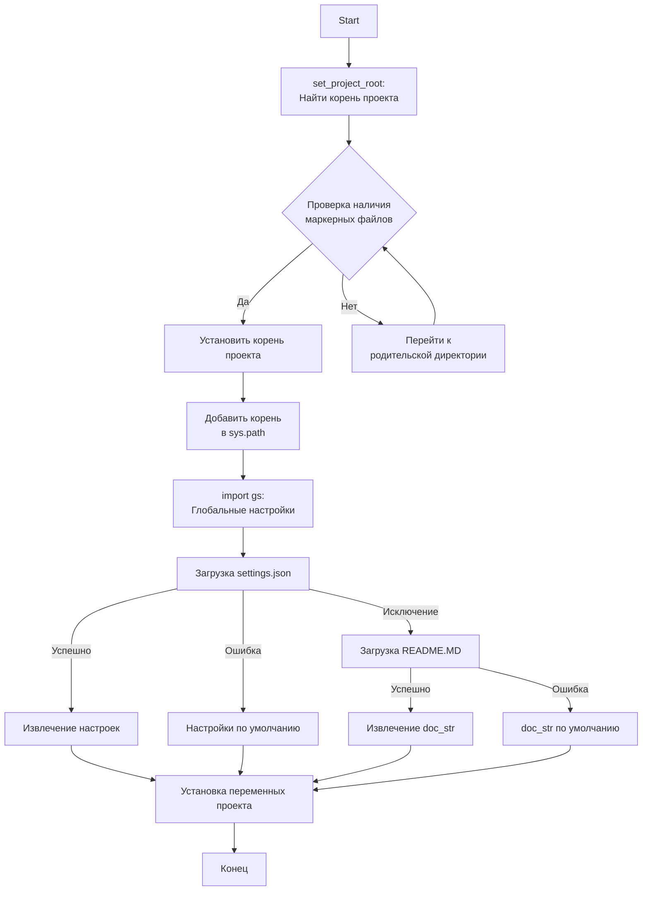
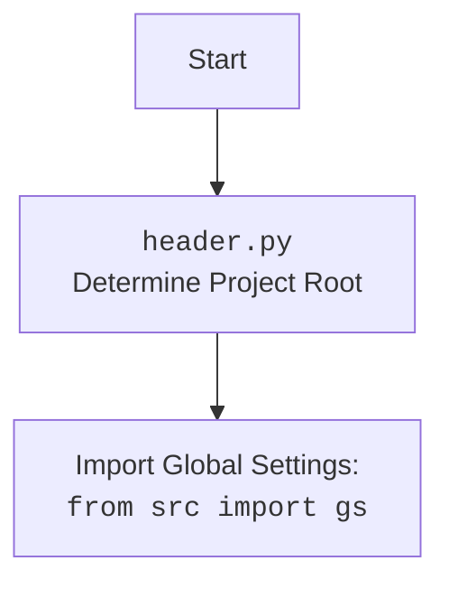

## ИНСТРУКЦИЯ:

Анализируй предоставленный код подробно и объясни его функциональность. Ответ должен включать три раздела:  

1. **<алгоритм>**: Опиши рабочий процесс в виде пошаговой блок-схемы, включая примеры для каждого логического блока, и проиллюстрируй поток данных между функциями, классами или методами.  
2. **<mermaid>**: Напиши код для диаграммы в формате `mermaid`, проанализируй и объясни все зависимости, 
    которые импортируются при создании диаграммы. 
    **ВАЖНО!** Убедитесь, что все имена переменных, используемые в диаграмме `mermaid`, 
    имеют осмысленные и описательные имена. Имена переменных вроде `A`, `B`, `C`, и т.д., не допускаются!  
    
    **Дополнительно**: Если в коде есть импорт `import header`, добавьте блок `mermaid` flowchart, объясняющий `header.py`:
    ```mermaid
    flowchart TD
        Start --> Header[<code>header.py</code><br> Determine Project Root]
    
        Header --> import[Import Global Settings: <br><code>from src import gs</code>] 
    ```

3. **<объяснение>**: Предоставьте подробные объяснения:  
   - **Импорты**: Их назначение и взаимосвязь с другими пакетами `src.`.  
   - **Классы**: Их роль, атрибуты, методы и взаимодействие с другими компонентами проекта.  
   - **Функции**: Их аргументы, возвращаемые значения, назначение и примеры.  
   - **Переменные**: Их типы и использование.  
   - Выделите потенциальные ошибки или области для улучшения.  

Дополнительно, постройте цепочку взаимосвязей с другими частями проекта (если применимо).  

Это обеспечивает всесторонний и структурированный анализ кода.
## Формат ответа: `.md` (markdown)
**КОНЕЦ ИНСТРУКЦИИ**

## <алгоритм>

```mermaid
flowchart TD
    Start[Начало] --> FindProjectRoot[Определение корневой директории проекта (set_project_root)]
    FindProjectRoot -- "Ищет маркерные файлы (__root__, .git) в родительских директориях" --> CheckMarkerFiles{Найден маркерный файл?}
    CheckMarkerFiles -- Да --> SetRoot[Установить найденную директорию как корень проекта]
    CheckMarkerFiles -- Нет --> MoveUp[Переход к родительской директории]
    MoveUp --> CheckMarkerFiles
    SetRoot --> AddToPath[Добавление корневой директории в sys.path]
    AddToPath --> LoadSettings[Загрузка settings.json]
    LoadSettings -- "Файл settings.json найден и успешно загружен" --> GetSettings[Извлечение настроек проекта (project_name, version, и т.д.)]
    LoadSettings -- "Файл settings.json не найден или ошибка при загрузке" --> DefaultSettings[Установка настроек проекта по умолчанию]
	LoadSettings  -- "Исключение FileNotFoundError, json.JSONDecodeError" --> LoadReadme[Загрузка README.MD]
	LoadReadme -- "Файл README.MD найден и успешно загружен" --> GetDocStr[Извлечение doc_str проекта]
	LoadReadme -- "Файл README.MD не найден или ошибка при загрузке" --> DefaultDocStr[Установка doc_str по умолчанию]
    GetSettings --> SetProjectInfo[Установка информации о проекте (__project_name__, __version__, и т.д.)]
	DefaultSettings --> SetProjectInfo
	GetDocStr --> SetProjectInfo
	DefaultDocStr --> SetProjectInfo
    SetProjectInfo --> End[Конец]
```

**Примеры:**

*   **`FindProjectRoot`**:
    *   Начинаем в `/src/ai/dialogflow/`.
    *   Проверяем `/src/ai/dialogflow/`, `/src/ai/`, `/src/` и так далее.
    *   Если `.git` найден в `/`, то корень проекта `/`.
*   **`CheckMarkerFiles`**:
    *   Для `/src/ai/dialogflow/` - маркерные файлы не найдены -> нет
    *   Для `/` - маркерный файл `.git` найден -> да
*   **`SetRoot`**: 
    *   Корнем проекта становится `/`.
*   **`AddToPath`**:
    *   Путь `/` добавляется в `sys.path`.
*   **`LoadSettings`**:
    *   Файл `settings.json` читается из `/src/settings.json`
    *   Если файл не найден или ошибка чтения - переходим к `DefaultSettings`
*   **`GetSettings`**:
    *   Значения `project_name` и `version` из `settings.json` будут использованы.
*   **`DefaultSettings`**:
    *   Если `settings.json` отсутствует, `project_name` будет `hypotez`, `version` - `''`
*    **`LoadReadme`**:
    *   Файл `README.MD` читается из `/src/README.MD`
     *  Если файл не найден или ошибка чтения - переходим к `DefaultDocStr`
*   **`GetDocStr`**:
    *   Значение `doc_str` из `README.MD` будет использовано
*   **`DefaultDocStr`**:
    *  Если `README.MD` отсутствует, `doc_str` будет `''`
*    **`SetProjectInfo`**:
    *   Значения проекта устанавливаются в переменные `__project_name__`, `__version__`, `__doc__` и т.д.

## <mermaid>





**Зависимости:**

1.  **`import sys`**: Модуль `sys` используется для работы с системными параметрами и функциями. В данном случае он используется для добавления корневой директории проекта в `sys.path`, что позволяет импортировать модули из этой директории.
2.  **`import json`**: Модуль `json` используется для загрузки настроек проекта из файла `settings.json`. Этот модуль обеспечивает парсинг JSON-данных.
3.  **`from packaging.version import Version`**: Импортирует класс `Version` из модуля `packaging.version`. Используется для работы с версиями, но в коде не используется. Возможно заготовка для дальнейшей работы.
4.  **`from pathlib import Path`**: Класс `Path` из модуля `pathlib` используется для работы с путями файловой системы.
5.  **`from src import gs`**: Импортирует глобальные настройки проекта из модуля `src.gs`. Это обеспечивает доступ к путям и другим настройкам, определенным в `gs.py`.

## <объяснение>

**Импорты:**

*   **`import sys`**:  Используется для модификации `sys.path`, добавляя в него корень проекта, чтобы можно было импортировать модули из `src`.
*   **`import json`**:  Используется для работы с файлами JSON, в частности, для загрузки настроек проекта из `settings.json`.
*   **`from packaging.version import Version`**: Используется для сравнения и манипулирования версиями. В текущем коде не используется напрямую, но скорее всего задел для будущего использования, возможно для сравнения версий проекта.
*   **`from pathlib import Path`**: Обеспечивает объектно-ориентированный способ работы с путями файловой системы.
*   **`from src import gs`**: Импортирует глобальные настройки проекта из `src/gs.py`.  Позволяет получить доступ к общесистемным параметрам, путям к директориям и файлам, определенным в `gs.py`.

**Функции:**

*   **`set_project_root(marker_files: tuple = ('__root__', '.git')) -> Path`**:
    *   **Аргументы**:
        *   `marker_files`: кортеж строк, представляющий имена файлов или директорий, которые указывают на корень проекта. По умолчанию это `('__root__', '.git')`.
    *   **Возвращаемое значение**:
        *   `Path`: Объект `Path`, представляющий путь к корневой директории проекта, или путь к директории, где находится текущий файл, если маркерные файлы не найдены.
    *   **Назначение**:
        *   Функция находит корень проекта, начиная с текущей директории и двигаясь вверх по иерархии каталогов, пока не найдет один из `marker_files`. После нахождения, корень проекта добавляется в `sys.path`, чтобы можно было импортировать модули из этого проекта.
    *   **Пример**:
        *   Если текущий файл находится в `/src/ai/dialogflow/header.py` и в `/` есть файл `.git`, то функция вернет `Path("/")`.

**Переменные:**

*   **`__root__ (Path)`**: Путь к корневой директории проекта. Получается в результате вызова `set_project_root()`.
*   **`settings (dict)`**:  Словарь с настройками проекта, загружаемый из `settings.json`.
*   **`doc_str (str)`**:  Строка с содержимым документации проекта, загружаемая из `README.MD`.
*   **`__project_name__ (str)`**:  Имя проекта, извлекается из `settings.json` или устанавливается по умолчанию в `hypotez`.
*   **`__version__ (str)`**:  Версия проекта, извлекается из `settings.json` или устанавливается пустой строкой.
*  **`__doc__ (str)`**:  Строка документации проекта, извлекается из `README.MD` или устанавливается пустой строкой.
*   **`__details__ (str)`**: Пустая строка.
*   **`__author__ (str)`**: Автор проекта, извлекается из `settings.json` или устанавливается пустой строкой.
*   **`__copyright__ (str)`**: Копирайт проекта, извлекается из `settings.json` или устанавливается пустой строкой.
*   **`__cofee__ (str)`**: Сообщение про кофе, извлекается из `settings.json` или устанавливается значением по умолчанию.

**Цепочка взаимосвязей:**

1.  Файл `header.py` определяет корень проекта с помощью функции `set_project_root()`.
2.  Корень проекта добавляется в `sys.path`, позволяя импортировать модули из `src`.
3.  Импортируется `src.gs` для получения глобальных настроек, таких как пути к файлам.
4.  Загружаются настройки из `settings.json`, используя `gs.path.root`, и сохраняются в переменную `settings`.
5.  Загружается документация из `README.MD`, используя `gs.path.root`, и сохраняются в переменную `doc_str`.
6.  Извлеченные или дефолтные значения используются для установки глобальных переменных проекта (`__project_name__`, `__version__`, `__doc__` и т.д.).
7.  Другие модули в `src` могут импортировать переменные из `header.py`, получая доступ к информации о проекте и путям к файлам.

**Потенциальные ошибки и области для улучшения:**

*   **Обработка ошибок**:  Обработка `FileNotFoundError` и `json.JSONDecodeError` выполняется через `...`. Лучше добавить логирование ошибок или выдавать более информативные сообщения.
*   **Зависимость от структуры проекта**: Код жестко завязан на определенную структуру каталогов (наличие `src/settings.json` и `src/README.MD`).
*   **`Version`**: `packaging.version.Version` не используется. Если не требуется, импорт можно убрать.
*   **Типы данных**: Типы данных переменных `__details__`, `__author__` и `__copyright__` не указаны.

**Дополнительно**:

Код выполняет важную роль инициализации проекта, предоставляя информацию о проекте и пути к файлам. Он является точкой входа для многих модулей проекта.