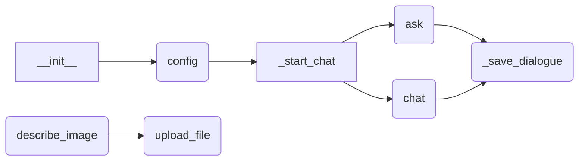
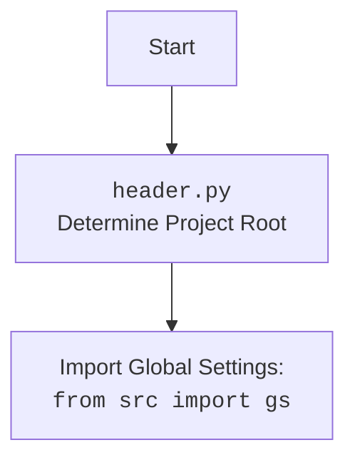

## ИНСТРУКЦИЯ:

Анализируй предоставленный код подробно и объясни его функциональность. Ответ должен включать три раздела:  

1. **<алгоритм>**: Опиши рабочий процесс в виде пошаговой блок-схемы, включая примеры для каждого логического блока, и проиллюстрируй поток данных между функциями, классами или методами.  
2. **<mermaid>**: Напиши код для диаграммы в формате `mermaid`, проанализируй и объясни все зависимости, 
    которые импортируются при создании диаграммы. 
    **ВАЖНО!** Убедитесь, что все имена переменных, используемые в диаграмме `mermaid`, 
    имеют осмысленные и описательные имена. Имена переменных вроде `A`, `B`, `C`, и т.д., не допускаются!  
    
    **Дополнительно**: Если в коде есть импорт `import header`, добавьте блок `mermaid` flowchart, объясняющий `header.py`:\
    ```mermaid
    flowchart TD
        Start --> Header[<code>header.py</code><br> Determine Project Root]
    
        Header --> import[Import Global Settings: <br><code>from src import gs</code>] 
    ```

3. **<объяснение>**: Предоставьте подробные объяснения:  
   - **Импорты**: Их назначение и взаимосвязь с другими пакетами `src.`.  
   - **Классы**: Их роль, атрибуты, методы и взаимодействие с другими компонентами проекта.  
   - **Функции**: Их аргументы, возвращаемые значения, назначение и примеры.  
   - **Переменные**: Их типы и использование.  
   - Выделите потенциальные ошибки или области для улучшения.  

Дополнительно, постройте цепочку взаимосвязей с другими частями проекта (если применимо).  

Это обеспечивает всесторонний и структурированный анализ кода.
## Формат ответа: `.md` (markdown)
**КОНЕЦ ИНСТРУКЦИИ**
## <алгоритм>

**1. Инициализация (`__init__`)**

- **Пример**: `ai = GoogleGenerativeAI(api_key="your_api_key", model_name="gemini-pro", system_instruction="You are a helpful assistant.")`
- **Блок**:
    1. Принимает `api_key`, `model_name`, `generation_config`, `system_instruction` и произвольные аргументы `kwargs`.
    2. Сохраняет переданные параметры в атрибуты экземпляра.
    3. Определяет пути для сохранения диалогов.
    4. Инициализирует модель `google.generativeai`.

**2. Конфигурация (`config`)**
- **Пример**: `config = ai.config()`
- **Блок**:
    1. Читает JSON файл конфигурации из `gs.path.src / 'ai' / 'gemini' / 'generative_ai.json'`.
    2. Возвращает словарь с настройками.

**3. Начало чата (`_start_chat`)**
- **Пример**: `ai._start_chat()`
- **Блок**:
    1. Инициализирует сессию чата, создавая пустой список для истории.
    2. Возвращает объект сессии.

**4. Сохранение диалога (`_save_dialogue`)**

- **Пример**: `ai._save_dialogue([{"role": "user", "text": "Hello"}, {"role": "model", "text": "Hi there"}])`
- **Блок**:
    1. Принимает список сообщений диалога.
    2. Каждое сообщение добавляется в текстовый файл.
    3. Каждое сообщение в формате JSON добавляется в JSON файл.

**5. Запрос (`ask`)**

- **Пример**: `response = ai.ask("What is the capital of France?")`
- **Блок**:
    1. Принимает текстовый запрос `q` и число попыток `attempts`.
    2. Выполняет запрос к модели, повторяя попытки в случае ошибки (с экспоненциальным увеличением времени ожидания).
    3. В случае успеха возвращает текст ответа; в случае неудачи возвращает `None`.
    4. Сохраняет диалог.

**6. Чат (`chat`)**

- **Пример**: `response = ai.chat("Hello, how are you?")`
- **Блок**:
    1. Принимает текстовое сообщение `q`.
    2. Вызывает `_start_chat` если сессия еще не создана.
    3. Отправляет сообщение в сессию чата.
    4. Возвращает текст ответа.

**7. Описание изображения (`describe_image`)**

- **Пример**: `description = ai.describe_image(Path("path/to/image.jpg"))`
- **Блок**:
    1. Принимает путь к изображению `image_path`.
    2. Кодирует изображение в base64.
    3. Отправляет изображение модели для получения описания.
    4. В случае успеха возвращает текстовое описание, в случае неудачи `None`.

**8. Загрузка файла (`upload_file`)**

- **Пример**: `success = ai.upload_file("path/to/file.txt", file_name="my_file.txt")`
- **Блок**:
    1. Принимает путь к файлу `file`, или file like object и имя файла `file_name`.
    2. Загружает файл на сервер с повторными попытками в случае ошибки.
    3. Возвращает `True` в случае успеха, `False` в случае неудачи.
    
**Поток данных:**



## <mermaid>


**Импортированные зависимости:**

- **`google.generativeai`**:  Основная библиотека для работы с Google Generative AI.
- **`requests`**: Библиотека для отправки HTTP-запросов (хотя в явном виде не используется, но вероятно является зависимостью `google.generativeai`).
- **`grpc`**: Библиотека для RPC-вызовов (вероятно, используется внутри `google.generativeai`).
- **`google.api_core.exceptions`**: Исключения, которые могут быть выброшены Google API.
- **`google.auth.exceptions`**: Исключения, связанные с авторизацией Google.
- **`src.logger`**: Модуль для логирования.
- **`src.utils.printer`**: Модуль для форматированного вывода в консоль.
- **`src.utils.file`**: Модуль для работы с файлами (чтение, запись).
- **`src.utils.date_time`**: Модуль для работы с датой и временем.
- **`src.utils.convertors.unicode`**: Модуль для преобразования unicode.
- **`src.utils.jjson`**: Модуль для работы с JSON файлами.



## <объяснение>

**Импорты:**

-   `google.generativeai`:  Основной пакет, обеспечивающий взаимодействие с моделями Google Generative AI. Он отвечает за отправку запросов, получение ответов и другие операции. 
-   `requests`, `grpc`:  Хотя явно не импортируются в коде, они являются зависимостями пакета `google.generativeai` и необходимы для его функционирования. `requests` используется для HTTP-запросов, а `grpc` для удаленных вызовов процедур.
-  `google.api_core.exceptions`: Этот модуль содержит исключения, которые могут быть выброшены при взаимодействии с Google API, например, ошибки сети, квоты, аутентификации и т.д. 
-   `google.auth.exceptions`: Модуль содержит исключения, связанные с процессом аутентификации для Google API.
-   `src.logger`:  Внутренний модуль для логирования событий в приложении. Он обеспечивает сохранение информации о процессе работы, ошибок и других важных данных. Это помогает в отладке и мониторинге.
-   `src.utils.printer`:  Модуль для форматированного вывода информации на экран. Обычно используется для отображения сообщений пользователю, результатов работы и отладочной информации.
-   `src.utils.file`:  Модуль для работы с файловой системой. Он содержит функции для чтения, записи, создания и удаления файлов. Этот модуль используется для сохранения диалогов в файлы.
-  `src.utils.date_time`: Модуль для работы с датами и временем. Он может предоставлять функции для форматирования дат, вычисления разницы между датами и т.д., хотя точное использование в текущем контексте не указано.
-  `src.utils.convertors.unicode`:  Модуль для преобразования строк из различных кодировок в Unicode. Это может понадобиться для корректной обработки текста, особенно если данные приходят из разных источников.
-   `src.utils.jjson`:  Модуль для работы с JSON файлами, облегчая чтение и запись данных в этом формате. Используется для сохранения истории диалога в JSON.

**Классы:**

-   `GoogleGenerativeAI`:
    -   **Роль**: Класс является центральной точкой взаимодействия с Google Generative AI API. Он инкапсулирует всю логику, необходимую для отправки запросов, обработки ответов и управления историей диалогов.
    -   **Атрибуты**:
        -   `api_key`: Ключ API для доступа к Google AI.
        -   `model_name`: Название модели ИИ (например, `gemini-pro`).
        -   `generation_config`: Конфигурация генерации текста (например, параметры температуры, топ-p).
        -   `system_instruction`: Системная инструкция для модели (например, роль, стиль).
        -   `log_path`: Путь к файлу журнала.
        -   `dialogue_path`: Путь к файлу для сохранения диалогов.
        -   `history`: Список истории сообщений.
        -   `model`: Объект модели `google.generativeai`.
        -   `chat`: Объект сессии чата.
    -   **Методы**:
        -   `__init__`: Инициализация класса с настройками.
        -   `config`: Загрузка конфигурации из файла.
        -   `_start_chat`: Создание новой сессии чата.
        -   `_save_dialogue`: Сохранение истории диалога в файл.
        -   `ask`: Отправка запроса в режиме "вопрос-ответ".
        -   `chat`: Отправка сообщения в режиме диалога.
        -   `describe_image`: Получение текстового описания изображения.
        -   `upload_file`: Загрузка файла на сервер.
    -   **Взаимодействие**:
        -   Использует `google.generativeai` для отправки запросов к модели.
        -   Использует `src.logger` для логирования действий.
        -   Использует `src.utils.file` и `src.utils.jjson` для сохранения диалогов.
        -   Использует `src.utils.printer` для вывода в консоль.
        -   Использует `gs` (global settings) для получения пути к файлам конфигурации.

**Функции:**

-   `__init__(self, api_key: str, model_name: Optional[str] = None, generation_config: Optional[Dict] = None, system_instruction: Optional[str] = None, **kwargs)`:
    -   **Аргументы**: API ключ, имя модели, конфигурация генерации, системная инструкция и произвольные аргументы.
    -   **Возвращаемое значение**: Нет.
    -   **Назначение**: Инициализирует объект `GoogleGenerativeAI` с необходимыми настройками и подготавливает его к работе.
-   `config()`:
    -   **Аргументы**: Нет.
    -   **Возвращаемое значение**: Словарь с настройками из файла.
    -   **Назначение**: Загружает настройки из файла `generative_ai.json`.
-   `_start_chat(self)`:
    -   **Аргументы**: Нет.
    -   **Возвращаемое значение**: Объект сессии чата.
    -   **Назначение**: Начинает новую сессию чата с пустой историей.
-   `_save_dialogue(self, dialogue: list)`:
    -   **Аргументы**: Список сообщений диалога.
    -   **Возвращаемое значение**: Нет.
    -   **Назначение**: Сохраняет диалог в текстовом и JSON форматах.
-   `ask(self, q: str, attempts: int = 15) -> Optional[str]`:
    -   **Аргументы**: Текст запроса `q` и количество попыток `attempts`.
    -   **Возвращаемое значение**: Текст ответа от модели или `None` при неудаче.
    -   **Назначение**: Отправляет текстовый запрос к модели и возвращает ответ.
-   `chat(self, q: str) -> str`:
    -   **Аргументы**: Текст сообщения `q`.
    -   **Возвращаемое значение**: Текст ответа от модели.
    -   **Назначение**: Отправляет сообщение в сессию чата и возвращает ответ.
-   `describe_image(self, image_path: Path) -> Optional[str]`:
    -   **Аргументы**: Путь к изображению `image_path`.
    -   **Возвращаемое значение**: Текстовое описание изображения или `None` при неудаче.
    -   **Назначение**: Получает текстовое описание изображения от модели.
-   `upload_file(self, file: str | Path | IOBase, file_name: Optional[str] = None) -> bool`:
    -   **Аргументы**: Путь к файлу, файловый объект или строка с содержимым файла, имя файла.
    -   **Возвращаемое значение**: `True` при успешной загрузке, `False` при неудаче.
    -   **Назначение**: Загружает файл на сервер.

**Переменные:**

-   `api_key`:  Строка, содержащая API-ключ для аутентификации.
-   `model_name`:  Строка, содержащая имя модели AI (например, "gemini-pro").
-   `generation_config`: Словарь, содержащий параметры для генерации текста (например, "temperature").
-   `system_instruction`: Строка, содержащая инструкции для модели AI (например, роль, ограничения).
-   `log_path`:  Строка, содержащая путь к файлу лога.
-   `dialogue_path`: Строка, содержащая путь к файлу для сохранения диалогов.
-   `history`: Список, хранящий историю сообщений в диалоге.
-   `model`:  Объект модели AI из библиотеки `google.generativeai`.
-   `chat`:  Объект чат-сессии из библиотеки `google.generativeai`.

**Потенциальные ошибки и области для улучшения:**

-   **Отсутствие явной обработки исключений для всех методов:** Некоторые методы имеют общую обработку исключений, но не всегда понятно, какие исключения могут быть выброшены.
-   **Жестко заданные пути к файлам:** Пути к файлам для логов и диалогов могут быть более гибкими (например, через конфигурацию).
-   **Возможность добавления асинхронности:** Для операций, связанных с сетью, можно добавить асинхронное выполнение, чтобы избежать блокировки основного потока.
-   **Управление состоянием сессии**: Сейчас сессия создается заново при каждом вызове `chat` если она не существует. Можно добавить функционал для более гибкого управления сессией.

**Взаимосвязи с другими частями проекта:**

-   `GoogleGenerativeAI` является частью AI модуля проекта (`src.ai`).
-   Модуль зависит от глобальных настроек проекта (`src.gs`).
-   Использует общие утилиты проекта (`src.utils`).
-   Использует `src.logger` для логгирования.
-  Может быть использован другими частями проекта, где требуется интеграция с Google Generative AI.