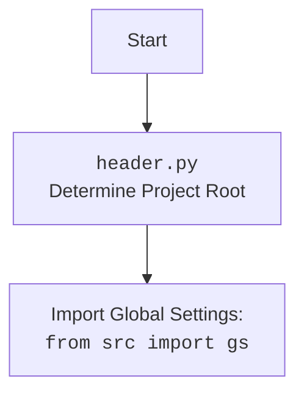

## Анализ кода `GoogleGenerativeAI`

### <алгоритм>

1. **Инициализация (`__init__`)**:
   - Принимает API-ключ, имя модели (необязательно), конфигурацию генерации (необязательно) и системные инструкции (необязательно).
   - Устанавливает API-ключ, имя модели, конфигурацию и системные инструкции как атрибуты объекта.
   - Определяет пути для хранения истории диалогов.
   - Инициализирует модель Google Generative AI.
   - **Пример**:
     ```python
     ai = GoogleGenerativeAI(api_key="your_api_key", model_name="gemini-pro", system_instruction="You are a helpful assistant.")
     ```

2. **Конфигурация (`config`)**:
   - Загружает конфигурацию из файла `generative_ai.json` расположенного в директории `src/ai/gemini`.
   - Использует `gs.path.src` для определения пути к файлу.
   - **Пример**: Конфигурационный файл может содержать настройки API.
     ```json
     {
        "api_key": "your_api_key",
        "model_name": "gemini-pro"
     }
     ```

3. **Начало чата (`_start_chat`)**:
   - Инициализирует пустую историю диалога для нового чата.
   - **Пример**: Создается пустой список для хранения сообщений.
     ```python
     self.history = []
     ```

4. **Сохранение диалога (`_save_dialogue`)**:
   - Принимает список диалогов.
   - Сохраняет диалог в текстовый файл, добавляя каждое сообщение в отдельную строку.
   - Сохраняет диалог в JSON файл.
   - **Пример**:
     ```python
     dialogue = [
        {"role": "user", "content": "Привет"},
        {"role": "assistant", "content": "Здравствуйте!"}
     ]
     self._save_dialogue(dialogue)
     ```
     *Текстовый файл*:\n
     `[{"role": "user", "content": "Привет"}]`\n
     `[{"role": "assistant", "content": "Здравствуйте!"}]`\n
     *JSON файл*:\n
     `[{"role": "user", "content": "Привет"}, {"role": "assistant", "content": "Здравствуйте!"}]`\n

5. **Запрос (`ask`)**:
   - Принимает текстовый запрос и количество попыток.
   - Отправляет запрос к AI модели.
   - Обрабатывает ошибки (сеть, недоступность сервиса, квоты, аутентификация, неверный ввод, API ошибки).
     - В случае ошибок повторяет запрос с экспоненциальной задержкой (до `attempts` раз).
   - Сохраняет диалог.
   - Возвращает ответ или `None` если все попытки неудачны.
   - **Пример**:
     ```python
     response = ai.ask("Какой сегодня день?")
     ```

6. **Чат (`chat`)**:
   - Принимает текстовое сообщение.
   - Использует сессию чата, инициализированную `_start_chat`.
   - Отправляет сообщение модели и возвращает ответ.
   - **Пример**:
      ```python
      response = ai.chat("Расскажи шутку")
      ```

7. **Описание изображения (`describe_image`)**:
   - Принимает путь к изображению.
   - Кодирует изображение в base64 и отправляет запрос на описание к модели.
   - Возвращает текстовое описание изображения или `None` при ошибке.
   - **Пример**:
      ```python
      image_path = Path("/path/to/image.jpg")
      description = ai.describe_image(image_path)
      ```

8. **Загрузка файла (`upload_file`)**:
   - Принимает путь к файлу или объект файла и его имя.
   - Загружает файл к модели.
   - Обрабатывает ошибки, повторяя запрос (логика повтора не ясна в предоставленном фрагменте).
   - Возвращает `True` если успешно, `False` при ошибке.
   - **Пример**:
     ```python
     file_path = "/path/to/file.txt"
     result = ai.upload_file(file_path, "file.txt")
     ```
### <mermaid>

```mermaid
flowchart TD
    Start[Start] --> Init[<code>__init__</code><br>Initialize API, paths, model]
    Init --> Config[<code>config</code><br>Load settings from JSON]
    Config --> StartChat[<code>_start_chat</code><br>Initialize empty chat history]
    StartChat --> AskQuery[<code>ask</code><br>Send text query, handle errors, save dialogue]
    AskQuery --> Chat[<code>chat</code><br>Send message in chat session]
    Chat --> DescribeImage[<code>describe_image</code><br>Send image for description]
    DescribeImage --> UploadFile[<code>upload_file</code><br>Upload file to AI model]
    UploadFile --> SaveDialogue[<code>_save_dialogue</code><br>Save dialogue to files]
    SaveDialogue --> End[End]
    
    classDef file fill:#f9f,stroke:#333,stroke-width:2px
	class Init, Config, StartChat, AskQuery, Chat, DescribeImage, UploadFile, SaveDialogue file
    
```

**Объяснение зависимостей `mermaid`:**

-   `flowchart TD`:  Объявляет диаграмму типа flowchart (блок-схема) и направление сверху вниз (Top-Down).
-   `Start`, `Init`, `Config`, `StartChat`, `AskQuery`, `Chat`, `DescribeImage`, `UploadFile`, `SaveDialogue`, `End`:  Узлы диаграммы, представляющие различные методы класса `GoogleGenerativeAI`.
-   `-->`:  Стрелки, указывающие на поток выполнения между методами.
-   `classDef file fill:#f9f,stroke:#333,stroke-width:2px`:  Определение стиля для классов, представляющих методы, задает цвет заливки и обводки.
-   `class Init, Config, StartChat, AskQuery, Chat, DescribeImage, UploadFile, SaveDialogue file`: Применяет стиль `file` к определенным узлам.

**Дополнительно**:



### <объяснение>

**Импорты:**

*   `google.generativeai`: Основная библиотека для взаимодействия с Google Generative AI API.
*   `requests`: Используется для HTTP-запросов, вероятно, для загрузки файлов или других сетевых операций (хотя прямого использования в описании не видно).
*   `grpc`: Библиотека для RPC (Remote Procedure Call), используется для взаимодействия с API Google (не явно в описании).
*   `google.api_core.exceptions`: Исключения для обработки ошибок API Google.
*   `google.auth.exceptions`: Исключения для обработки ошибок аутентификации Google.
*   `src.logger`: Кастомный модуль для логирования, используемый в проекте `hypo`.
*   `src.utils.printer`: Кастомный модуль для вывода информации на экран.
*   `src.utils.file`: Кастомный модуль для работы с файлами.
*   `src.utils.date_time`: Кастомный модуль для работы с датой и временем.
*   `src.utils.convertors.unicode`: Кастомный модуль для работы с Unicode.
*   `src.utils.jjson`: Кастомный модуль для работы с JSON.

**Класс `GoogleGenerativeAI`:**

*   **Роль**: Инкапсулирует логику для взаимодействия с Google Generative AI API, предоставляя методы для запросов, чата, описания изображений и загрузки файлов.
*   **Атрибуты:**
    *   `api_key` (str): API ключ для Google Generative AI.
    *   `model_name` (str): Название модели AI (необязательно).
    *   `generation_config` (dict): Конфигурация генерации (необязательно).
    *   `system_instruction` (str): Системные инструкции для AI (необязательно).
    *   `dialogue_path_text` (str): Путь к текстовому файлу для сохранения диалогов.
    *   `dialogue_path_json` (str): Путь к JSON файлу для сохранения диалогов.
    *   `model`: Объект модели Google Generative AI.
    *   `history` (list): История диалогов.
*   **Методы:**
    *   `__init__`: Конструктор класса, инициализирует атрибуты и модель.
    *   `config`: Загружает настройки из файла.
    *   `_start_chat`: Начинает сессию чата.
    *   `_save_dialogue`: Сохраняет диалог в файл.
    *   `ask`: Отправляет запрос и получает ответ.
    *   `chat`: Отправляет сообщение в чат и получает ответ.
    *   `describe_image`: Отправляет изображение на описание и получает текст.
    *   `upload_file`: Загружает файл в модель.
*   **Взаимодействие:** Взаимодействует с API Google Generative AI, кастомными модулями для логирования, работы с файлами, временем, JSON и другими утилитами.

**Функции:**

*   **`__init__`**:  Инициализирует объект, устанавливая его начальные параметры. Принимает API ключ, название модели (необязательно), конфигурацию генерации (необязательно) и системные инструкции (необязательно), устанавливает пути к файлам для сохранения диалогов и создает модель Generative AI.
*   **`config`**: Загружает настройки конфигурации из файла `generative_ai.json`. Не имеет аргументов и возвращает значения конфигурации.
*   **`_start_chat`**:  Инициализирует сессию чата, устанавливая пустую историю диалога. Не имеет аргументов и ничего не возвращает.
*   **`_save_dialogue`**: Сохраняет диалог в текстовый и JSON файлы. Принимает список сообщений диалога и не возвращает ничего.
*   **`ask`**:  Отправляет текстовый запрос к AI модели, обрабатывая возможные ошибки и повторные попытки. Принимает текстовый запрос `q` и количество попыток `attempts`, возвращает ответ от модели или `None`, если все попытки неудачны.
*   **`chat`**: Отправляет сообщение в чат и получает ответ от модели. Принимает сообщение `q` и возвращает текст ответа.
*   **`describe_image`**: Отправляет изображение для получения текстового описания от AI модели. Принимает путь к изображению `image_path` и возвращает текстовое описание или `None`, если произошла ошибка.
*   **`upload_file`**: Загружает файл в AI модель. Принимает путь к файлу или объект файла `file` и имя файла `file_name` и возвращает `True` при успешной загрузке или `False` при ошибке.

**Переменные:**

*   `api_key` (str): API-ключ для Google Generative AI.
*   `model_name` (str): Название используемой модели.
*   `generation_config` (dict): Конфигурация для генерации ответов.
*   `system_instruction` (str): Инструкции для системы AI.
*   `dialogue_path_text` (str): Путь для сохранения диалогов в текстовом формате.
*   `dialogue_path_json` (str): Путь для сохранения диалогов в формате JSON.
*   `model`: Объект Google Generative AI model.
*   `history` (list): Список сообщений диалога.

**Потенциальные ошибки или области для улучшения:**

*   **Обработка ошибок**: Несмотря на наличие обработки ошибок, не совсем ясно, как именно реализуется повторная загрузка файла (`upload_file`).
*   **Логика повторов**: Более детальная логика повторных попыток в случае ошибок (`ask`) было бы полезно вынести в отдельную функцию.
*   **Конфигурация**:  Загрузка конфигурации может быть расширена для поддержки различных сред и источников (например, переменные окружения).
*   **Использование `requests`**:  В описании кода не было явно показано использование библиотеки `requests`, возможно это связано с неполным представлением кода.
*   **`upload_file`**:  Нужна более подробная информация о логике загрузки, т.к. не ясно как именно реализована логика повторных запросов.

**Взаимосвязи с другими частями проекта:**

*   Использует `src.logger` для логирования, что позволяет отслеживать операции.
*   Использует `src.utils.printer` для вывода информации, скорее всего в консоль.
*   Использует `src.utils.file`, `src.utils.jjson` для работы с файлами и сохранением диалогов в формате JSON.
*   Использует `src.utils.date_time` для работы с датой и временем, предположительно для логирования и сохранения диалогов.
*   Использует `src.utils.convertors.unicode`, вероятно, для работы со строками в различных кодировках.
*   Зависит от `gs.path.src` для определения пути к файлу конфигурации.

Этот анализ предоставляет подробную информацию о коде, его функциях, взаимосвязях и потенциальных областях улучшения, соответствуя требованиям задания.