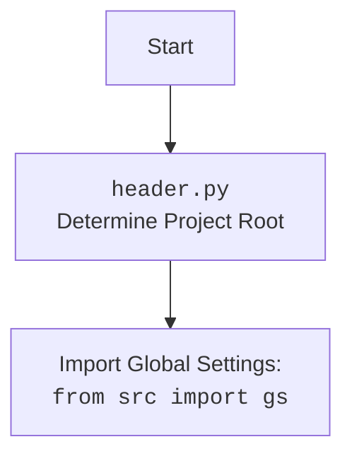

## Анализ кода модуля `src.ai.gemini`

### 1. <алгоритм>

**Блок-схема работы `GoogleGenerativeAI`:**

1.  **Инициализация (`__init__`)**:
    *   Принимает `api_key`, `model_name`, `generation_config`, `system_instruction` и прочие параметры.
    *   Загружает конфигурации из `generative_ai.json` (`config()`).
    *   Устанавливает пути для сохранения логов и истории диалогов.
    *   Инициализирует модель Google Generative AI с заданными параметрами.
    *   **Пример**:
        ```python
        ai = GoogleGenerativeAI(api_key="your_api_key", model_name="gemini-pro", system_instruction="You are helpful assistant.")
        ```

2.  **Начало чата (`_start_chat`)**:
    *   Инициализирует новую сессию чата с пустым списком истории.
    *   **Пример**:
        ```python
        chat_session = ai._start_chat()
        ```

3.  **Сохранение диалога (`_save_dialogue`)**:
    *   Принимает список сообщений диалога.
    *   Добавляет каждое сообщение в текстовый и JSON файлы.
    *   **Пример**:
        ```python
        dialogue = [{"role": "user", "content": "Hello"}, {"role": "model", "content": "Hi!"}]
        ai._save_dialogue(dialogue)
        ```

4.  **Запрос к модели (`ask`)**:
    *   Принимает текстовый запрос `q` и максимальное количество попыток `attempts`.
    *   Выполняет запрос к модели Google Gemini.
    *   В случае ошибки повторяет запрос с экспоненциальным увеличением задержки (backoff).
    *   Сохраняет диалог в файлы истории.
    *   Возвращает текстовый ответ или None в случае неудачи.
    *   **Пример**:
        ```python
        response = ai.ask("What is the capital of France?")
        print(response)  # Выведет ответ или None
        ```

5.  **Чат с моделью (`chat`)**:
    *   Принимает текстовое сообщение `q`.
    *   Использует чат-сессию, инициализированную `_start_chat`.
    *   Выполняет запрос к модели Gemini и получает ответ.
    *   Возвращает текстовый ответ или сообщение об ошибке.
    *   **Пример**:
        ```python
        response = ai.chat("How are you?")
        print(response) # Выведет ответ или ошибку
        ```

6.  **Описание изображения (`describe_image`)**:
    *   Принимает путь к изображению `image_path`.
    *   Кодирует изображение в base64.
    *   Отправляет изображение в модель для текстового описания.
    *   Возвращает описание или None в случае ошибки.
    *   **Пример**:
        ```python
        description = ai.describe_image(Path("path/to/image.jpg"))
        print(description) # Выведет описание или None
        ```

7.  **Загрузка файла (`upload_file`)**:
    *   Принимает путь к файлу `file` или объект файла `IOBase` и имя файла `file_name`.
    *   Загружает файл в модель.
    *   Возвращает `True` в случае успеха или `False` в случае неудачи.
    *   **Пример**:
        ```python
        success = ai.upload_file("path/to/document.pdf", file_name="document.pdf")
        if success:
            print("File uploaded successfully")
        else:
             print("Error uploading the file")
        ```

### 2. <mermaid>

```mermaid
flowchart TD
    Start[Start] --> Init[<code>__init__</code><br>Initialize GoogleGenerativeAI]
    Init --> Config[<code>config()</code><br>Load Configurations from JSON]
    Config --> SetPaths[Set Logging and History Paths]
    SetPaths --> InitModel[Initialize Google Generative AI Model]
    InitModel --> StartChat[<code>_start_chat()</code><br>Start Chat Session]
    StartChat --> SaveDialogue[<code>_save_dialogue()</code><br>Save Dialogue to Files]
    SaveDialogue --> Ask[<code>ask()</code><br>Send Query to AI Model]
    Ask --> Chat[<code>chat()</code><br>Send Chat Message to AI Model]
    Chat --> DescribeImage[<code>describe_image()</code><br>Generate Textual Description of Image]
    DescribeImage --> UploadFile[<code>upload_file()</code><br>Upload File to AI Model]
    UploadFile --> End[End]

    style Start fill:#f9f,stroke:#333,stroke-width:2px
    style End fill:#ccf,stroke:#333,stroke-width:2px
```

**Зависимости (импорт) в `mermaid`:**

1.  **`Start`**: Начало процесса.
2.  **`Init`**: Инициализация класса `GoogleGenerativeAI`.
3.  **`Config`**: Загрузка конфигурации из JSON файла.
4.  **`SetPaths`**: Установка путей для логов и истории.
5.  **`InitModel`**: Инициализация модели Google Generative AI.
6.  **`StartChat`**: Инициализация чат-сессии.
7.  **`SaveDialogue`**: Сохранение истории диалогов.
8.  **`Ask`**: Запрос к модели и получение ответа.
9.  **`Chat`**: Отправка сообщения в чат и получение ответа.
10. **`DescribeImage`**: Получение текстового описания изображения.
11. **`UploadFile`**: Загрузка файла в модель.
12. **`End`**: Завершение процесса.



### 3. <объяснение>

**Импорты:**

*   `google.generativeai`: Основной пакет для работы с Google Generative AI API.
*   `requests`: Библиотека для отправки HTTP-запросов, используется внутри `google.generativeai`.
*   `grpc`: Библиотека для создания RPC-клиентов и серверов, используется Google Generative AI API для связи.
*   `google.api_core.exceptions`: Пакет для обработки исключений от Google API.
*   `google.auth.exceptions`: Пакет для обработки исключений, связанных с аутентификацией Google.
*   `src.logger`: Кастомный модуль для логирования событий.
*   `src.utils.printer`: Кастомный модуль для форматированного вывода в консоль.
*   `src.utils.file`: Кастомный модуль для работы с файлами.
*   `src.utils.date_time`: Кастомный модуль для работы с датой и временем.
*   `src.utils.convertors.unicode`: Кастомный модуль для работы с unicode.
*   `src.utils.jjson`: Кастомный модуль для работы с JSON файлами.

**Классы:**

*   `GoogleGenerativeAI`:
    *   **Роль**: Инкапсулирует всю логику взаимодействия с Google Generative AI.
    *   **Атрибуты**:
        *   `api_key`: Ключ API для доступа к сервису.
        *   `model_name`: Название используемой модели (например, "gemini-pro").
        *   `generation_config`: Конфигурации генерации текста.
        *   `system_instruction`: Инструкции для модели.
        *   `log_path`, `dialogue_text_path`, `dialogue_json_path`: Пути для логов и истории.
        *   `model`: Объект модели Google Generative AI.
        *   `chat`: Объект сессии чата.
    *   **Методы**: `__init__`, `config`, `_start_chat`, `_save_dialogue`, `ask`, `chat`, `describe_image`, `upload_file`.
    *   **Взаимодействие**:
        *   Использует `google.generativeai` для доступа к моделям.
        *   Использует `src.logger` для логирования.
        *   Использует `src.utils.file` для сохранения данных.
        *   Использует `src.utils.jjson` для работы с JSON.
        *   Использует `src.utils.date_time` для работы со временем.
        *   Использует `src.utils.printer` для вывода в консоль.
        *   Использует `src.utils.convertors.unicode` для преобразования unicode.

**Функции:**

*   `__init__(self, api_key: str, model_name: Optional[str] = None, generation_config: Optional[Dict] = None, system_instruction: Optional[str] = None, **kwargs)`
    *   **Аргументы**:
        *   `api_key`: Ключ API Google Generative AI.
        *   `model_name`: Название модели.
        *   `generation_config`: Конфигурации генерации.
        *   `system_instruction`: Системные инструкции.
        *   `**kwargs`: Дополнительные аргументы.
    *   **Возвращает**: `None`.
    *   **Назначение**: Инициализация экземпляра класса, настройка параметров и установка соединения с AI API.
*   `config()`
    *   **Аргументы**: `None`.
    *   **Возвращает**: Конфигурации из файла `generative_ai.json`.
    *   **Назначение**: Загружает конфигурацию из файла.
*   `_start_chat(self)`
    *   **Аргументы**: `None`.
    *   **Возвращает**: Объект сессии чата Google Generative AI.
    *   **Назначение**: Инициализирует сессию чата.
*   `_save_dialogue(self, dialogue: list)`
    *   **Аргументы**:
        *   `dialogue`: Список словарей сообщений диалога.
    *   **Возвращает**: `None`.
    *   **Назначение**: Сохранение диалога в текстовый и JSON форматы.
*   `ask(self, q: str, attempts: int = 15) -> Optional[str]`
    *   **Аргументы**:
        *   `q`: Текст запроса.
        *   `attempts`: Максимальное количество попыток (по умолчанию 15).
    *   **Возвращает**: Текстовый ответ от модели или `None` в случае ошибки.
    *   **Назначение**: Отправляет текстовый запрос и обрабатывает ответ с retry логикой.
*   `chat(self, q: str) -> str`
    *   **Аргументы**:
        *   `q`: Текст сообщения чата.
    *   **Возвращает**: Текстовый ответ от модели.
    *   **Назначение**: Отправляет сообщение в чат-сессию.
*   `describe_image(self, image_path: Path) -> Optional[str]`
    *   **Аргументы**:
        *   `image_path`: Путь к файлу изображения.
    *   **Возвращает**: Текстовое описание изображения или `None` в случае ошибки.
    *   **Назначение**: Описывает изображение с помощью AI.
*   `upload_file(self, file: str | Path | IOBase, file_name: Optional[str] = None) -> bool`
    *   **Аргументы**:
        *   `file`: Путь к файлу, объект файла или файловый путь.
        *   `file_name`: Имя файла (опционально).
    *   **Возвращает**: `True`, если загрузка успешна, `False` в противном случае.
    *   **Назначение**: Загружает файл в модель.

**Переменные:**

*   `api_key` (str): Ключ API для доступа к Google Generative AI.
*   `model_name` (str): Название используемой модели.
*   `generation_config` (dict): Конфигурации для генерации текста.
*   `system_instruction` (str): Системные инструкции для модели.
*   `log_path` (Path): Путь к файлу логов.
*   `dialogue_text_path` (Path): Путь к файлу истории диалогов в текстовом формате.
*   `dialogue_json_path` (Path): Путь к файлу истории диалогов в JSON формате.
*   `model`: Объект модели Google Generative AI.
*   `chat`: Объект сессии чата.

**Потенциальные ошибки и области для улучшения:**

*   **Отсутствие асинхронности:** Код выполняется синхронно, что может замедлить выполнение, особенно при запросах к API. Рассмотреть возможность использования асинхронных операций для повышения производительности.
*   **Обработка ошибок:** Хотя в коде есть обработки ошибок, возможно усовершенствовать логику retry и добавить более детальную обработку ошибок (например, разные типы ошибок должны обрабатываться по-разному).
*   **Конфигурация:** Конфигурации сейчас загружаются из файла JSON, но можно сделать более гибкую систему конфигурации (например, с использованием переменных окружения).
*   **Тестирование:** Необходимо добавить больше unit-тестов для обеспечения надежности работы кода, особенно для обработки ошибок и edge cases.

**Цепочка взаимосвязей с другими частями проекта:**

*   Модуль `src.ai.gemini` зависит от `src.logger` для логирования, от `src.utils.file`, `src.utils.jjson`, `src.utils.date_time` и `src.utils.printer` для различных утилит, а также от `src.utils.convertors.unicode` для обработки unicode.
*   Этот модуль может использоваться другими частями проекта для доступа к Google Generative AI для различных задач, например, генерация текста, чат-боты, анализ изображений и загрузка файлов.
*   Модуль `src.ai.gemini` также зависит от `header.py`, который определяет корневую директорию проекта и загружает глобальные настройки `from src import gs`.
*   В целом, `GoogleGenerativeAI` является ключевым модулем для интеграции AI в проект.