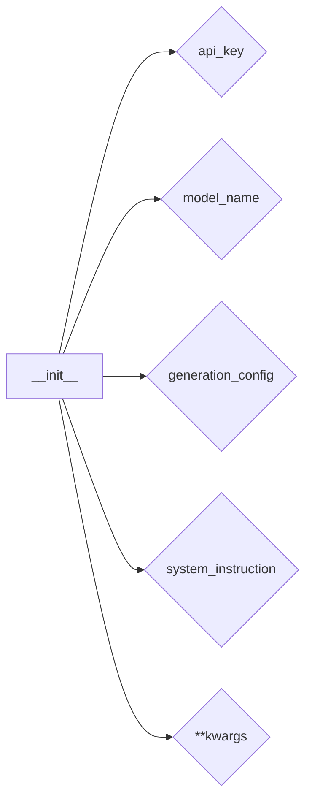

# Анализ кода класса `gemini`

## <input code>

```python
    def __init__(self, 
                 api_key: str, 
                 model_name: Optional[str] = None, 
                 generation_config: Optional[Dict] = None, 
                 system_instruction: Optional[str] = None, 
                 **kwargs):
        ...
```

## <algorithm>

Алгоритм работы `__init__`-метода класса `gemini` в данном случае не представлен. Код лишь демонстрирует сигнатуру метода.  На основе сигнатуры можно сделать вывод о том, как данные будут обрабатываться в методе. 

Пошаговая блок-схема невозможна, так как код не содержит логики.


## <mermaid>



## <explanation>

**Импорты:**

Код не содержит импортов, но сигнатура метода `__init__` предполагает, что `Optional`, `Dict`, и `str` импортированы из стандартной библиотеки Python. Эти типы данных задают ожидаемые типы данных для аргументов метода. 


**Классы:**

Код показывает фрагмент определения класса `gemini`.  Сигнатура метода `__init__` указывает на то, что класс `gemini` принимает в качестве аргументов параметры инициализации.


**Функции:**

* **`__init__`**: Это метод конструктор класса `gemini`. Он принимает в качестве параметров:
    * `api_key: str`: Ключ API для доступа к модели.
    * `model_name: Optional[str] = None`: Имя модели (возможно, необязательный параметр).
    * `generation_config: Optional[Dict] = None`: Настройки генерации (возможно, необязательный параметр).
    * `system_instruction: Optional[str] = None`: Системная инструкция, передаваемая модели.
    * `**kwargs`: Любые дополнительные параметры.

**Переменные:**

В данном примере переменные - это параметры конструктора класса `gemini`.  Они используются для настройки объекта `gemini`.


**Возможные ошибки или области для улучшений:**

* **Отсутствует реализация логики:** Не определены действия внутри `__init__`, что необходимо для инициализации объекта класса `gemini`.
* **Документация:** Не хватает документации по назначению параметров `generation_config` и `**kwargs`.
* **Проверка входных данных:** Не определено, как обрабатываются ошибки, если `api_key` имеет неверный формат или если в `generation_config` переданы неправильные значения.


**Взаимосвязи с другими частями проекта:**

Этот код, вероятно, часть проекта, использующего модели машинного обучения, подобные Gemini. Связь с другими частями проекта осуществляется через аргументы `api_key`, `model_name`, `generation_config`, `system_instruction` и `kwargs`.  Эти аргументы необходимы для взаимодействия с сервисами, предоставляющими доступ к модели Gemini.  Например, `api_key` требуется для аутентификации, `model_name`  для выбора нужной модели, а `system_instruction` определяет контекст работы модели.  Файлы инструкций (`instruction_doc_writer_html_en.md`, etc.), упомянутые в тексте, указывают на хранение информации, которая будет использоваться для настройки модели.  src/ai/prompts — хранилище глобальных инструкций, а src.endpoints содержит описание API-путей для доступа к модели.

```