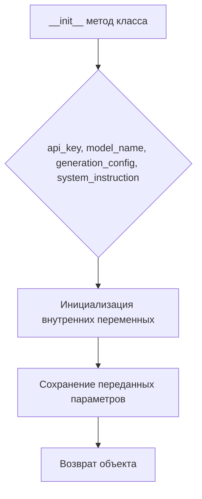
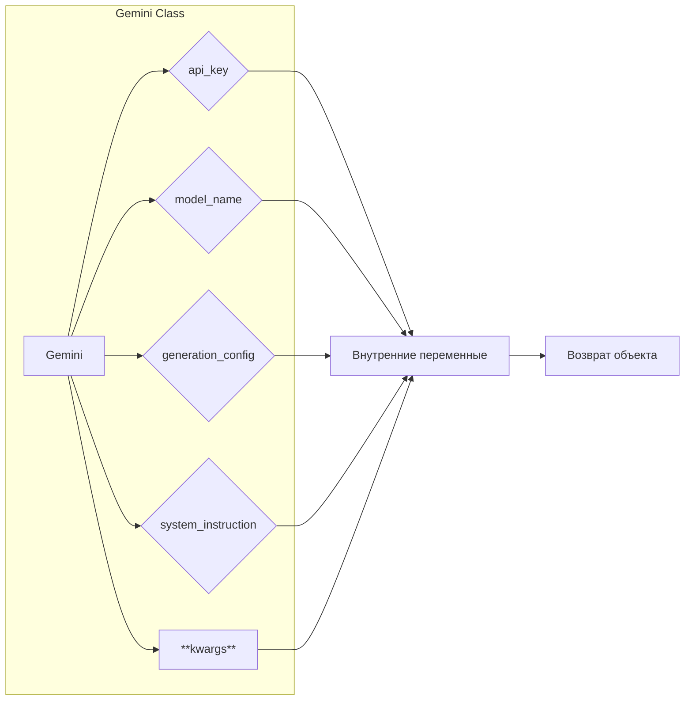

# <input code>

```python
    def __init__(self, 
                 api_key: str, 
                 model_name: Optional[str] = None, 
                 generation_config: Optional[Dict] = None, 
                 system_instruction: Optional[str] = None, 
                 **kwargs):
        
        ...
```

# <algorithm>

Простая блок-схема:



**Пример:**

Если вызов `__init__` выглядит так:

```python
gemini_model = Gemini(api_key="YOUR_API_KEY", system_instruction="Предоставьте краткий ответ")
```

то блок `B` получит значения `YOUR_API_KEY` для `api_key` и `"Предоставьте краткий ответ"` для `system_instruction`.  Блок `D` сохранит эти значения как атрибуты объекта `gemini_model`.


# <mermaid>



**Объяснение диаграммы:**

Диаграмма показывает, что класс `Gemini` принимает несколько параметров: `api_key`, `model_name`, `generation_config`, `system_instruction` и дополнительные параметры `**kwargs`.  Эти параметры сохраняются во внутренних переменных класса `Gemini`, которые используются в дальнейшем для работы с моделью.  Функция `__init__` возвращает экземпляр класса `Gemini`.


# <explanation>

**Импорты:**

Код не содержит импортов.  Он показывает только часть метода `__init__` класса `Gemini` (из модели `gemini`).  Для понимания полной функциональности необходимо посмотреть весь класс и другие связанные части кодовой базы (`src.endpoints`, `src.ai.prompts`, etc.).


**Классы:**

Класс `Gemini` отвечает за инициализацию модели.  Метод `__init__` является конструктором класса, принимающим различные параметры для настройки модели.

**Функции:**

Метод `__init__` — это ключевой метод, который принимает параметры инициализации.  Его  аргументы:
* `api_key: str` — ключ доступа к API.
* `model_name: Optional[str] = None` — название модели (опционально).
* `generation_config: Optional[Dict] = None` — параметры генерации (опционально).
* `system_instruction: Optional[str] = None` — системная инструкция (опционально).
* `**kwargs` — дополнительные параметры.

Метод `__init__` не возвращает значение явно, но неявно возвращает созданный экземпляр класса `Gemini`.

**Переменные:**

В данном фрагменте кода определены параметры (`api_key`, `model_name`, `generation_config`, `system_instruction`, `**kwargs`). Их типы указаны аннотациями (`str`, `Optional[str]`, `Optional[Dict]`).  Они используются для инициализации внутренних атрибутов объекта.

**Возможные ошибки и улучшения:**

* **Недостающая реализация:**  Код показывает лишь сигнатуру метода `__init__`. Для полной функциональности необходимо посмотреть реализацию внутри `...`, которая должна инициализировать необходимые внутренние переменные и, возможно, выполнять дополнительные проверки параметров.
* **Нет валидации параметров:**  Важно добавить проверку валидности параметров (`api_key`, `system_instruction` и т.д.).
* **Отсутствие связи с другими частями проекта:** Для понимания полной картины нужно увидеть, как `Gemini` взаимодействует с другими частями проекта (например, с API).


**Цепочка взаимосвязей:**

* `Gemini` получает `api_key` и `system_instruction`, вероятно, из конфигурационных файлов или из переменных окружения.
* `Gemini` (или его подкласс) взаимодействует с внешним API для запуска запросов к модели.
* `Gemini` использует `system_instruction` и другие параметры в запросах к модели.
* `system_instruction` и `instruction` находятся в `src/ai/prompts` (для глобальных), а инструкции для конкретных запросов в `instruction` у клиента.

Для более полного анализа необходим код остальных классов и функций.