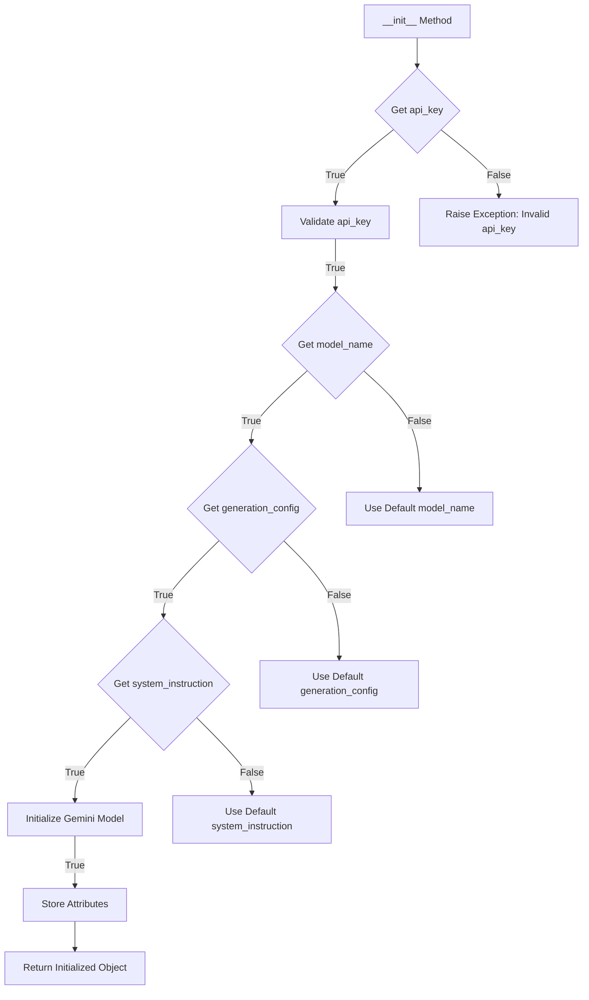
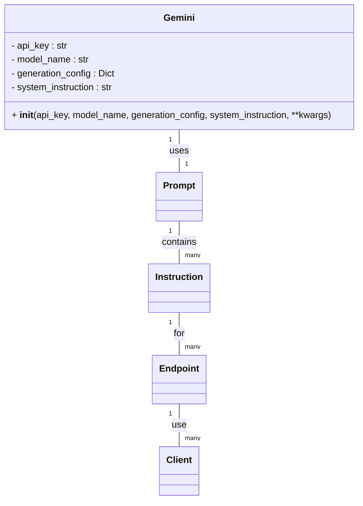

# <input code>

```python
    def __init__(self, 
                 api_key: str, 
                 model_name: Optional[str] = None, 
                 generation_config: Optional[Dict] = None, 
                 system_instruction: Optional[str] = None, 
                 **kwargs):
        
                 ...
```

# <algorithm>



Пример: Если `api_key` не валиден, метод `__init__` генерирует исключение. Если `model_name` не предоставлен, используется значение по умолчанию.

# <mermaid>



# <explanation>

**Импорты:**

Код демонстрирует фрагмент класса `Gemini` из библиотеки `generative-ai-python`.  Прямых импортов в данном фрагменте нет, но по описанию можно предположить наличие импортов для типов данных `str`, `Optional`, `Dict` из стандартного пакета Python, а также, вероятно, для API ключей и параметров конфигурации.  Сама библиотека `generative-ai-python` находится в `src`, и предположительно, содержит классы, необходимые для взаимодействия с моделями обработки естественного языка (например, `google.generativeai`).

**Классы:**

Класс `Gemini` (судя по коду и документации) представляет собой объект модели Gemini. Он принимает параметры для инициализации: `api_key`, `model_name`, `generation_config`, и `system_instruction`.  Эти параметры хранятся как атрибуты объекта.  Возможные `kwargs`  позволяют добавлять дополнительные параметры.  Ключевым элементом является `system_instruction`, который задаёт общую задачу модели на всё время её существования.

**Функции:**

Функция `__init__` — конструктор класса. Она принимает на вход различные параметры, валидирует их, и инициализирует объект `Gemini`. По описанию она, вероятно, устанавливает конфигурацию модели и необходимые данные для коммуникации с API.

**Переменные:**

`api_key`: Строка, содержащая API ключ для доступа к модели.
`model_name`: Название модели.
`generation_config`: Словарь, содержащий дополнительные параметры генерации.
`system_instruction`: Строка, содержащая системную инструкцию.

**Возможные ошибки и улучшения:**

- Отсутствует валидация `api_key`, `model_name`, `generation_config` и `system_instruction` на корректность. В реальной реализации должны быть проверки типов и допустимых значений для этих параметров.
- Не указаны значения по умолчанию для параметров. Должны быть указаны значения по умолчанию (например, для `model_name`).
- Не хватает обработки исключений. В `__init__` не предусмотрено  обработка ситуаций, когда параметры некорректны.
- Не показаны действия внутри `...`. В реальности код внутри `...` должен содержать инициализацию самой модели, подключаемый к API ключ.

**Взаимосвязи с другими частями проекта:**

* **`src.ai.prompts`**: Хранит глобальные инструкции для модели, которые применяются к каждому запросу.
* **`instruction`**: Клиентские директории с инструкциями, специфичными для различных задач.
* **`src.endpoints`**: Содержит конфигурацию или методы для взаимодействия с клиентами.

Взаимосвязи предполагают, что инструкция задаёт контекст для дальнейшей работы модели. Клиенты предоставляют свои инструкции, которые могут дополнять или изменять глобальные инструкции из папки `prompts`. Взаимодействие с `endpoints` позволяет организовывать запросы к модели.