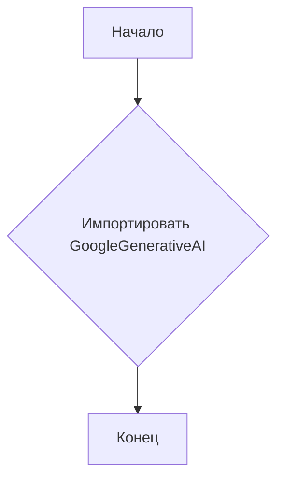
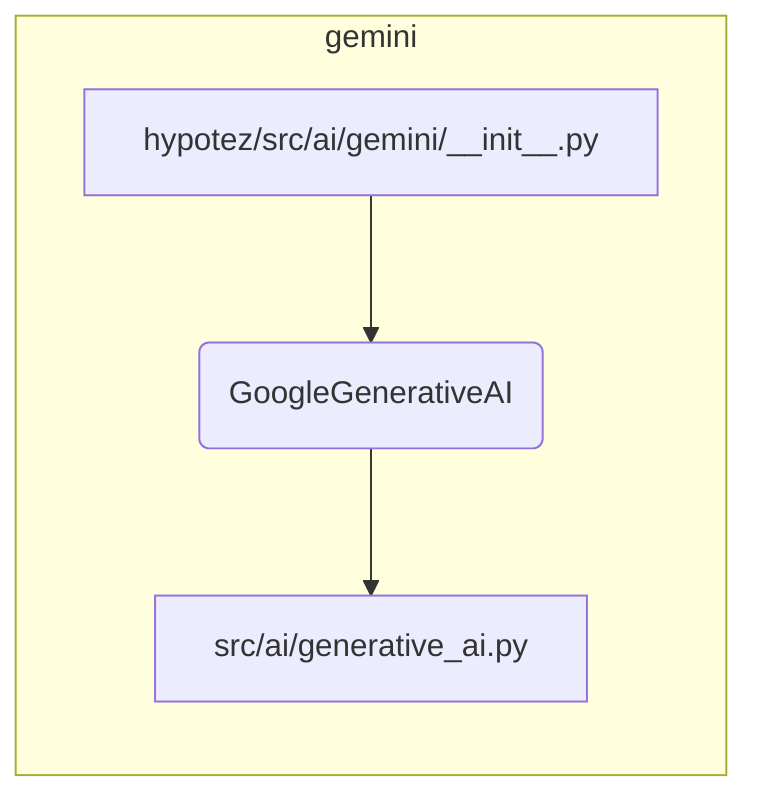

```MD
# Анализ файла hypotez/src/ai/gemini/__init__.py

1. **<input code>**:

```python
## \file hypotez/src/ai/gemini/__init__.py
# -*- coding: utf-8 -*-\
#! venv/Scripts/python.exe
#! venv/bin/python/python3.12

"""
.. module: src.ai.gemini 
	:platform: Windows, Unix
	:synopsis: Модуль модели `gemini`

"""
MODE = 'dev'


from .generative_ai import GoogleGenerativeAI
```

2. **<algorithm>**:

Этот файл является инициализатором модуля `gemini`.  В данном случае, он просто импортирует класс `GoogleGenerativeAI` из подмодуля `generative_ai`.  Алгоритм работы состоит из одной операции - импорта.  Нет циклов, условных операторов и сложных вычислений.

**Блок-схема:**



**Пример:**

В данном случае,  нет конкретных входных данных или выходов.  Это просто определение, что в `gemini`  есть класс `GoogleGenerativeAI`.

3. **<mermaid>**:



**Объяснение диаграммы:**

Диаграмма показывает, что файл `__init__.py` импортирует класс `GoogleGenerativeAI` из модуля `generative_ai`, который расположен в папке `src/ai`.  Отсюда, видно, что есть зависимость от файла `generative_ai.py` внутри пакета `ai`.

4. **<explanation>**:

* **Импорты**:
    - `from .generative_ai import GoogleGenerativeAI`:  Этот импорт позволяет использовать класс `GoogleGenerativeAI` из подмодуля `generative_ai` внутри текущего модуля `gemini`.  Значок `.` указывает, что модуль `generative_ai` находится в той же директории, что и `__init__.py`. Это ключевой момент для организации модулей в проекте.

* **Классы**:
    - `GoogleGenerativeAI`: Этот класс, определённый в модуле `generative_ai.py`, скорее всего, представляет собой интерфейс для взаимодействия с API Google AI или какой-либо другой генеративной моделью.  Без доступа к `generative_ai.py`, детальное описание невозможно.

* **Функции**:
    - Нет явных функций в этом файле.  Функциональность реализуется через методы класса `GoogleGenerativeAI`, которые будут описаны в файле `generative_ai.py`.

* **Переменные**:
    - `MODE = 'dev'`:  Вероятно, эта переменная указывает на режим работы (например, 'dev' – для разработки, 'prod' – для производства).  Она будет использоваться в других частях проекта для настройки поведения приложения.

* **Возможные ошибки или области для улучшений**:
    - Отсутствует проверка существования файла `generative_ai.py`. Если файл отсутствует, произойдёт ошибка импорта.
    - В данном коде нет обработчика ошибок, что может привести к падению приложения, если `generative_ai.py` недоступен.
    - Не указано, как именно будет использоваться  `GoogleGenerativeAI` и где он будет инициализирован.  Необходимо определить, где производится инициализация `GoogleGenerativeAI`.

**Цепочка взаимосвязей**:

Файл `__init__.py` в папке `gemini` зависит от файла `generative_ai.py` в подпапке `generative_ai` этого же проекта.  Этот файл, в свою очередь, скорее всего, взаимодействует с библиотеками Google AI (или другими внешними API). Следовательно, в проект включена зависимость от API Google AI.  Непосредственная цепочка взаимосвязей выходит за рамки анализа одного файла.