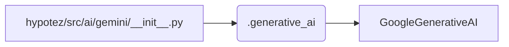

```MD
# <input code>

```python
## \file hypotez/src/ai/gemini/__init__.py
# -*- coding: utf-8 -*-
#! venv/Scripts/python.exe
#! venv/bin/python/python3.12

"""
.. module: src.ai.gemini 
	:platform: Windows, Unix
	:synopsis: Модуль модели `gemini`

"""
MODE = 'dev'


from .generative_ai import GoogleGenerativeAI
```

# <algorithm>

Алгоритм работы данного файла сводится к простому импорту.  В нём нет сложных вычислений или операций.

1. **Импорт:** Файл `hypotez/src/ai/gemini/__init__.py` импортирует класс `GoogleGenerativeAI` из модуля `.generative_ai`.

**Пример:**
```
# Предполагая, что .generative_ai содержит
# class GoogleGenerativeAI:
#     def __init__(self, ...):
#         pass

# Здесь происходит импорт и доступ к классу
# my_ai = GoogleGenerativeAI() 
```

В этом файле нет циклов или условных операторов,  никаких вызовов функций за пределами импорта.

# <mermaid>



**Объяснение диаграммы:**

- `hypotez/src/ai/gemini/__init__.py` -  наш текущий файл.
- `.generative_ai` -  модуль, в котором определен класс `GoogleGenerativeAI`.
- `GoogleGenerativeAI` -  класс, который импортируется в текущий файл.

Диаграмма отражает прямую зависимость: `__init__.py` импортирует `GoogleGenerativeAI` из модуля `.generative_ai`.  Это единственная связь в данном коде.

# <explanation>

**Импорты:**

`from .generative_ai import GoogleGenerativeAI`:  Этот импорт подключает класс `GoogleGenerativeAI` из модуля `generative_ai`, который, скорее всего, находится в той же директории (внутри папки `gemini`). `.` указывает на текущий пакет.


**Классы:**

В данном файле непосредственно нет определенных классов. Импортируется только класс `GoogleGenerativeAI`.  Подробная информация о классе `GoogleGenerativeAI` находится в модуле `.generative_ai`.


**Функции:**

Нет определенных функций в этом файле.

**Переменные:**

`MODE = 'dev'`: Это строковая переменная, которая, вероятно, определяет режим работы системы (например, 'dev' - для разработки, 'prod' - для производства).  Эта переменная используется в других частях приложения для настройки поведения.


**Возможные ошибки или улучшения:**

- **Документация:**  Дополнить описанием переменной `MODE`.
- **Файлы `.generative_ai`:**  Необходимо наличие соответствующего файла `.generative_ai` для корректной работы кода.
- **Использование:** Файл `__init__.py` предназначен для инициализации модуля.  В других частях приложения будет использоваться импортированный класс `GoogleGenerativeAI`.  Без контекста, в каком коде используется `GoogleGenerativeAI`, сложно оценить полное назначение `__init__.py`.


**Взаимосвязи с другими частями проекта:**

Этот модуль (`.generative_ai`) скорее всего предоставляет API для работы с моделью Gemini от Google.  Связь с другими модулями,  выглядит так:

```
+-----------------+    +-----------------+
|   Main App      |    |     .generative_ai     |
+-----------------+    +-----------------+
     |                      ^
     |                      |
     V                      |
     +-------------------+  |
     |       Gemini       |  |
     |      Interface     |  |
     +-------------------+  V
                                     +-----------------+
                                     |   Other modules   |
                                     +-----------------+
```


В главном приложении используется API для общения с моделью Gemini через импортированный класс.  Другие модули, вероятно, будут использовать API (через `GoogleGenerativeAI`), для обработки и/или отображения данных.