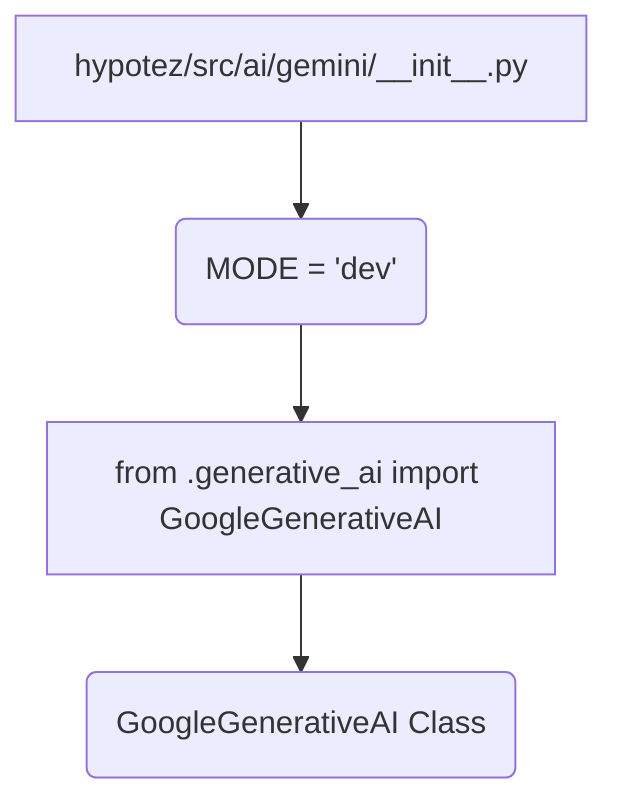

```MD
# Анализ кода hypotez/src/ai/gemini/__init__.py

1. **<input code>**

```python
## \file hypotez/src/ai/gemini/__init__.py
# -*- coding: utf-8 -*-
#! venv/Scripts/python.exe
#! venv/bin/python/python3.12

"""
.. module: src.ai.gemini 
	:platform: Windows, Unix
	:synopsis: Модуль модели `gemini`

"""
MODE = 'dev'


from .generative_ai import GoogleGenerativeAI
```

2. **<algorithm>**

Код представляет собой инициализационную часть модуля `gemini`.  Алгоритм работы очень прост - он импортирует класс `GoogleGenerativeAI` из подмодуля `generative_ai`.  Пошаговая блок-схема тривиальна:

1. **Импорт:** Модуль `generative_ai` импортируется в текущий модуль.
2. **Инициализация:**  Переменной `MODE` присваивается значение 'dev'.

**Примеры данных:**

* **MODE:** `'dev'` (строка)


3. **<mermaid>**



**Описание зависимостей:**

* `hypotez/src/ai/gemini/__init__.py`  зависит от `hypotez/src/ai/gemini/generative_ai.py` (из-за импорта `GoogleGenerativeAI`).  Это означает, что для корректной работы `__init__.py` необходим корректный импортируемый файл `generative_ai.py`, который вероятно определяет `GoogleGenerativeAI`.


4. **<explanation>**

* **Импорты:**  `from .generative_ai import GoogleGenerativeAI` — импортирует класс `GoogleGenerativeAI` из подмодуля `generative_ai`, который находится в той же директории (`./`).  Это типичный импорт модуля внутри текущей директории.  Строка `# -*- coding: utf-8 -*-` указывает на использование кодировки UTF-8 в файле. `#!` строки (shebang) указывают на исполняемый интерпретатор Python, который используется для запуска скрипта. Они важны для работы на Unix-подобных системах.
* **Переменные:** `MODE = 'dev'` - глобальная переменная, которая вероятно используется для определения режима работы (например, 'dev', 'prod').
* **Классы:**  `GoogleGenerativeAI` — это класс, который, предположительно, реализует интерфейс для работы с моделью Gemini от Google.  Более подробная информация о классе доступна в файле `generative_ai.py`.
* **Функции:**  В данном `__init__.py` нет определенных функций, только импорт класса и инициализация переменной.
* **Возможные ошибки/улучшения:**
    * Нет явного определения использования переменной `MODE`.
    *  Файл `generative_ai.py`  не представлен, что затрудняет полное понимание функциональности и возможных ошибок.
    * Не указано, как и где используется переменная `MODE`, что делает ее потенциально бесполезной.  Лучше бы было использовать конфигурационные файлы или анотации для определений.
    * Неочевидно, как `MODE` влияет на выполнение кода.


**Связь с другими частями проекта:**

Этот файл является частью модуля `gemini`  и, вероятно, используется другими частями проекта, которые взаимодействуют с API Gemini.  Для полной оценки связи необходим анализ остальной части проекта.