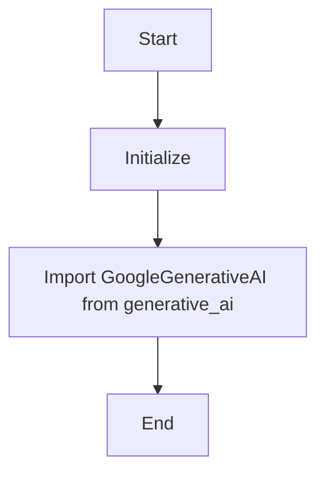

## Анализ кода `hypotez/src/ai/gemini/__init__.py`

### <алгоритм>
1. **Инициализация переменной `MODE`:**
   - Присваиваем строковое значение `'dev'` переменной `MODE`.
   - Пример: `` означает, что модуль находится в режиме разработки.
2. **Импорт класса `GoogleGenerativeAI`:**
   - Импортируем класс `GoogleGenerativeAI` из модуля `generative_ai`, расположенного в текущем пакете.
   - Пример: `from .generative_ai import GoogleGenerativeAI` позволяет использовать функциональность класса `GoogleGenerativeAI`.
3. **Конец модуля:**
   - Завершаем выполнение кода в файле `__init__.py`.

### <mermaid>

### <объяснение>
**Импорты:**
- `from .generative_ai import GoogleGenerativeAI`: 
    - Импортирует класс `GoogleGenerativeAI` из модуля `generative_ai`, расположенного в том же пакете (`src.ai.gemini`).
    - Это означает, что класс `GoogleGenerativeAI` доступен для использования в данном модуле и может быть использован для создания экземпляров, которые в свою очередь будут взаимодействовать с API Google Gemini.
    - `.` в `from .generative_ai` означает, что поиск `generative_ai` происходит в текущем пакете.
- **Взаимосвязь с пакетами `src`**: Этот импорт связывает данный модуль с другими модулями в том же пакете, позволяя использовать функциональность `GoogleGenerativeAI` для работы с моделью `gemini`.

**Переменные:**
- `MODE`:
    - Строковая переменная.
    - Значение по умолчанию `'dev'` указывает на режим разработки.
    - Может использоваться для определения настроек, которые будут загружаться в зависимости от режима работы программы. Например, в production может быть `MODE='prod'`.

**Классы:**
- `GoogleGenerativeAI`:
    - Импортируется, но не используется напрямую в этом файле.
    - Ожидается, что класс реализует функциональность для взаимодействия с API Google Gemini.
    - Атрибуты и методы, скорее всего, будут связаны с отправкой запросов и обработкой ответов от API Gemini.

**Функции:**
- Отсутствуют функции в этом файле, поскольку основная его цель - импорт и инициализация.

**Потенциальные улучшения и ошибки:**
- **Отсутствие описания класса:** Желательно добавить docstring к классу `GoogleGenerativeAI` с описанием его атрибутов, методов и предназначения.
- **Использование `MODE`:** Хорошей практикой является использование переменной `MODE` для загрузки настроек, которые зависят от режима работы программы (dev, test, prod и т.д.).
- **Обработка ошибок импорта:** Если импорт не удаётся, например из-за отсутствия модуля `generative_ai`, то следует предусмотреть обработку `ImportError`.

**Цепочка взаимосвязей:**
- Этот файл `__init__.py` является точкой входа для пакета `src.ai.gemini`, т.е. при импорте пакета `from src.ai import gemini`  будет запущен этот скрипт.
- Модуль зависит от `src.ai.gemini.generative_ai`, где реализуется логика работы с Google Gemini. 
- Дальнейшее взаимодействие будет зависеть от того, где именно и как используется импортированный класс `GoogleGenerativeAI`.