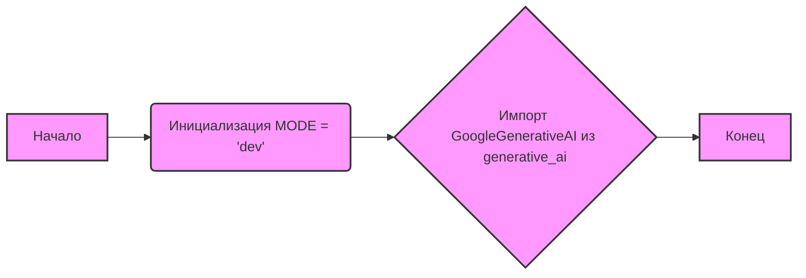

## Анализ кода `hypotez/src/ai/gemini/__init__.py`

### <алгоритм>

1. **Начало**: Запуск интерпретатора Python.
2. **Инициализация `MODE`**: Устанавливается глобальная переменная `MODE` в значение `'dev'`.
3. **Импорт `GoogleGenerativeAI`**: Импортируется класс `GoogleGenerativeAI` из модуля `generative_ai`, находящегося в том же пакете `src.ai.gemini`.
4. **Конец**: Завершение выполнения модуля.

**Пример:**
- `MODE = 'dev'`: Установка режима работы модуля в 'dev', что может влиять на поведение при разработке.
- `from .generative_ai import GoogleGenerativeAI`: Импорт класса, позволяющего взаимодействовать с моделью Google Gemini.

### <mermaid>

**Описание зависимостей Mermaid:**

- **Начало (A)**: Начальная точка выполнения скрипта.
- **Инициализация MODE (B)**: Присваивание строкового значения 'dev' переменной `MODE`.
- **Импорт GoogleGenerativeAI (C)**: Импорт класса `GoogleGenerativeAI` из модуля `generative_ai` для использования в проекте.
- **Конец (D)**: Конечная точка выполнения скрипта.

### <объяснение>

#### Импорты

-   `from .generative_ai import GoogleGenerativeAI`:
    -   **Назначение**: Импортирует класс `GoogleGenerativeAI` из модуля `generative_ai`, который находится в той же директории (`.`) и пакете `src.ai.gemini`.
    -   **Взаимосвязь**: `GoogleGenerativeAI` предположительно предназначен для работы с API Google Gemini и предоставляет методы для генерации текста и других задач, связанных с ИИ. Этот импорт делает этот класс доступным для использования в других частях пакета `src.ai.gemini`.

#### Классы

-   В текущем файле нет классов, но упоминается класс `GoogleGenerativeAI`, импортируемый из модуля `generative_ai`.

#### Функции
- В текущем файле нет функций.

#### Переменные

-   `MODE`:
    -   **Тип**: Строка.
    -   **Использование**: Устанавливает режим работы модуля. В данном случае установлен режим `'dev'`, что может сигнализировать о том, что модуль находится в стадии разработки.

#### Потенциальные ошибки и области для улучшения

- **Отсутствие обработки ошибок**: В коде нет обработки исключений. Это может привести к неожиданным сбоям, если импорт `GoogleGenerativeAI` не удастся.
- **Магические строки**: Использование строки `'dev'` для режима работы может быть не очень гибким. Рассмотрите возможность использования перечисления (Enum) для управления режимами.
- **Отсутствие docstring для модуля**: Хотя есть docstring в начале файла, он содержит только информацию о модуле и платформе. Было бы полезно добавить более подробное описание его функциональности и назначения.

#### Цепочка взаимосвязей

1.  **`hypotez/src/ai/gemini/__init__.py`**: Инициирует работу с моделью Gemini, импортируя `GoogleGenerativeAI`.
2.  **`hypotez/src/ai/gemini/generative_ai.py`** (предполагаемый файл):  Содержит класс `GoogleGenerativeAI`, который взаимодействует с API Gemini, используя сторонние библиотеки (например, `google-generativeai`) для генерации ответов, а также может использовать запросы из  `hypotez/src/api/prompt.py` для формирования запросов.
3. **`hypotez/src/api/prompt.py`**: Содержит класс `Prompt` для создания промптов, которые используются для генерации контента, и эти промпты могут быть использованы для  `GoogleGenerativeAI`.
4.  **Дальнейшие части проекта**: Могут использовать `GoogleGenerativeAI` для различных задач, таких как генерация ответов, текста, анализ и т.д.