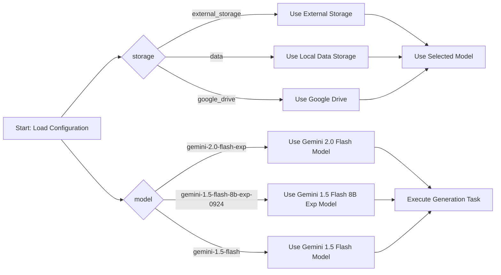

## АНАЛИЗ КОДА: `hypotez/src/ai/gemini/generative_ai.json`

### 1. **<алгоритм>**

Данный JSON файл представляет собой конфигурацию. В нем заданы параметры для работы с генеративной моделью Gemini.

1.  **`storage`**: определяет, какое хранилище будет использоваться. Возможные варианты: `external_storage`, `data`, `google_drive`.
    *   **Пример**: `storage: "external_storage"` – означает, что внешнее хранилище будет использоваться для хранения и загрузки данных.
2.  **`storage_choices`**: массив, содержащий все допустимые варианты хранилища.
    *   **Пример**: `storage_choices: ["external_storage", "data", "google_drive"]` -  показывает, что пользователь может выбрать один из трех вариантов.
3.  **`model`**: определяет используемую генеративную модель Gemini.
    *   **Пример**: `model: "gemini-2.0-flash-exp"` – указывает, что будет использоваться модель `gemini-2.0-flash-exp`.
4.  **`model_choices`**: массив, содержащий все доступные варианты модели.
    *   **Пример**: `model_choices: ["gemini-2.0-flash-exp", "gemini-1.5-flash-8b-exp-0924", "gemini-1.5-flash"]` - показывает, что можно выбрать одну из трех моделей.

Взаимодействия между этими параметрами не происходит, они представляют собой независимые настройки, которые будут использованы при инициализации и работе системы генерации текста.

### 2. **<mermaid>**

**Описание диаграммы:**

1.  **`Start: Load Configuration`**: Начальная точка процесса, когда конфигурация загружается из файла JSON.
2.  **`storage`**: Проверяется параметр `storage` в конфигурации.
    *   **`external_storage`**: Если выбрано внешнее хранилище, то выполняется действие "Use External Storage".
    *  **`data`**: Если выбрано локальное хранилище данных, то выполняется действие "Use Local Data Storage".
    *   **`google_drive`**: Если выбрано Google Drive, то выполняется действие "Use Google Drive".
3.  **`model`**: Проверяется параметр `model` в конфигурации.
    *  **`gemini-2.0-flash-exp`**: Если выбрана модель `gemini-2.0-flash-exp`, то выполняется действие "Use Gemini 2.0 Flash Model".
    *   **`gemini-1.5-flash-8b-exp-0924`**: Если выбрана модель `gemini-1.5-flash-8b-exp-0924`, то выполняется действие "Use Gemini 1.5 Flash 8B Exp Model".
    *   **`gemini-1.5-flash`**: Если выбрана модель `gemini-1.5-flash`, то выполняется действие "Use Gemini 1.5 Flash Model".
4.  **`Use Selected Model`**: После выбора хранилища, выбранная модель используется для выполнения генеративной задачи.
5.  **`Execute Generation Task`**: Выполнение задачи генерации текста с использованием выбранных хранилища и модели.

### 3. **<объяснение>**

**Импорты:**
*   В данном фрагменте кода нет импортов. Это файл конфигурации, а не исполняемый код Python.

**Классы:**
*   В данном JSON-файле нет классов. Он предназначен для хранения настроек в формате ключ-значение.

**Функции:**
*   В данном файле нет функций.

**Переменные:**
*   **`storage`** (строка): Определяет, какое хранилище данных будет использоваться (например, "external_storage", "data", "google_drive").
*   **`storage_choices`** (массив строк): Список доступных вариантов хранилища данных.
*   **`model`** (строка): Название используемой модели Gemini (например, "gemini-2.0-flash-exp").
*   **`model_choices`** (массив строк): Список доступных моделей Gemini.

**Объяснение:**

Этот JSON-файл предназначен для конфигурации генеративной модели. Он содержит два основных блока настроек:

1.  **Хранилище данных:**
    *   `storage`: Позволяет выбрать, где хранить данные (например, на внешнем хранилище, локально или в Google Drive).
    *   `storage_choices`: Предоставляет пользователю список доступных вариантов хранилища.

2.  **Модель:**
    *   `model`: Определяет, какую именно модель Gemini использовать для генерации текста.
    *   `model_choices`: Предлагает список доступных моделей для выбора.

Файл `generative_ai.json` используется для настройки параметров, которые будут влиять на поведение системы. Выбор `storage` и `model` позволяет адаптировать работу генеративной модели к конкретным задачам и ресурсам.

**Потенциальные ошибки или области для улучшения:**

*   **Отсутствие валидации**: JSON не гарантирует, что значения параметров будут корректными. Например, значение `storage` может быть установлено в какое-то не предусмотренное значение. Необходимо проводить валидацию этих настроек перед тем, как использовать их в программном коде.
*   **Жестко заданные значения**: В массивах `storage_choices` и `model_choices` значения жестко заданы. Было бы хорошо, если бы была возможность подгружать их динамически.
*   **Отсутствие описания параметров**: Отсутствует описание для чего нужен тот или иной параметр.

**Взаимосвязи с другими частями проекта:**
Этот файл вероятно будет загружаться из Python кода при инициализации системы генерации текста, чтобы получить необходимые настройки. Он будет использоваться в связке с классами или функциями, которые взаимодействуют с выбранным хранилищем и запускают выбранную модель Gemini.