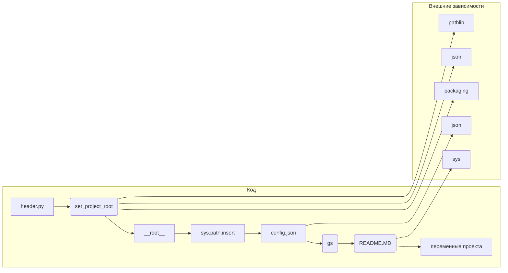

# Анализ кода файла hypotez/src/ai/gemini/header.py

## <input code>

```python
## \file hypotez/src/ai/gemini/header.py
# -*- coding: utf-8 -*-
#! venv/Scripts/python.exe
#! venv/bin/python/python3.12

"""
.. module: src.ai.gemini 
	:platform: Windows, Unix
	:synopsis: Модуль интерфейса с моделью от Coogle - generativeai

"""
MODE = 'dev'


import sys
import json
from packaging.version import Version

from pathlib import Path
def set_project_root(marker_files=('pyproject.toml', 'requirements.txt', '.git')) -> Path:
    """
    Finds the root directory of the project starting from the current file's directory,
    searching upwards and stopping at the first directory containing any of the marker files.

    Args:
        marker_files (tuple): Filenames or directory names to identify the project root.
    
    Returns:
        Path: Path to the root directory if found, otherwise the directory where the script is located.
    """
    __root__:Path
    current_path:Path = Path(__file__).resolve().parent
    __root__ = current_path
    for parent in [current_path] + list(current_path.parents):
        if any((parent / marker).exists() for marker in marker_files):
            __root__ = parent
            break
    if __root__ not in sys.path:
        sys.path.insert(0, str(__root__))
    return __root__


# Get the root directory of the project
__root__ = set_project_root()
"""__root__ (Path): Path to the root directory of the project"""

from src import gs

config:dict = None
try:
    with open(gs.path.root / 'src' / 'config.json', 'r') as f:
        config = json.load(f)
except (FileNotFoundError, json.JSONDecodeError):
    ...

doc_str:str = None
try:
    with open(gs.path.root / 'src' / 'README.MD', 'r') as settings_file:
        doc_str = settings_file.read()
except (FileNotFoundError, json.JSONDecodeError):
    ...


__project_name__ = config.get("project_name", 'hypotez') if config else 'hypotez'
__version__: str = config.get("version", '')  if config else ''
__doc__: str = doc_str if doc_str else ''
__details__: str = ''
__author__: str = config.get("author", '')  if config else ''
__copyright__: str = config.get("copyrihgnt", '')  if config else ''
__cofee__: str = settings.get("cofee", "Treat the developer to a cup of coffee for boosting enthusiasm in development: https://boosty.to/hypo69")  if settings  else "Treat the developer to a cup of coffee for boosting enthusiasm in development: https://boosty.to/hypo69"
```

## <algorithm>

```mermaid
graph TD
    A[Начало] --> B{Найти корневой каталог проекта};
    B -- Да -- C[set_project_root];
    B -- Нет -- D[Использовать текущий каталог];
    C --> E{Проверка наличия файлов};
    E -- Да -- F[__root__ = родительский каталог];
    E -- Нет -- G[Перейти к родительскому каталогу];
    G --> E;
    F --> H[Добавить корневой каталог в sys.path];
    H --> I[__root__ возвращается];
    I --> J[Загрузка конфигурации];
    J --> K{Открыть config.json};
    K -- Файл найден -- L[config = json.load];
    K -- Файл не найден -- L[config = None];
    L --> M[Загрузка документации];
    M --> N{Открыть README.MD};
    N -- Файл найден -- O[doc_str = settings_file.read];
    N -- Файл не найден -- O[doc_str = None];
    O --> P[Инициализация переменных проекта];
    P --> Q[Конец];

    subgraph Подготовка к выполнению
        A --> B;
    end
```

**Пример:**

Если файл `header.py` находится в каталоге `hypotez/src/ai/gemini/`, `set_project_root` найдет корневой каталог `hypotez`.  В этом случае `__root__` будет содержать путь к `hypotez`.

## <mermaid>



**Разъяснение к диаграмме:**

Диаграмма показывает взаимосвязи между основными частями кода в `header.py` и внешними библиотеками.  `set_project_root` использует `pathlib` для работы с путями, `json` для обработки файлов конфигурации и `sys` для манипулирования системным путем. `gs` - это внутренний модуль проекта (предполагается), который вероятно предоставляет доступ к корневому каталогу.


## <explanation>

**Импорты:**

- `sys`: Обеспечивает доступ к системным переменным, включая `sys.path`. Используется для добавления корневого каталога проекта в `sys.path`.
- `json`: Используется для загрузки и сохранения данных в формате JSON (конфигурация проекта).
- `packaging.version`: Вероятно используется для работы с версиями пакетов, но в данном коде не используется явно.
- `pathlib`: Обеспечивает удобный и объектно-ориентированный способ работы с файловыми путями.
- `src.gs`: Внутренний модуль, вероятно, предоставляющий методы для работы с путями к файлам проекта.

**Классы:**

Код не содержит определений классов.

**Функции:**

- `set_project_root(marker_files=...)`: Находит корневой каталог проекта, начиная с текущего файла и ищет файлы указанные в `marker_files`.  Функция возвращает `Path` объекта, представляющего корневой каталог.
    - `marker_files`: кортеж строк, используемых для поиска корневого каталога.  По умолчанию это `pyproject.toml`, `requirements.txt` и `.git`.
    - Возвращаемое значение: `Path` объекта, представляющего корневой каталог проекта.

**Переменные:**

- `MODE`: Строковая константа, вероятно, используемая для обозначения режима работы (`dev`, `prod` и т.д.).
- `__root__`:  Переменная `Path` хранит путь к корневому каталогу проекта, полученный из `set_project_root`.
- `config`: Словарь, содержащий конфигурацию проекта, загруженный из `config.json`.  Может быть `None` в случае ошибки при загрузке.
- `doc_str`: Строка, содержащая содержимое файла `README.MD`, используется для заполнения документации проекта.  Может быть `None` в случае ошибки при загрузке.
- `__project_name__`, `__version__`, `__doc__`, `__details__`, `__author__`, `__copyright__`, `__cofee__`:  Строковые переменные, хранящие информацию о проекте, полученную из `config`. Заполняются значениями из файла конфигурации или имеют значения по умолчанию.


**Возможные ошибки и улучшения:**

- **Обработка ошибок:**  Использование `try...except` блоков для обработки `FileNotFoundError` и `json.JSONDecodeError` - хорошее решение. Но стоит подумать о более подробной информации об ошибках (например, вывести сообщение об ошибке в `stderr` или `logging`).
- **Типы данных:**  В коде явно указываются типы переменных, что хорошо. Можно было бы еще больше использовать аннотации типов.
- **Использование `logging`:** Для отслеживания ошибок и предупреждений стоит использовать `logging` вместо `print` или `...`.
- **Обработка `settings`:**  Переменная `settings` используется для доступа к значению `cofee`, но она не инициализирована, что может привести к ошибке.
- **Документация:**  Документация (внутри строки) в `set_project_root` очень подробная и понятная, но в целом стоит улучшить общую документацию проекта.


**Взаимосвязи с другими частями проекта:**

Код устанавливает путь к корневому каталогу, который вероятно используется другими модулями проекта, особенно при импорте различных пакетов (файлы `config.json` и `README.MD`). `gs` явно указывает на наличие модуля для работы с путями к файлам, что позволит использовать общую логику для получения данных из различных файлов в рамках проекта.