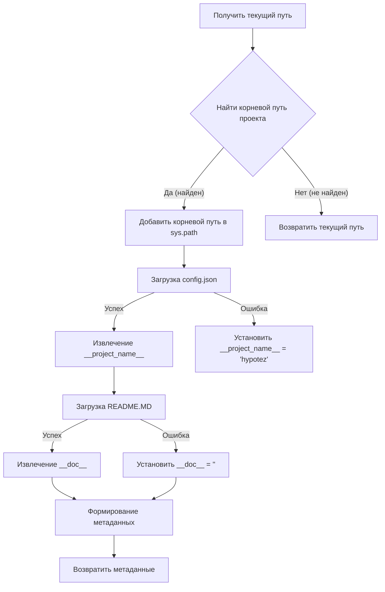
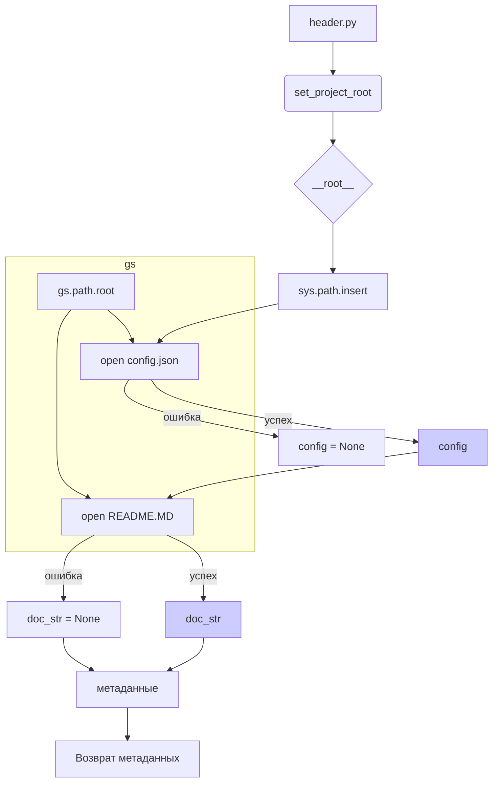

# <input code>

```python
## \file hypotez/src/ai/gemini/header.py
# -*- coding: utf-8 -*-
#! venv/Scripts/python.exe
#! venv/bin/python/python3.12

"""
.. module: src.ai.gemini 
	:platform: Windows, Unix
	:synopsis: Модуль интерфейса с моделью от Coogle - generativeai

"""
MODE = 'dev'


import sys
import json
from packaging.version import Version

from pathlib import Path
def set_project_root(marker_files=('pyproject.toml', 'requirements.txt', '.git')) -> Path:
    """
    Finds the root directory of the project starting from the current file's directory,
    searching upwards and stopping at the first directory containing any of the marker files.

    Args:
        marker_files (tuple): Filenames or directory names to identify the project root.
    
    Returns:
        Path: Path to the root directory if found, otherwise the directory where the script is located.
    """
    __root__:Path
    current_path:Path = Path(__file__).resolve().parent
    __root__ = current_path
    for parent in [current_path] + list(current_path.parents):
        if any((parent / marker).exists() for marker in marker_files):
            __root__ = parent
            break
    if __root__ not in sys.path:
        sys.path.insert(0, str(__root__))
    return __root__


# Get the root directory of the project
__root__ = set_project_root()
"""__root__ (Path): Path to the root directory of the project"""

from src import gs

config:dict = None
try:
    with open(gs.path.root / 'src' /  'config.json', 'r') as f:
        config = json.load(f)
except (FileNotFoundError, json.JSONDecodeError):
    ...

doc_str:str = None
try:
    with open(gs.path.root / 'src' /  'README.MD', 'r') as settings_file:
        doc_str = settings_file.read()
except (FileNotFoundError, json.JSONDecodeError):
    ...


__project_name__ = config.get("project_name", 'hypotez') if config else 'hypotez'
__version__: str = config.get("version", '')  if config else ''
__doc__: str = doc_str if doc_str else ''
__details__: str = ''
__author__: str = config.get("author", '')  if config else ''
__copyright__: str = config.get("copyrihgnt", '')  if config else ''
__cofee__: str = settings.get("cofee", "Treat the developer to a cup of coffee for boosting enthusiasm in development: https://boosty.to/hypo69")  if settings  else "Treat the developer to a cup of coffee for boosting enthusiasm in development: https://boosty.to/hypo69"
```

# <algorithm>

**Блок-схема:**



**Примеры:**

* **Нахождение корневого пути:** Если скрипт находится в `hypotez/src/ai/gemini`, `set_project_root()` найдёт `hypotez` как корневой путь.
* **Загрузка конфигурации:**  Если `config.json` содержит `{"project_name": "MyProject"}`, `__project_name__` будет "MyProject".

# <mermaid>



# <explanation>

**Импорты:**

* `sys`: Предоставляет доступ к системным переменным, в том числе `sys.path`, необходимым для импорта модулей из разных каталогов.
* `json`: Используется для работы с JSON-файлами, в частности для загрузки конфигурации.
* `packaging.version`:  Используется для работы с версиями пакетов. В данном примере эта библиотека не используется напрямую, но присутствует.
* `pathlib`: Для работы с путями к файлам.
* `src.gs`:  Скорее всего, это пользовательский модуль, содержащий функции и/или классы для работы с файловой системой проекта (`gs.path.root`).  Необходим для определения пути к корневому каталогу проекта.

**Классы:**

Нет классов в данном файле.

**Функции:**

* `set_project_root(marker_files)`:  Ищет корневой каталог проекта, начиная с текущего каталога и поднимаясь вверх по дереву каталогов.  Возвращает `Path` объект корневого каталога или текущего каталога, если не найден. Аргумент `marker_files` позволяет указать какие файлы или папки использовать для определения корневого каталога.


**Переменные:**

* `MODE`: Строковая переменная, хранит значение 'dev'.
* `config`: Словарь, хранит конфигурацию проекта из `config.json`.
* `doc_str`: Строка, хранит содержимое файла `README.MD`.
* `__root__`: Путь к корневому каталогу проекта.
* `__project_name__`, `__version__`, `__doc__`, `__details__`, `__author__`, `__copyright__`, `__cofee__`:  Переменные, содержащие информацию о проекте, полученную из `config.json` или имеющие значения по умолчанию.


**Возможные ошибки и улучшения:**

* **Обработка ошибок:**  Обработка `FileNotFoundError` и `json.JSONDecodeError` для `config.json` и `README.MD` важна, чтобы избежать неожиданных ошибок при работе с файлами, которые могут отсутствовать или содержать неправильные данные.
* **Модуль `gs`:**  Необходимо больше информации о модуле `gs`, чтобы полностью понять функциональность. 
* **Необходимость конфигурации:**  Код предполагает наличие файлов `config.json` и `README.MD` в корне проекта, что нужно учитывать при использовании скрипта.
* **`settings.get(...)`:** Есть использование переменной `settings`, которая не определена ранее в коде. Вероятно, она должна быть `config`.

**Взаимосвязь с другими частями проекта:**

Код взаимодействует с другими частями проекта через импорт `src.gs`, который, вероятно, содержит инструменты для работы с файловой системой и ресурсами проекта.