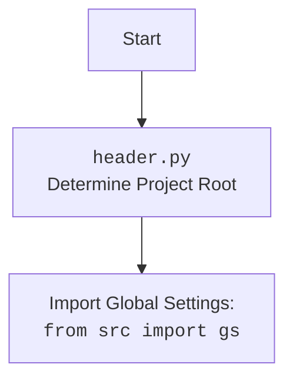

## АНАЛИЗ КОДА

### <алгоритм>

1. **`set_project_root(marker_files)`**:
    *   **Начало**: Функция принимает `marker_files` (кортеж имен файлов или директорий) для определения корня проекта.
        *   _Пример:_ `marker_files = ('__root__', '.git')`
    *   **Инициализация**: `current_path` устанавливается в путь к директории, где находится текущий файл. `__root__` изначально устанавливается равным `current_path`.
        *   _Пример:_ Если файл `header.py` находится в `/home/user/hypotez/src/ai/gemini`, то `current_path` будет `/home/user/hypotez/src/ai/gemini`.
    *   **Поиск корня**:
        *   Перебирает текущую директорию и все ее родительские директории.
        *   Для каждой директории проверяет, существует ли в ней любой из `marker_files`.
        *   Если маркер найден, устанавливает `__root__` в эту директорию и прерывает цикл.
            *   _Пример:_ Если файл `__root__` найден в `/home/user/hypotez`, то `__root__` становится `/home/user/hypotez`.
    *   **Обновление `sys.path`**:
        *   Если `__root__` не в `sys.path`, добавляет его в начало `sys.path` для обеспечения импорта модулей из корня проекта.
    *   **Возврат**: Возвращает `__root__` (путь к корню проекта).

2. **Инициализация `__root__`**:
    *   Вызывает `set_project_root()`, сохраняя возвращённый путь в глобальную переменную `__root__`.

3. **Загрузка конфигурации (`config`)**:
    *   Пытается открыть файл `config.json`, находящийся в каталоге `src` от корня проекта.
    *   Загружает JSON из файла и сохраняет в переменную `config`.
    *   В случае ошибок `FileNotFoundError` или `json.JSONDecodeError` не предпринимает никаких действий.

4.  **Загрузка документации (`doc_str`)**:
    *   Пытается открыть файл `README.MD`, находящийся в каталоге `src` от корня проекта.
    *   Читает содержимое файла и сохраняет в переменную `doc_str`.
    *   В случае ошибок `FileNotFoundError` или `json.JSONDecodeError` не предпринимает никаких действий.

5. **Инициализация глобальных переменных**:
    *   `__project_name__`: Если `config` есть, берет `project_name` из него, иначе устанавливает в `hypotez`.
    *   `__version__`: Если `config` есть, берет `version` из него, иначе устанавливает в пустую строку.
    *   `__doc__`: Если `doc_str` загружена, то устанавливается в ее значение, иначе пустая строка.
    *   `__details__`: устанавливает в пустую строку.
    *   `__author__`: Если `config` есть, берет `author` из него, иначе устанавливает в пустую строку.
    *    `__copyright__`: Если `config` есть, берет `copyrihgnt` из него, иначе устанавливает в пустую строку.
    *    `__cofee__`: Если `settings` есть, берет `cofee` из него, иначе устанавливает в строку "Treat the developer to a cup of coffee for boosting enthusiasm in development: https://boosty.to/hypo69".

### <mermaid>

```mermaid
flowchart TD
    Start --> FindRoot[set_project_root()<br>Find Project Root Directory]
    FindRoot --> CheckMarkers{Check for Marker Files in Directory and Parents}
    CheckMarkers -- "Marker Found" --> SetRoot[Set __root__ to Found Directory]
    CheckMarkers -- "No Marker" --> NextParent[Move to Parent Directory]
     NextParent -- "Has Parent" --> CheckMarkers
    NextParent -- "No Parent" --> SetRoot[Set __root__ to Current Directory]
    SetRoot --> UpdateSysPath{Update sys.path}
    UpdateSysPath --> ReturnRoot[Return __root__]
    ReturnRoot --> SetGlobalRoot[__root__ = ReturnRoot]
    SetGlobalRoot --> LoadConfig{Load Config <br>from <code>config.json</code>}
    LoadConfig -- "Success" --> SaveConfig[config = Loaded Config]
    LoadConfig -- "Failure" --> IgnoreConfigError[Ignore Config Error]
   
    SaveConfig --> LoadDoc{Load Document <br>from <code>README.MD</code>} 
    IgnoreConfigError --> LoadDoc
    
    LoadDoc -- "Success" --> SaveDoc[doc_str = Loaded Document]
    LoadDoc -- "Failure" --> IgnoreDocError[Ignore Document Error]
    SaveDoc --> SetGlobals[Set Global Variables using config/doc]
     IgnoreDocError --> SetGlobals
    SetGlobals --> End
   
  
    
```

### <объяснение>

**Импорты:**

*   `sys`: Используется для модификации `sys.path`, добавляя корень проекта в список путей поиска модулей.
*   `json`: Используется для работы с файлами JSON (чтение конфигурации из `config.json`).
*   `packaging.version.Version`: Не используется в данном коде.
*   `pathlib.Path`: Используется для удобной работы с путями в файловой системе.

**Функции:**

*   `set_project_root(marker_files: tuple = ('__root__')) -> Path:`
    *   **Аргументы**:
        *   `marker_files` (tuple): Кортеж имен файлов или директорий, которые служат маркерами для определения корня проекта. По умолчанию `('__root__')`.
    *   **Возвращает**: `Path` - путь к корневой директории проекта.
    *   **Назначение**: Определяет корневую директорию проекта, начиная с текущей директории файла и поднимаясь вверх по дереву директорий, пока не найдет один из `marker_files`. Если маркер не найден, то возвращается путь к текущей директории. Добавляет найденный путь в `sys.path` для обеспечения корректного импорта модулей.
    *   **Пример**:
        ```python
        root_path = set_project_root(marker_files=('__root__', '.git'))
        print(root_path) # /home/user/hypotez/
        ```

**Переменные:**

*   `MODE: str = 'dev'` - Устанавливает режим выполнения. В данном коде не используется.
*   `__root__: Path`: Глобальная переменная, хранящая путь к корневой директории проекта, вычисленный с помощью `set_project_root()`.
*   `config: dict`: Словарь, содержащий конфигурационные данные, загруженные из `config.json`. Инициализируется как `None`, потом заполняется из файла.
*   `doc_str: str`: строка, содержащая документацию загруженной из файла `README.MD`. Инициализируется как `None`, потом заполняется из файла.
*  `__project_name__: str`: Имя проекта, загружаемое из `config.json` или `hypotez` по умолчанию.
* `__version__: str`: Версия проекта, загружаемое из `config.json` или пустая строка по умолчанию.
* `__doc__: str`: Строка документации, загружаемая из `README.MD` или пустая строка по умолчанию.
* `__details__: str`: Детали, устанавливаются в пустую строку.
* `__author__: str`: Автор, загружаемый из `config.json` или пустая строка по умолчанию.
* `__copyright__: str`: Авторские права, загружаемые из `config.json` или пустая строка по умолчанию.
* `__cofee__: str`: Строка поощрения разработчика, загружаемая из `settings`, если она существует, иначе используется строка по умолчанию.

**Взаимосвязи:**

*   Модуль `header.py` играет ключевую роль в проекте, так как определяет корень проекта, загружает конфигурацию и устанавливает важные глобальные переменные, которые используются в других частях проекта.
*   Импортирует `from src import gs`. Это предполагает, что в `src` есть модуль `gs`, содержащий глобальные настройки, которые используются для определения пути к файлу конфигурации.
*   Зависит от существования файлов `config.json` и `README.MD` в директории `/src` от корня проекта.
*   Значения `__project_name__`, `__version__`, `__author__` и `__copyright__` берутся из файла конфигурации.

**Потенциальные ошибки и улучшения:**

*   **Обработка ошибок**: В коде используются блоки `try-except` для обработки ошибок при открытии и чтении `config.json` и `README.MD`, но ошибки просто игнорируются (`...`). Было бы лучше логировать ошибки или выдавать предупреждения, чтобы разработчик знал о проблемах.
*   **Отсутствие валидации**: Код не валидирует структуру файла `config.json`. Стоит добавить проверку, чтобы убедиться, что необходимые ключи (например, `project_name`, `version`) существуют.
*   **Использование `settings`**: В коде используется переменная `settings`, которая не определена. Это может вызвать ошибку. Вместо этого скорее всего нужно обратится к `config`.
*   **Константы:** MODE нужно вынести в config или settings.
*   **Не используется импорт:** `packaging.version` не используется.

**Цепочка взаимосвязей с другими частями проекта:**
1.  **`header.py`** определяет корень проекта и загружает базовые настройки (конфигурация, документация)
2.  Эти настройки используются другими модулями, которые зависят от:
    *   корня проекта (`__root__`):  для доступа к файлам и модулям.
    *   конфигурации (`config`):  для настройки поведения.
    *   глобальных переменных (`__project_name__`, `__version__`, и т.д.): для отображения информации о проекте.
3.  Таким образом, `header.py` это базовый компонент, влияющий на работу всего проекта.