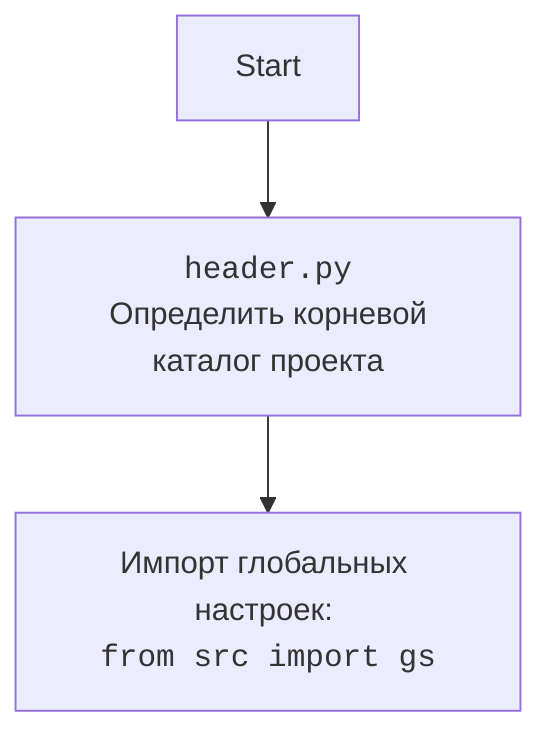

## <алгоритм>

1.  **`set_project_root(marker_files)` Function:**
    *   **Начало**: Функция вызывается с кортежем `marker_files` (по умолчанию `('__root__', '.git')`).
    *   **Инициализация**:
        *   `__root__` инициализируется как путь к родительской директории текущего файла.
        *   `current_path` инициализируется как путь к родительской директории текущего файла.
    *   **Поиск Корневой Директории**:
        *   Перебираются все родительские директории от текущей до корня файловой системы.
        *   Для каждой родительской директории проверяется, существует ли в ней какой-либо из `marker_files`.
        *   Если маркерный файл найден, текущая директория родителя устанавливается как корневая директория `__root__`. Цикл прерывается.
    *   **Добавление Корневой Директории в `sys.path`**:
        *   Если `__root__` нет в списке путей поиска модулей `sys.path`, то путь добавляется в начало списка.
    *   **Возврат**: Функция возвращает путь к корневой директории `__root__`.
    *   **Пример**:
        *   Если файл `header.py` находится в `/home/user/project/src/ai/gemini/`, а маркерный файл `__root__` в `/home/user/project/`, то `set_project_root()` вернёт `/home/user/project/`.

2.  **Глобальная Переменная `__root__`**:
    *   Вызывается функция `set_project_root()` для определения корневой директории проекта.
    *   Результат сохраняется в глобальной переменной `__root__`.

3. **Импорт `gs`**
    *   Импортируется `gs` из `src`, который предположительно является модулем глобальных настроек.

4.  **Загрузка `config.json`**:
    *   **Попытка загрузки**:
        *   Пытается открыть файл `config.json` из директории `src` относительно корневой директории.
        *   Если файл успешно открыт, данные загружаются в переменную `config` как словарь из JSON.
    *   **Обработка ошибок**:
        *   Если возникает ошибка `FileNotFoundError` (файл не найден) или `json.JSONDecodeError` (ошибка декодирования JSON), ошибки игнорируются.

5.  **Загрузка `README.MD`**:
    *   **Попытка загрузки**:
        *   Пытается открыть файл `README.MD` из директории `src` относительно корневой директории.
        *   Если файл успешно открыт, содержимое читается и сохраняется в переменную `doc_str`.
    *   **Обработка ошибок**:
        *   Если возникает ошибка `FileNotFoundError` (файл не найден) или `json.JSONDecodeError` (ошибка декодирования JSON), ошибки игнорируются.

6.  **Инициализация Глобальных Переменных**:
    *   Инициализируются глобальные переменные:
        *   `__project_name__`: извлекается из `config` или устанавливается в 'hypotez'.
        *   `__version__`: извлекается из `config` или устанавливается в пустую строку.
        *   `__doc__`: устанавливается из `doc_str` или в пустую строку.
        *   `__details__`: устанавливается в пустую строку.
        *  `__author__`: извлекается из `config` или устанавливается в пустую строку.
        *   `__copyright__`: извлекается из `config` или устанавливается в пустую строку.
        *   `__cofee__`: извлекается из `settings` или устанавливается в строку по умолчанию.

## <mermaid>

```mermaid
flowchart TD
    Start[Start] --> FindRoot[<code>set_project_root()</code><br>Найти корневую директорию проекта];
    FindRoot -->  CheckMarkers[Проверка наличия маркерных файлов];
    CheckMarkers -- Найдено --> SetRoot[Установить корневую директорию];
    CheckMarkers -- Не найдено --> ContinueSearch[Продолжить поиск в родительских директориях];
     ContinueSearch --> SetRoot;
    SetRoot --> AddToSysPath[Добавить корневую директорию в <code>sys.path</code>];
    AddToSysPath --> ImportGS[Импорт глобальных настроек: <code>from src import gs</code>];
    ImportGS --> LoadConfig[Загрузка <code>config.json</code>];
    LoadConfig -- Успешно --> LoadReadme[Загрузка <code>README.MD</code>];
    LoadConfig -- Ошибка --> LoadReadme;    
    LoadReadme -- Успешно --> SetGlobalVars[Установка глобальных переменных проекта];
    LoadReadme -- Ошибка --> SetGlobalVars;
    SetGlobalVars --> End[End];
```



## <объяснение>

**Импорты:**

*   `sys`: Используется для доступа к системным переменным и функциям, в частности, для модификации `sys.path` - списка путей, где Python ищет модули для импорта.
*   `json`: Используется для работы с JSON-файлами, загрузки данных конфигурации из `config.json`.
*   `packaging.version.Version`: Используется для работы с версиями, хотя в данном коде не используется.
*   `pathlib.Path`: Используется для работы с путями файловой системы в объектно-ориентированном стиле.

**Функции:**

*   `set_project_root(marker_files: tuple = ('__root__', '.git')) -> Path`:
    *   **Аргументы**:
        *   `marker_files`: кортеж с именами файлов или директорий, которые служат маркерами для определения корневой директории проекта.
    *   **Возвращаемое значение**:
        *   `Path`: Объект `Path` с путем к корневой директории проекта или к директории, где находится файл `header.py`, если корневая директория не найдена.
    *   **Назначение**:
        *   Определение корневой директории проекта путем поиска маркеров в родительских директориях.
    *   **Примеры**:
        *   `set_project_root()` возвращает путь к директории, содержащей файл `__root__` или `.git`.

**Переменные:**

*   `__root__`:
    *   **Тип**: `pathlib.Path`.
    *   **Использование**: Хранит путь к корневой директории проекта, определенный функцией `set_project_root()`. Используется для построения путей к другим файлам проекта.
*   `config`:
    *   **Тип**: `dict`.
    *   **Использование**: Содержит словарь с данными конфигурации, загруженными из файла `config.json`, или `None`, если файл не найден или произошла ошибка загрузки.
*   `doc_str`:
    *   **Тип**: `str`.
    *   **Использование**: Содержит строку с содержимым файла `README.MD` или `None`, если файл не найден.
*   `__project_name__`:
    *   **Тип**: `str`.
    *   **Использование**: Содержит имя проекта, извлеченное из `config` или значение по умолчанию 'hypotez'.
*   `__version__`:
    *   **Тип**: `str`.
    *   **Использование**: Содержит версию проекта, извлеченную из `config` или пустую строку.
*   `__doc__`:
    *   **Тип**: `str`.
    *   **Использование**: Содержит описание проекта, загруженное из `README.MD` или пустую строку.
*    `__details__`:
     *  **Тип**: `str`.
     *   **Использование**:  Установлена пустой строкой, может быть использована для дополнительной информации о проекте.
*   `__author__`:
    *   **Тип**: `str`.
    *   **Использование**: Содержит автора проекта, извлеченного из `config` или пустую строку.
*   `__copyright__`:
    *   **Тип**: `str`.
    *   **Использование**: Содержит информацию об авторских правах, извлеченную из `config` или пустую строку.
*   `__cofee__`:
    *  **Тип**: `str`.
    *   **Использование**: Содержит сообщение о поддержке разработчиков, извлеченное из `settings` или строку по умолчанию.
* `gs`:
    *   **Тип**: Предположительно, пользовательский модуль.
    *   **Использование**: Содержит глобальные настройки проекта, включая пути к файлам.

**Взаимосвязи с другими частями проекта:**

*   Этот модуль является частью пакета `src.ai.gemini`, который предназначен для интеграции с Google Gemini AI.
*   Модуль использует `src.gs` для получения глобальных настроек, включая корневой каталог проекта и пути к файлам.
*   Загружает данные из файлов `config.json` и `README.MD`, которые могут содержать метаданные и настройки проекта.

**Потенциальные ошибки и улучшения:**

*   **Обработка ошибок**: Обработка ошибок загрузки `config.json` и `README.MD` выполняется при помощи `try`/`except`. В случае ошибки `config` и `doc_str` останутся `None`, что может вызвать ошибки в дальнейшем коде, если не проверять их на `None`. Необходимо улучшить обработку ошибок, возможно, выводя сообщения об ошибках в лог.
*   **Зависимости**: Модуль зависит от наличия файлов `config.json` и `README.MD` в определенном месте. Если эти файлы отсутствуют, переменные `config` и `doc_str` будут `None`, что нужно учитывать при дальнейшем использовании.
*  **Определение корневой директории**: Метод определения корневой директории является достаточно простым и может не работать в сложных структурах проекта. Возможно, стоит добавить более гибкий механизм.
*  **Неиспользуемые импорты**: Импорт `packaging.version` не используется в коде и его следует удалить.
* **Чтение настроек:**  В коде есть опечатка `copyrihgnt`,  нужно исправить на  `copyright`  и `settings`,  нужно исправить на `config`  и  проверять на None,  чтобы избежать ошибки `AttributeError`.
*   **Использование `__details__`**: В текущей реализации переменная `__details__` всегда устанавливается в пустую строку, что делает ее бесполезной. Возможно, следует использовать её для хранения дополнительной информации о проекте.

**Цепочка взаимосвязей:**

1.  `header.py` определяет корневую директорию проекта и загружает базовые настройки.
2.  Загруженные настройки (путь к корневой директории, данные из `config.json` и `README.MD`) используются другими модулями пакета `src.ai.gemini` для работы с Gemini AI.
3.  Глобальные переменные `__root__`, `__project_name__`, `__version__`, `__doc__`, `__author__`, `__copyright__` и `__cofee__` могут использоваться в других модулях для получения информации о проекте.
4. `src.gs`  может содержать другие параметры настроек, используемые в разных частях проекта.
5.  Модуль `header.py` является важным компонентом, поскольку он задает основу для работы с путями и параметрами конфигурации в рамках всего проекта.