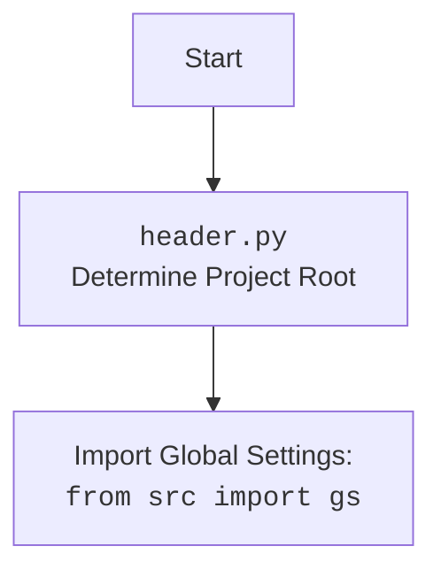

## <алгоритм>

1.  **Инициализация:**
    *   Устанавливается ``.
    *   Импортируются необходимые библиотеки: `header`, `webbrowser`, `threading`, `fastapi`, `pydantic`, `src.ai.gooogle_generativeai.kazarinov`, `random`, `pathlib`, `src.gs`.
    *   Создается экземпляр FastAPI `app`.
    *   Инициализируются шаблоны Jinja2, указывающие на директорию с HTML файлами.
    *   Монтируются статические файлы (CSS, JS и прочее), указывающие на директорию со статикой.
    *   Создается экземпляр модели `Kazarinov` с конфигурацией генерации.
    *   Загружаются вопросы из текстовых файлов в список `questions_list`.

2.  **Определение модели данных:**
    *   Создается модель `Question` с полем `question: str`, которая используется для валидации данных, получаемых из формы.

3.  **Обработка запросов:**
    *   **GET `/`:**
        *   Функция `get_chat` обрабатывает GET запрос на главную страницу (`/`).
        *   Отображает шаблон `chat.html` с пустой строкой в качестве ответа.
    *   **POST `/ask`:**
        *   Функция `ask_question` обрабатывает POST запрос на эндпоинт `/ask`, принимая данные из формы в виде объекта `Question`.
        *   Если пользователь ввел `--next`, загружается случайный вопрос из списка `questions_list`.
        *   Отправляет вопрос в модель `Kazarinov` (метод `k.ask`).
        *   Отображает шаблон `chat.html` с полученным ответом.

4.  **Запуск приложения:**
    *   В функции `open_browser` открывается браузер по адресу `http://127.0.0.1:8000`.
    *   Если файл запущен как основной (`__name__ == "__main__"`):
        *   Браузер запускается в отдельном потоке через 1.5 секунды после запуска приложения.
        *   Приложение FastAPI запускается с помощью `uvicorn` на `127.0.0.1:8000`.

## <mermaid>

```mermaid
flowchart TD
    subgraph FastAPI Application
        Start[Start Application] --> Init[Initialize FastAPI, Templates, Static Files, Kazarinov Model]
        Init --> LoadQuestions[Load Questions from Files]
        LoadQuestions --> GetChat[GET "/": Render chat.html with empty response]
        LoadQuestions --> PostAsk[POST "/ask": Get user question]
        PostAsk --> CheckNext[Check if user question is "--next"]
        CheckNext -- "Yes" --> SelectRandomQuestion[Select a random question from the list]
        CheckNext -- "No" --> UseUserQuestion[Use User Question]
        SelectRandomQuestion --> AskKazarinov[Send question to Kazarinov model]
        UseUserQuestion --> AskKazarinov
        AskKazarinov --> RenderResponse[Render chat.html with Kazarinov response]
        RenderResponse --> End[End Request]

    end

    subgraph Browser Interaction
        StartBrowser[Start Application] --> OpenBrowser[Open Browser at http://127.0.0.1:8000]

    end

    StartBrowser --> Start
    RenderResponse --> End
    
    style Start fill:#f9f,stroke:#333,stroke-width:2px
    style End fill:#ccf,stroke:#333,stroke-width:2px
    
    
```



## <объяснение>

### Импорты:

*   `header`: (Предположительно) используется для определения корневого каталога проекта и настройки среды.
*   `webbrowser`: Модуль для открытия веб-страниц в браузере по умолчанию. Используется для автоматического открытия страницы с чатом при запуске приложения.
*   `threading`: Модуль для создания и управления потоками. Используется для запуска браузера в отдельном потоке, чтобы он не блокировал основной поток приложения FastAPI.
*   `fastapi`: Фреймворк для создания API на Python. Используется для создания веб-приложения чата.
*   `fastapi.templating.Jinja2Templates`: Модуль для рендеринга HTML-шаблонов с использованием Jinja2.
*   `fastapi.staticfiles.StaticFiles`: Модуль для обработки статических файлов (CSS, JS, картинки).
*   `pydantic.BaseModel`: Модуль для определения моделей данных и валидации данных, полученных в запросах.
*   `src.ai.gooogle_generativeai.kazarinov.Kazarinov`: Класс для взаимодействия с моделью Google Gemini.
*   `random`: Модуль для генерации случайных чисел. Используется для случайного выбора вопроса из списка.
*   `pathlib.Path`: Модуль для работы с путями файловой системы.
*   `src.gs`: (Предположительно) Модуль с глобальными настройками проекта.

### Классы:

*   `Question(BaseModel)`:
    *   **Роль**: Модель данных для валидации входящих запросов.
    *   **Атрибуты**: `question: str` - строка с вопросом пользователя.
    *   **Методы**: Нет явных методов, но унаследованы методы `BaseModel` для валидации данных.
*   `Kazarinov`:
    *   **Роль**: Класс для взаимодействия с Google Gemini.
    *   **Атрибуты**: `system_instruction`, `generation_config`.
    *   **Методы**: `ask(user_question, no_log=False, with_pretrain=False)` - Метод для отправки запроса в модель и получения ответа.

### Функции:

*   `get_chat(request: Request)`:
    *   **Аргументы**: `request: Request` - объект запроса FastAPI.
    *   **Возвращает**: `TemplateResponse` - HTML-страница `chat.html`.
    *   **Назначение**: Обрабатывает GET-запрос на корневой путь `/` и отрисовывает начальную страницу чата.
*   `ask_question(question: Question, request: Request)`:
    *   **Аргументы**: `question: Question` - объект вопроса пользователя, `request: Request` - объект запроса FastAPI.
    *   **Возвращает**: `TemplateResponse` - HTML-страница `chat.html` с ответом модели.
    *   **Назначение**: Обрабатывает POST-запрос на `/ask`, отправляет вопрос модели, и отрисовывает страницу чата с ответом.
*   `open_browser()`:
    *   **Аргументы**: Нет.
    *   **Возвращает**: Нет.
    *   **Назначение**: Открывает браузер по адресу `http://127.0.0.1:8000`.

### Переменные:

*   `MODE`: Строка `'dev'`, предположительно определяющая режим работы приложения.
*   `app`: Экземпляр FastAPI.
*   `templates`: Экземпляр `Jinja2Templates`, настроенный на каталог с HTML-шаблонами.
*   `k`: Экземпляр `Kazarinov` модели.
*   `questions_list`: Список строк, содержащий вопросы, загруженные из файлов.
*   `user_question`: Строка, содержащая вопрос пользователя, который будет отправлен в модель.

### Объяснение:

Код представляет собой веб-приложение для общения с моделью Google Gemini через HTML-интерфейс. Он использует FastAPI для создания API, Jinja2 для рендеринга HTML-шаблонов, и модуль `Kazarinov` для взаимодействия с моделью.

**Основные шаги:**

1.  **Инициализация:** Настраивается приложение, загружаются шаблоны, статические файлы, и инициализируется модель `Kazarinov`.
2.  **Обработка запросов:**
    *   GET-запрос на главную страницу `/` отображает начальную страницу чата.
    *   POST-запрос на `/ask` отправляет вопрос пользователя в модель и отображает ответ.
3.  **Запуск:** Приложение запускается с помощью `uvicorn` и открывает браузер для удобного взаимодействия с чатом.

**Потенциальные проблемы и улучшения:**

*   **Обработка ошибок:** Код не содержит обработки ошибок, например, если модель не отвечает или возникла ошибка при загрузке шаблонов.
*   **Логирование:**  Добавление более подробного логирования может быть полезным для отладки и мониторинга приложения.
*   **Конфигурация:**  Параметры модели и другие настройки лучше вынести в отдельный файл конфигурации.
*   **Асинхронность:**  В коде не используются асинхронные операции, хотя есть `async def`.
*   **Безопасность:** Небезопасная обработка запросов (необходимо рассмотреть использование валидации и sanitize для входящих данных)
*   **`--next`**  логика обработки `--next` странновата

**Взаимосвязи с другими частями проекта:**

*   Код использует `src.gs` для получения путей к каталогам и файлам, что предполагает наличие модуля `gs.py` в проекте.
*   Модель `Kazarinov` находится в пакете `src.ai.gooogle_generativeai.kazarinov`, что говорит о том, что это часть более крупного проекта по работе с ИИ и конкретно с Google Gemini.
*   `header.py` отвечает за получение `root` и `src` директорий.