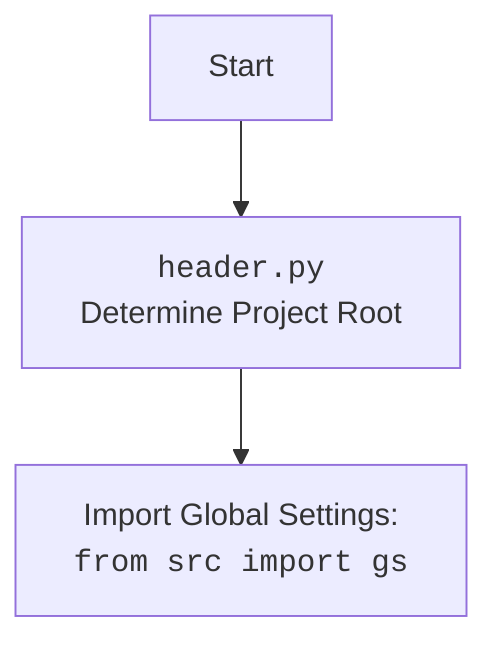

## АНАЛИЗ КОДА: `hypotez/src/ai/gemini/html_chat/header.py`

### 1. **<алгоритм>**

1.  **Установка режима `MODE`:**
    *   Присваиваем глобальной переменной `MODE` значение `'dev'`. Это может указывать на то, что код находится в режиме разработки.
    *   **Пример:** ``

2.  **Определение корневой директории проекта `__root__`:**
    *   Получаем текущую рабочую директорию с помощью `os.getcwd()`.
    *   Ищем индекс последнего вхождения подстроки `hypotez` в пути рабочей директории.
    *   Извлекаем часть строки от начала до индекса последнего вхождения `hypotez` + 7 символов.
    *   Создаем объект `Path` из извлеченной строки и присваиваем его переменной `__root__`.
    *  **Пример:**
        *   Пусть `os.getcwd()` возвращает `/Users/username/projects/hypotez/src/ai/gemini/html_chat`
        *  `os.getcwd().rfind(r'hypotez')` вернет `21`
        * `os.getcwd()[:21+7]` вернет `/Users/username/projects/hypotez`
        * `__root__` будет объектом `Path('/Users/username/projects/hypotez')`

3.  **Добавление корневой директории в `sys.path`:**
    *   Добавляем путь, хранящийся в переменной `__root__`, в список путей поиска модулей `sys.path`. Это позволяет импортировать модули из корневой директории проекта.
     *   **Пример:**  `sys.path.append('/Users/username/projects/hypotez')`

### 2. **<mermaid>**

```mermaid
flowchart TD
    Start --> SetMode[Set ]
    SetMode --> GetCurrentDir[Get current working directory: <br><code>os.getcwd()</code>]
    GetCurrentDir --> FindHypotezIndex[Find last index of 'hypotez' in path:<br> <code>os.getcwd().rfind(r'hypotez')</code>]
    FindHypotezIndex --> ExtractRootPath[Extract root path :<br> <code>os.getcwd()[:index + 7]</code>]
    ExtractRootPath --> CreatePathObject[Create Path object:<br><code>Path(root_path)</code>]
    CreatePathObject --> AssignRootPath[Assign to __root__ ]
    AssignRootPath --> AddToSysPath[Add __root__ to sys.path: <br><code>sys.path.append(__root__)</code>]
    AddToSysPath --> End
```

**Описание зависимостей:**

*   `os`: Модуль `os` используется для работы с операционной системой, в частности, для получения текущей рабочей директории (`os.getcwd()`) и поиска подстроки в строке (`os.getcwd().rfind(r'hypotez')`).
*   `sys`: Модуль `sys` используется для добавления пути к корневой директории проекта в `sys.path`, что позволяет Python корректно находить и импортировать модули, находящиеся вне текущей рабочей директории.
*  `pathlib`: Модуль `pathlib` используется для представления пути в виде объекта `Path`.

**Дополнительно:**



### 3. **<объяснение>**

**Импорты:**

*   `import sys, os`:
    *   `sys`: Модуль `sys` предоставляет доступ к некоторым переменным и функциям, взаимодействующим с интерпретатором Python. В данном случае используется `sys.path` для изменения путей поиска модулей.
    *   `os`: Модуль `os` предоставляет функции для работы с операционной системой. Здесь используется `os.getcwd()` для получения текущей рабочей директории и `os.getcwd().rfind()` для поиска подстроки.
* `from pathlib import Path`:
   * `pathlib` модуль предоставляет класс `Path` для работы с путями в файловой системе.

**Переменные:**

*   `MODE`:  Глобальная переменная, которая устанавливается в значение `'dev'`. Скорее всего, это переменная используется для определения режима работы приложения (разработка, продакшн и т.д.).
*   `__root__`: Переменная типа `Path` , представляющая абсолютный путь к корневой директории проекта.  Она вычисляется на основе текущей рабочей директории и используется для добавления корневого пути проекта в `sys.path`, чтобы обеспечить правильный импорт других модулей проекта.

**Функции:**

*   Используются встроенные функции: `os.getcwd()`, `str.rfind()`, `sys.path.append()`.
    *   `os.getcwd()`: Возвращает текущую рабочую директорию в виде строки.
    *   `str.rfind(substr)`: Возвращает последний индекс подстроки `substr` в строке. Если подстрока не найдена, возвращает -1.
    *  `sys.path.append(path)`: Добавляет строку `path` в список `sys.path`.

**Потенциальные ошибки и улучшения:**

1.  **Жестко закодированный поиск `hypotez`:** Поиск подстроки 'hypotez' в `os.getcwd()` делает код зависимым от определенной структуры директории. Если имя папки `hypotez` будет изменено или перемещено, код может сломаться.  Идеально было бы использовать более гибкий способ определения корневой директории (например, чтение из файла конфигурации или поиск файла `.git`).
2.  **Проверка на отсутствие подстроки:**  Не предусмотрена обработка случая, когда подстрока  `hypotez` не найдена в пути. Если `rfind` вернет `-1`, это приведет к некорректному пути. Необходимо добавить проверку на `-1` и выдать исключение или установить путь по умолчанию, если подстрока не найдена.
3. **Зависимость от рабочей директории:** Код полагается на то, что скрипт запускается из рабочей директории внутри проекта. Если скрипт будет запущен из другого места, логика определения корневой директории может нарушиться.

**Взаимосвязь с другими частями проекта:**

Этот файл `header.py` служит для настройки окружения, устанавливая корневую директорию проекта.  Это позволяет другим модулям проекта импортировать модули из различных поддиректорий, используя абсолютные пути,  независимо от текущей рабочей директории. Например, модуль может использовать `from src.ai.gemini.html_chat import ...` вместо относительного `from ... import ...`.  Это упрощает управление зависимостями и делает проект более структурированным.  Определение `__root__` позволяет использовать этот путь в других файлах для загрузки ресурсов или настройки путей к файлам. Также,  модули из других частей проекта могут импортировать `MODE` для настройки своего поведения.