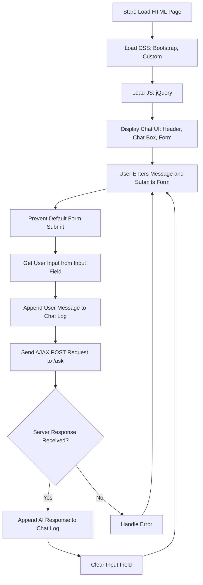

## Анализ кода `chat.html`

### 1. <алгоритм>

**Блок-схема работы `chat.html`:**

1. **Инициализация страницы:**
   - Загрузка HTML-страницы.
   - Подключение стилей Bootstrap и пользовательских стилей (`styles.css`).
   - Подключение библиотеки jQuery.

2. **Отображение интерфейса:**
   - Заголовок "Kazarinov AI Chat".
   - Блок `chat-box` для отображения сообщений (имеет прокрутку при переполнении).
   - Форма `chat-form` с полем ввода и кнопкой "Отправить".

3. **Обработка отправки формы:**
   - Пользователь вводит сообщение в поле `user-input` и нажимает "Отправить".
   - Функция jQuery `$(document).ready(function() { ... });` срабатывает при загрузке DOM.
   - Функция `$('#chat-form').submit(function(event) { ... });` перехватывает событие отправки формы.
      - Вызов `event.preventDefault();` предотвращает перезагрузку страницы.
      - Получение введенного текста из поля ввода: `let userInput = $('#user-input').val();`.
      - Добавление сообщения пользователя в `chat-log`: `$('#chat-log').append('
<strong>Вы:</strong> ' + userInput + '
');`.

4. **Отправка запроса к серверу:**
    - Отправка AJAX запроса на сервер по адресу `/ask`:
      -  Метод `POST`.
      - Данные: `data: { user_input: userInput }`.
    - Получение ответа от сервера в функцию обратного вызова `success: function(response) { ... }`:
      - Добавление ответа от AI в `chat-log`: `$('#chat-log').append('
<strong>AI:</strong> ' + response.response + '
');`.
      - Очистка поля ввода: `$('#user-input').val('');`.

**Пример работы:**

- **Пользователь:** вводит "Привет!" и нажимает "Отправить".
    - Сообщение "Вы: Привет!" отображается в `chat-box`.
    - AJAX запрос отправляется на `/ask` с данными `user_input: "Привет!"`.
    - **Сервер (не показан в данном коде):** Обрабатывает запрос и возвращает ответ, например, `{"response": "Привет! Рад тебя видеть!"}`.
    - Сообщение "AI: Привет! Рад тебя видеть!" отображается в `chat-box`.
    - Поле ввода очищается.

### 2. <mermaid>

**Объяснение:**

-   **Start:** Начало процесса, когда браузер загружает HTML страницу.
-   **LoadStyles:** Загрузка стилей CSS, включая Bootstrap и пользовательские стили, для визуального оформления страницы.
-   **LoadScripts:** Загрузка JavaScript библиотеки jQuery, необходимой для обработки событий и AJAX запросов.
-   **DisplayUI:** Отображение пользовательского интерфейса чата, включая заголовок, область чата и форму ввода сообщений.
-   **UserInput:** Пользователь вводит сообщение в поле ввода и отправляет форму.
-   **PreventDefault:** Предотвращение стандартного поведения браузера при отправке формы, чтобы не перезагружать страницу.
-   **GetUserInput:** Получение текста введенного пользователем из поля ввода.
-   **AppendUserMessage:** Добавление сообщения пользователя в область чата.
-   **SendAjaxRequest:** Отправка AJAX запроса на сервер по адресу `/ask` с введенным сообщением.
-   **ProcessResponse:** Проверка, был ли получен ответ от сервера.
-   **AppendAIMessage:** При получении ответа от сервера, добавление сообщения от AI в область чата.
-   **ClearInput:** Очистка поля ввода для следующего сообщения.
-    **HandleError:**  Если возникает ошибка при отправке или получении данных, управление передается сюда (хотя в предоставленном коде нет обработки ошибок, она должна быть предусмотрена).

### 3. <объяснение>

**Импорты:**

-   В данном файле нет явных импортов Python, так как это HTML-файл, а не Python-скрипт.
-   Импорты CSS и JS:
    -   `https://cdn.jsdelivr.net/npm/bootstrap@4.0.0/dist/css/bootstrap.min.css`: Подключение CSS-фреймворка Bootstrap для стилизации.
    -   `https://code.jquery.com/jquery-3.5.1.min.js`: Подключение библиотеки jQuery для облегчения работы с DOM и AJAX.
    -   `{{ url_for('static', path='css/styles.css') }}`: Подключение пользовательских стилей из файла `styles.css`, который находится в каталоге `static`. Функция `url_for` генерирует корректный URL для доступа к статическим файлам (например, из Flask).

**Классы:**

-   В данном HTML-файле нет классов Python. Используются классы CSS (например, `container`, `chat-box`, `form-control`) для стилизации элементов.

**Функции:**

-   В HTML-файле есть JavaScript-функции, которые вызываются при наступлении определенных событий:
    -   `$(document).ready(function() { ... });`: Функция, которая выполняется после загрузки DOM. Используется для инициализации обработчиков событий.
    -   `$('#chat-form').submit(function(event) { ... });`: Функция-обработчик события отправки формы.
        -   `event.preventDefault();`: Метод, предотвращающий стандартное поведение формы.
        -   `$('#user-input').val();`: Метод jQuery для получения значения из поля ввода.
        -   `$('#chat-log').append(...);`: Метод jQuery для добавления HTML-контента в элемент `chat-log`.
        -   `$.ajax({...});`: Метод jQuery для отправки AJAX-запроса.
            -   `url`: URL запроса.
            -   `method`: Метод запроса (POST).
            -   `data`: Данные, отправляемые на сервер.
            -   `success`: Функция, вызываемая при успешном получении ответа от сервера.
-   `url_for('static', path='css/styles.css')`: функция шаблонизатора Flask для формирования URL к статическому файлу

**Переменные:**

-   JavaScript-переменные:
    -   `userInput`: Строка, хранящая текст, введенный пользователем.
    -   `response`: Объект, содержащий ответ от сервера (включает поле `response` с текстом ответа от AI).
-   HTML-элементы с `id`:
    -   `chat-log`: Элемент `div`, в котором отображаются сообщения чата.
    -   `chat-form`: Элемент `form`, содержащий поле ввода и кнопку отправки.
    -   `user-input`: Элемент `input`, в который пользователь вводит текст сообщения.
   - `MODE`: Константа, определяющая режим работы приложения (в данном случае debug).

**Потенциальные ошибки и области для улучшения:**

-   **Обработка ошибок:** Код не включает обработку ошибок при отправке AJAX-запроса. Необходимо добавить обработку ошибок в `$.ajax`, чтобы пользователь получал информацию об ошибках связи или обработки запроса на сервере.
-   **Безопасность:** Код отображает ответы от сервера без предварительной обработки. Необходимо обезопасить приложение от XSS-атак (межсайтового скриптинга), обрабатывая ответы от сервера перед добавлением в HTML.
-   **Валидация:** Отсутствует валидация пользовательского ввода на клиенте.
-   **Улучшение UI/UX:** Можно добавить индикатор загрузки, пока запрос обрабатывается на сервере.

**Взаимосвязь с другими частями проекта:**

-   Данный HTML-файл является частью веб-приложения, которое общается с сервером, возможно, через Flask или аналогичный веб-фреймворк.
-   Запросы на `/ask` отправляются на серверную часть приложения, которая обрабатывает сообщения пользователей, вызывает модель AI (например, Gemini) и возвращает ответ.
-   Файл `styles.css` определяет внешний вид элементов, таких как кнопки, блоки чата, ввод.
-   Файл `header.py` (если он используется) содержит общие настройки для всего проекта, которые могут включать пути к файлам, подключение к базе данных или модели AI.

Этот анализ дает полное понимание функциональности `chat.html`, а также его места в контексте всего приложения.