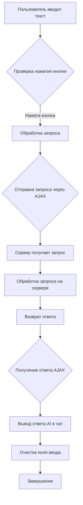
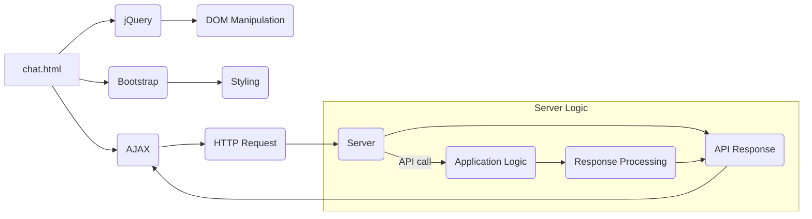

# <input code>

```html
# -*- coding: utf-8 -*-\n#! venv/Scripts/python.exe\n\n""" module: src.ai.gemini.html_chat.templates """\nMODE = \'debug\'\n<!DOCTYPE html>\n<html lang="en">\n<head>\n    <meta charset="UTF-8">\n    <meta name="viewport" content="width=device-width, initial-scale=1.0">\n    <title>Kazarinov Chat</title>\n    <!-- Bootstrap CSS -->\n    <link rel="stylesheet" href="https://cdn.jsdelivr.net/npm/bootstrap@4.0.0/dist/css/bootstrap.min.css" integrity="sha384-Gn5384xqQ1aoWXA+058RXPxPg6fy4IWvTNh0E263XmFcJlSAwiGgFAW/dAiS6JXm" crossorigin="anonymous">\n    <script src="https://code.jquery.com/jquery-3.5.1.min.js"></script>\n    <!-- Дополнительные стили -->\n    <link rel="stylesheet" href="{{ url_for(\'static\', path=\'css/styles.css\') }}">\n</head>\n<body>\n    <div class="container mt-5">\n        <h1 class="text-center">Kazarinov AI Chat</h1>\n        <div class="chat-box border rounded p-3 mb-3" style="height: 400px; overflow-y: scroll;">\n            <div id="chat-log">\n                <!-- Здесь будут отображаться сообщения -->\n            </div>\n        </div>\n        <form id="chat-form">\n            <div class="input-group">\n                <input type="text" id="user-input" class="form-control" placeholder="Введите сообщение...">\n                <div class="input-group-append">\n                    <button class="btn btn-primary" type="submit">Отправить</button>\n                </div>\n            </div>\n        </form>\n    </div>\n\n\n    <script>\n        $(document).ready(function() {\n            $(\'#chat-form\').submit(function(event) {\n                event.preventDefault();\n\n                let userInput = $(\'#user-input\').val();\n                $(\'#chat-log\').append(\'<p><strong>Вы:</strong> \' + userInput + \'</p>\');\n\n                $.ajax({\n                    url: \'/ask\',\n                    method: \'POST\',\n                    data: { user_input: userInput },\n                    success: function(response) {\n                        $(\'#chat-log\').append(\'<p><strong>AI:</strong> \' + response.response + \'</p>\');\n                        $(\'#user-input\').val(\'\');  // Очистка поля ввода\n                    }\n                });\n            });\n        });\n    </script>\n</body>\n</html>\n```

# <algorithm>



Примеры:
* **A:** Пользователь вводит "Привет".
* **C:** Проверка нажатия - кнопка "Отправить" нажата.
* **D:** AJAX запрос отправляется на `/ask` с данными `user_input: "Привет"`.
* **F:** Сервер обрабатывает запрос и возвращает ответ AI (например, "Приветствую!").
* **I:** В чат добавляется строка "AI: Приветствую!".
* **J:** Поле ввода очищается.


# <mermaid>




# <explanation>

* **Импорты:**
    *  Файл не содержит импортов в традиционном смысле (Python). Это HTML-шаблон, использующий JavaScript и Bootstrap. Зависимости `jquery` и `bootstrap` подгружаются через внешние ссылки. Зависимости `url_for` предполагают использование Flask фреймворка, который управляет статическими файлами, такими как `styles.css`  в переменной `url_for('static', path='css/styles.css')`.
* **Классы:**
    *  Нет определенных классов. HTML-шаблон используется для структуры веб-страницы и отображения данных.
* **Функции:**
    * `$.ajax()`: Запрашивает данные от сервера через AJAX.
        * `url`: Путь к обработчику на сервере (`/ask`).
        * `method`: Метод запроса (`POST`).
        * `data`: Данные, передаваемые на сервер (`user_input`).
        * `success`: Обработчик успешного ответа от сервера, добавляющий ответ AI в чат и очищающий поле ввода.
    * `$(document).ready(function() {...})` :  Обработчик события загрузки страницы.
    * Неявные функции: внутренние функции JavaScript для обработки нажатия кнопки, получения данных из поля ввода и работы с DOM.
* **Переменные:**
    * `MODE`:  Настройка режима (например, 'debug').
    * `userInput`: Содержит текст введенный пользователем.
    * `response`:  Ответ от серверной части приложения.
* **Возможные ошибки и улучшения:**
    * Отсутствует валидация введённых данных.
    * Отсутствие обработки ошибок (например, если сервер не отвечает).
    *  Отсутствие обработчика не успешного выполнения запроса (например, `error`).
    * Неопределенный ответ от сервера. Нужно определять, как реагировать на ошибки сервера.
    * Отсутствие типизации JavaScript-переменных.


**Взаимосвязь с другими частями проекта:**
Этот HTML-шаблон взаимодействует с серверной частью проекта (Flask или Django), которая реализует логику обработки запросов `/ask` и возвращает ответ в формате JSON.  Серверная часть получает данные `user_input` из запроса и использует их для взаимодействия с моделью AI (Gemini, вероятно).  Взаимодействие происходит через API запросы.