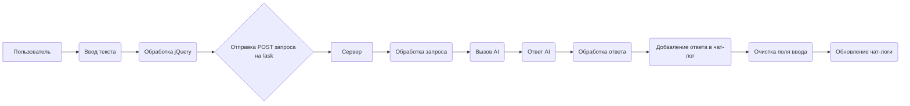

```MD
# <input code>

```html
# -*- coding: utf-8 -*-
#! venv/Scripts/python.exe

""" module: src.ai.gemini.html_chat.templates """
MODE = 'debug'
<!DOCTYPE html>
<html lang="en">
<head>
    <meta charset="UTF-8">
    <meta name="viewport" content="width=device-width, initial-scale=1.0">
    <title>Kazarinov Chat</title>
    <!-- Bootstrap CSS -->
    <link rel="stylesheet" href="https://cdn.jsdelivr.net/npm/bootstrap@4.0.0/dist/css/bootstrap.min.css" integrity="sha384-Gn5384xqQ1aoWXA+058RXPxPg6fy4IWvTNh0E263XmFcJlSAwiGgFAW/dAiS6JXm" crossorigin="anonymous">
    <script src="https://code.jquery.com/jquery-3.5.1.min.js"></script>
    <!-- Дополнительные стили -->
    <link rel="stylesheet" href="{{ url_for('static', path='css/styles.css') }}">
</head>
<body>
    <div class="container mt-5">
        <h1 class="text-center">Kazarinov AI Chat</h1>
        <div class="chat-box border rounded p-3 mb-3" style="height: 400px; overflow-y: scroll;">
            <div id="chat-log">
                <!-- Здесь будут отображаться сообщения -->
            </div>
        </div>
        <form id="chat-form">
            <div class="input-group">
                <input type="text" id="user-input" class="form-control" placeholder="Введите сообщение...">
                <div class="input-group-append">
                    <button class="btn btn-primary" type="submit">Отправить</button>
                </div>
            </div>
        </form>
    </div>


    <script>
        $(document).ready(function() {
            $('#chat-form').submit(function(event) {
                event.preventDefault();

                let userInput = $('#user-input').val();
                $('#chat-log').append('<p><strong>Вы:</strong> ' + userInput + '</p>');

                $.ajax({
                    url: '/ask',
                    method: 'POST',
                    data: { user_input: userInput },
                    success: function(response) {
                        $('#chat-log').append('<p><strong>AI:</strong> ' + response.response + '</p>');
                        $('#user-input').val('');  // Очистка поля ввода
                    }
                });
            });
        });
    </script>
</body>
</html>
```

# <algorithm>

```mermaid
graph TD
    A[Пользователь вводит текст] --> B{Обработка события submit};
    B --> C[Получение введенного текста];
    C --> D[Добавление сообщения пользователя в чат-лог];
    C --> E[Отправка запроса на сервер];
    E --> F[Получение ответа от сервера];
    F --> G[Добавление сообщения AI в чат-лог];
    G --> H[Очистка поля ввода];
    
    subgraph Сервер
        F -- Запрос на AI -- > I[AI-обработка];
        I -- Ответ -- > F;
    end
```

Пример: Пользователь вводит "Привет".
1. Пользователь нажимает кнопку "Отправить".
2. Обрабатывается событие submit.
3. Получается введенный текст "Привет".
4. В чат-лог добавляется сообщение "Вы: Привет".
5. Отправляется POST-запрос на сервер `/ask` с данными `user_input: Привет`.
6. Сервер обрабатывает запрос, передает его AI, получает ответ.
7. В чат-лог добавляется сообщение "AI: Ответ AI".
8. Поле ввода очищается.


# <mermaid>



# <explanation>

**Импорты:**

*  `https://code.jquery.com/jquery-3.5.1.min.js`:  Подключает библиотеку jQuery для JavaScript манипуляций с DOM (Document Object Model) и AJAX запросов.  Эта библиотека используется для работы с HTML элементами, такими как поле ввода и чат-лог, а также для отправки асинхронных запросов на сервер. Связь с `src` непрямая,  библиотека подключается через CDN.

**Классы:**

Нет определенных классов в коде.  Используется DOM (Document Object Model) для управления элементами HTML.

**Функции:**

* Нет определённых пользовательских функций в коде, но используется анонимная функция в `$(document).ready(...)`, и AJAX функция `$.ajax()`.


**Переменные:**

* `MODE`:  Строковая переменная, хранящая значение 'debug'. Используется скорее всего для настройки поведения приложения в различных режимах (например, отладка/производство).
* `userInput`: Переменная, хранящая введенный пользователем текст. Имеет тип string.
* `response`: Переменная, хранящая объект с ответом от сервера.  (тип - JSON).

**Возможные ошибки и улучшения:**

* Отсутствие валидации введенных данных.  Если пользователь введёт специальный символ или некорректные данные, сервер может получать ошибочные данные. Необходимо добавить проверки на стороне сервера.
*  Ошибки при подключении `$.ajax`.  Если не подключить jQuery, возникает ошибка.
* Отсутствие обработки ошибок `$.ajax`:  Необходимо добавить `error` обработчик, чтобы ловить ошибки при запросе к серверу (например, сетевые проблемы, ошибки на сервере).
*  Обработка больших сообщений:  Если в чат-лог будет добавляться много сообщений, то прокрутка может стать проблематичной.  Можно добавить опцию скрывать старые сообщения, если место не хватит.
*   Не указано откуда приходит `url: '/ask'` - предполагается, что это роут на сервер Flask.

**Взаимосвязь с другими частями проекта:**

Код использует роут `/ask` на серверной части проекта (вероятно, Flask). Этот роут обрабатывает POST-запрос с данными `user_input`, отправляет их для обработки в AI-модель (Gemini), получает ответ от AI и отправляет его обратно клиенту (в данном HTML шаблоне).  Без серверной части этот код бесполезен.