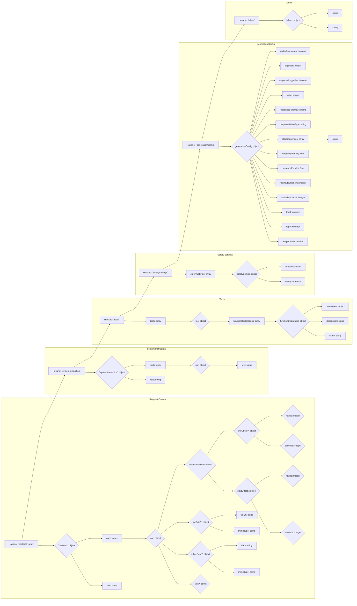

## АНАЛИЗ КОДА: `hypotez/src/ai/gemini/request.json.md`

### 1. <алгоритм>

Этот JSON-файл представляет собой структуру данных для запроса к API Gemini. Он описывает параметры запроса, включая содержимое (текст, данные, файлы), системные инструкции, инструменты, настройки безопасности и параметры генерации.

**Блок-схема:**

```mermaid
graph LR
    A[Начало: Формирование запроса] --> B{Определение содержимого запроса};
    B -- Текст --> C[Добавление текстового содержимого];
    B -- Inline Data --> D[Добавление inline данных (mimeType, data)];
    B -- File Data --> E[Добавление file данных (mimeType, fileUri)];
    E -->F{Метаданные для видео}
    F -- Да --> G[Добавление видео метаданных(startOffset, endOffset)];
    G --> H[Добавление systemInstruction (роль, текст)]
    H --> I{Добавление tools};
    I --> J{Добавление safetySettings};
    J --> K{Добавление generationConfig};
    K --> L{Добавление labels};
    L --> M[Конец: Запрос сформирован]
     C-->H
     D-->H
```

**Примеры данных для каждого логического блока:**

*   **B(Определение содержимого запроса)**: Здесь решается, какой тип данных будет отправлен в запросе. Это может быть текст, inline-данные (например, изображение в base64) или ссылка на файл.

*   **C(Добавление текстового содержимого)**:
    ```json
    {
      "role": "user",
      "parts": [
        {
          "text": "Привет, как дела?"
        }
      ]
    }
    ```
*   **D(Добавление inline данных)**:
    ```json
    {
      "role": "user",
      "parts": [
        {
          "inlineData": {
            "mimeType": "image/png",
            "data": "base64encodeddata..."
          }
        }
      ]
    }
    ```
*   **E(Добавление file данных)**:
    ```json
    {
      "role": "user",
      "parts": [
        {
          "fileData": {
            "mimeType": "text/plain",
            "fileUri": "gs://my-bucket/my-file.txt"
          }
        }
      ]
    }
    ```
*   **F, G(Метаданные для видео):**
    ```json
    {
        "videoMetadata": {
          "startOffset": {
            "seconds": 10,
            "nanos": 0
          },
          "endOffset": {
            "seconds": 20,
            "nanos": 0
          }
        }
    }
    ```
*   **H(Добавление systemInstruction)**:
    ```json
    {
      "role": "system",
      "parts": [
        {
          "text": "Ты - полезный ассистент."
        }
      ]
    }
    ```
*   **I(Добавление tools)**:
    ```json
    {
      "tools": [
        {
          "functionDeclarations": [
            {
              "name": "get_weather",
              "description": "Получить текущую погоду",
              "parameters": {
                  "location": "string"
              }
            }
          ]
        }
      ]
    }
    ```
*   **J(Добавление safetySettings)**:
    ```json
    {
      "safetySettings": [
        {
          "category": "HARM_CATEGORY_HATE_SPEECH",
          "threshold": "BLOCK_MEDIUM_AND_ABOVE"
        }
      ]
    }
    ```
*   **K(Добавление generationConfig)**:
    ```json
    {
        "temperature": 0.9,
        "topP": 1.0,
        "maxOutputTokens": 100,
        "stopSequences": ["\\n"]
    }
    ```

*   **L(Добавление labels)**:
    ```json
    {
      "labels": {
        "environment": "production",
        "project": "gemini"
      }
    }
    ```

### 2. <mermaid>



**Объяснение зависимостей:**

Диаграмма `mermaid` представляет структуру JSON-объекта.
1.  `Request Content`: описывает основное содержимое запроса, которое может состоять из текстовых частей, inline данных или файлов.
2.  `System Instruction`:  предоставляет инструкции для модели.
3.  `Tools`:  позволяет использовать инструменты, такие как вызовы функций.
4.  `Safety Settings`: определяет уровни безопасности для ответа.
5.  `Generation Config`:  настраивает параметры генерации текста.
6.  `Labels`:  позволяют добавить метки для запроса.
    
Каждая из этих секций имеет свои поля, которые могут быть как простыми типами данных (строки, числа, булевы), так и вложенными объектами и массивами. Все зависимости описывают вложенные поля JSON объекта.

### 3. <объяснение>

**Импорты:**

В данном коде импорты отсутствуют, поскольку это JSON-файл, а не Python-код.  Он предназначен для описания структуры данных, используемой API Gemini.

**Классы:**

В данном случае нет классов, так как это JSON файл.

**Функции:**

В данном случае нет функций, так как это JSON файл.

**Переменные:**

Переменные здесь - это ключи и значения JSON-объекта. Они представляют собой различные параметры запроса к API Gemini:

*   `cachedContent`: строка, представляющая кэшированный контент.
*   `contents`: массив объектов, каждый из которых содержит роль (например, "user", "model") и части содержимого (текст, inline data, file data).
*   `role`:  строка, указывающая роль части содержимого (например, "user", "system").
*   `text`:  строка, содержащая текстовое содержимое.
*   `inlineData`:  объект, содержащий inline данные (mimeType, data).
*   `mimeType`: строка, определяющая MIME тип данных (например, "image/png", "text/plain").
*   `data`: строка, содержащая закодированные данные.
*   `fileData`: объект, содержащий данные файла (mimeType, fileUri).
*   `fileUri`: строка, содержащая URI файла.
*   `videoMetadata`: объект, содержащий метаданные для видео (startOffset, endOffset).
*   `startOffset`: объект, определяющий начало видео (seconds, nanos).
*   `endOffset`: объект, определяющий конец видео (seconds, nanos).
*   `seconds`:  целое число, представляющее секунды в смещении видео.
*   `nanos`:  целое число, представляющее наносекунды в смещении видео.
*   `systemInstruction`: объект, содержащий системные инструкции для модели (роль, текст).
*   `tools`:  массив инструментов, которые можно использовать (например, вызовы функций).
*   `functionDeclarations`: массив объявлений функций, каждая из которых имеет имя, описание и параметры.
*   `name`:  строка, имя функции.
*   `description`:  строка, описание функции.
*   `parameters`:  объект, содержащий параметры функции.
*    `safetySettings`:  массив объектов, каждый из которых содержит категорию и порог безопасности.
*   `category`: перечисление (enum), категория безопасности.
*  `threshold`: перечисление (enum), порог блокировки.
*   `generationConfig`: объект, содержащий параметры генерации текста.
*   `temperature`:  число, параметр температуры для случайности генерации.
*   `topP`:  число, параметр для nucleus sampling.
*    `topK`:  число, параметр для top-k sampling.
*   `candidateCount`:  целое число, количество кандидатов для генерации.
*   `maxOutputTokens`: целое число, максимальное количество токенов в ответе.
*   `presencePenalty`:  число с плавающей точкой, штраф за присутствие токена.
*   `frequencyPenalty`: число с плавающей точкой, штраф за частоту токена.
*   `stopSequences`:  массив строк, последовательности, при появлении которых генерация должна остановиться.
*   `responseMimeType`:  строка, MIME тип ответа.
*    `responseSchema`: схема, описывающая формат ответа.
*   `seed`:  целое число, начальное значение для генерации случайных чисел.
*   `responseLogprobs`: булево значение, указывает, нужно ли возвращать лог вероятности.
*   `logprobs`: целое число, сколько вариантов лог вероятностей нужно вернуть.
*    `audioTimestamp`: булево значение, запрашивать ли временные метки для аудио.
*   `labels`:  объект, содержащий метки запроса.

**Потенциальные ошибки и области для улучшения:**

*   **Отсутствие валидации:** Данный JSON не предусматривает валидацию данных. Необходима дополнительная проверка для обеспечения корректности данных (например, mimeType должен быть валидным).
*   **Строгая типизация:**  В JSON типы данных определены не всегда строго. В некоторых случаях (например, параметры функции) ожидается object, но нет описания структуры этого объекта.
*   **Расширяемость:**  Может потребоваться добавление новых полей или изменение структуры, что потребует пересмотра схемы.

**Цепочка взаимосвязей с другими частями проекта:**

Этот JSON файл используется в качестве запроса к API Gemini. Его структура должна соответствовать требованиям API.  Этот файл используется как входные данные в коде, который отправляет запрос к API Gemini, например, в Python коде с использованием библиотек типа `google-generativeai`.

Например, данный `request.json` файл может быть прочитан и преобразован в Python dict, который далее используется в коде, например так:

```python
import json
import google.generativeai as genai

# Загрузка request.json
with open("hypotez/src/ai/gemini/request.json.md", "r") as f:
    request_data = json.load(f)


genai.configure(api_key="YOUR_API_KEY")

model = genai.GenerativeModel('gemini-pro')

# Передача данных запроса в модель Gemini
response = model.generate_content(request_data)
print(response.text)
```

Этот код считывает JSON данные из файла и отправляет запрос в Gemini API, используя загруженные данные.