## <алгоритм>

1.  **Установка корневой директории проекта (`set_project_root`)**:
    *   На вход принимает кортеж `marker_files` с именами файлов или директорий, по которым определяется корень проекта.
    *   Определяет текущую директорию, где находится файл.
    *   Итерируется по текущей директории и всем родительским директориям.
    *   На каждой итерации проверяет, существует ли в текущей директории какой-либо из `marker_files`.
    *   Если находит один из `marker_files`, устанавливает эту директорию как корневую и прерывает цикл.
    *   Если корневая директория еще не добавлена в `sys.path`, добавляет её.
    *   Возвращает `Path` объект корневой директории.
    
    **Пример**:
    
    ```python
    marker_files = ('pyproject.toml', 'requirements.txt', '.git')
    # Предположим, что структура директорий следующая:
    # /home/user/project/src/ai/gradio/header.py
    # /home/user/project/pyproject.toml
    # /home/user/project/requirements.txt
    # Корневая директория будет /home/user/project
    root = set_project_root(marker_files)
    print(root) # Вывод: /home/user/project
    ```

2. **Получение корневой директории**:
    *   Вызывается функция `set_project_root()`, результат присваивается глобальной переменной `__root__`.

3.  **Импорт модуля `gs`**:
    *   Импортируется модуль `gs` из `src`.

4.  **Чтение конфигурации из `config.json`**:
    *   Пытается открыть файл `config.json` в директории `src` относительно корня проекта (`gs.path.root`).
    *   Если файл успешно открыт, читает его содержимое как JSON и присваивает переменной `config`.
    *   В случае `FileNotFoundError` или `json.JSONDecodeError` обрабатывает исключение и переходит к следующему шагу.

    **Пример:**
    ```
        #Файл config.json
        {
            "project_name": "test_project",
            "version": "1.0.0",
            "author": "test_user",
            "copyrihgnt":"test_copyrihgnt"

        }
    ```
5.  **Чтение документации из `README.MD`**:
    *   Пытается открыть файл `README.MD` в директории `src` относительно корня проекта (`gs.path.root`).
    *   Если файл успешно открыт, читает его содержимое и присваивает переменной `doc_str`.
    *   В случае `FileNotFoundError` или `json.JSONDecodeError` обрабатывает исключение и переходит к следующему шагу.

6.  **Установка глобальных переменных**:
    *   Извлекает `project_name` из `config`, если `config` существует, иначе устанавливает значение по умолчанию `'hypotez'`.
    *   Извлекает `version` из `config`, если `config` существует, иначе устанавливает значение по умолчанию `''`.
    *   Присваивает `doc_str`  переменной `__doc__`, если `doc_str` существует, иначе `''`.
    *   Устанавливает `__details__` в `''`.
    *   Извлекает `author` из `config`, если `config` существует, иначе устанавливает значение по умолчанию `''`.
    *   Извлекает `copyright` из `config`, если `config` существует, иначе устанавливает значение по умолчанию `''`.
    *   Извлекает `cofee`  из `settings`, если `settings` существует, иначе устанавливает значение по умолчанию "Treat the developer to a cup of coffee for boosting enthusiasm in development: https://boosty.to/hypo69".
    
    **Пример**:
    ```
    __project_name__ = test_project
    __version__ = 1.0.0
    __doc__ = # Содержимое README.md если он существует или ''
    __details__ = ''
    __author__ = test_user
    __copyright__ = test_copyrihgnt
    __cofee__ = "Treat the developer to a cup of coffee for boosting enthusiasm in development: https://boosty.to/hypo69"
    ```

## <mermaid>


```mermaid
graph LR
    A[Start] --> B{Найти корневой каталог};
    B --> C{Проверка наличия marker_files};
    C -- Да --> D[Установить корневой каталог];
    C -- Нет --> E[Перейти к родительскому каталогу];
    E --> C;
    D --> F{Корневой каталог в sys.path?};
    F -- Нет --> G[Добавить корневой каталог в sys.path];
    F -- Да --> H[Получить корневой каталог];
    G --> H;
    H --> I[Импорт модуля gs];
    I --> J{Чтение config.json};
    J -- Успех --> K[Загрузить конфигурацию];
    J -- Ошибка --> L[Обработка ошибки];
    K --> M[Чтение README.MD];
    L --> M;
    M -- Успех --> N[Загрузить документацию];
    M -- Ошибка --> O[Обработка ошибки];
    N --> P[Установка глобальных переменных];
    O --> P;
    P --> Q[End];

    style A fill:#f9f,stroke:#333,stroke-width:2px
    style Q fill:#f9f,stroke:#333,stroke-width:2px
    style B fill:#ccf,stroke:#333,stroke-width:2px
    style C fill:#ccf,stroke:#333,stroke-width:2px
    style D fill:#ccf,stroke:#333,stroke-width:2px
    style E fill:#ccf,stroke:#333,stroke-width:2px
    style F fill:#ccf,stroke:#333,stroke-width:2px
    style G fill:#ccf,stroke:#333,stroke-width:2px
    style H fill:#ccf,stroke:#333,stroke-width:2px
    style I fill:#ccf,stroke:#333,stroke-width:2px
    style J fill:#ccf,stroke:#333,stroke-width:2px
    style K fill:#ccf,stroke:#333,stroke-width:2px
    style L fill:#ccf,stroke:#333,stroke-width:2px
    style M fill:#ccf,stroke:#333,stroke-width:2px
    style N fill:#ccf,stroke:#333,stroke-width:2px
    style O fill:#ccf,stroke:#333,stroke-width:2px
    style P fill:#ccf,stroke:#333,stroke-width:2px

```

**Анализ диаграммы:**

*   **Start:** Начало выполнения скрипта.
*   **Найти корневой каталог:** Функция `set_project_root` начинает поиск корневого каталога.
*   **Проверка наличия marker_files:** Проверяет, существует ли любой из marker files в текущей директории.
*   **Установить корневой каталог:** Устанавливает текущую директорию в качестве корня проекта.
*   **Перейти к родительскому каталогу:** Если marker file не найден, переходим к родительской директории.
*   **Корневой каталог в sys.path?:** Проверка, добавлен ли корневой каталог в sys.path.
*   **Добавить корневой каталог в sys.path:** Если нет, то добавляется.
*   **Получить корневой каталог:** Корневой каталог проекта найден.
*   **Импорт модуля gs:** Импортируется модуль `gs` для доступа к путям проекта.
*   **Чтение config.json:** Пытаемся прочитать файл `config.json`.
*   **Загрузить конфигурацию:** Если успешно, то загружает данные конфигурации.
*   **Обработка ошибки:** В случае ошибки чтения файла, происходит обработка исключения.
*   **Чтение README.MD:** Пытаемся прочитать файл `README.MD`.
*  **Загрузить документацию:** Если успешно, то загружает данные документации.
*   **Обработка ошибки:** В случае ошибки чтения файла, происходит обработка исключения.
*   **Установка глобальных переменных:** Устанавливаются глобальные переменные из конфигурации и документации.
*   **End:** Конец выполнения скрипта.

## <объяснение>

**Импорты:**

*   `sys`: Модуль `sys` используется для взаимодействия с интерпретатором Python. В данном коде он применяется для добавления корневой директории проекта в `sys.path`, чтобы Python мог находить модули проекта при импорте.
*   `json`: Модуль `json` используется для работы с данными в формате JSON. В этом коде он используется для чтения данных конфигурации из файла `config.json`.
*   `packaging.version.Version`: Из модуля `packaging` импортируется класс `Version`, который используется для работы с версиями пакетов. В данном коде не используется, но импортирован. 
*   `pathlib.Path`: Класс `Path` из модуля `pathlib` используется для работы с путями файлов и директорий в операционной системе. Он упрощает работу с путями и делает код более читаемым.

**Переменные:**

*   `MODE`: Строковая переменная, устанавливается в `'dev'`. Возможно, используется для определения режима работы приложения (разработка, отладка и т.д.).
*   `__root__`: `Path` объект, который хранит путь к корневой директории проекта. Этот путь вычисляется с помощью функции `set_project_root`.
*   `config`: Словарь, который хранит конфигурационные данные, загруженные из файла `config.json`. Если файл не найден или произошла ошибка при чтении, он остается `None`.
*  `doc_str`: Строковая переменная, в которой хранится содержимое файла `README.MD`.
*   `__project_name__`: Строка, содержащая имя проекта, берется из конфигурации или по умолчанию `hypotez`.
*   `__version__`: Строка, содержащая версию проекта, берется из конфигурации или пустая строка.
*   `__doc__`: Строка, содержащая документацию из `README.MD` файла.
*   `__details__`: Строка, содержит пустую строку.
*   `__author__`: Строка, содержащая имя автора, берется из конфигурации или пустая строка.
*    `__copyright__`: Строка, содержащая информацию об авторских правах, берется из конфигурации или пустая строка.
*    `__cofee__`: Строка, содержащая информацию о донате для разработчика, берется из конфигурации `settings` или значение по умолчанию.

**Функции:**

*   `set_project_root(marker_files)`:
    *   **Аргументы:**
        *   `marker_files` (tuple): Кортеж строк, содержащих имена файлов или директорий, которые используются для определения корня проекта.
    *   **Возвращает:**
        *   `Path`: Объект `Path`, представляющий путь к корневой директории проекта. Если корневая директория не найдена, возвращает текущую директорию.
    *   **Назначение:**
        *   Определяет корневую директорию проекта, начиная поиск с текущей директории и переходя вверх по дереву каталогов, пока не найдет один из `marker_files`.
        *   Добавляет корневую директорию в `sys.path` для возможности импорта модулей из других частей проекта.
    *   **Пример:**

        ```python
        root_path = set_project_root(marker_files=('pyproject.toml', 'requirements.txt', '.git'))
        print(root_path)  # Выведет путь к корневой директории
        ```

**Потенциальные ошибки и улучшения:**

*   **Обработка исключений**: Обработка `FileNotFoundError` и `json.JSONDecodeError` в блоках `try`/`except` выполняется пассивно (`...`). Может быть полезно добавить логирование ошибок или вывод сообщений об ошибках для лучшей отладки.
*  **Необязательное наличие файла README.MD:** Отсутствие файла `README.MD` обрабатывается спокойно, однако, может быть полезно добавить оповещение об отсутствии файла.
* **Глобальные переменные:** Использование большого количества глобальных переменных может усложнить отслеживание их изменений. Возможно, стоит рассмотреть вариант использования классов или структур данных для их организации.
*   **Жёстко заданные пути:** Путь к файлам `config.json` и `README.MD` жёстко задан. Можно сделать их более гибкими, добавив возможность переопределения пути через параметры.
*   **Модуль `settings`:** Использование переменной `settings` в строке, где устанавливается `__cofee__`, вызывает ошибку. Потенциально имеется ввиду модуль `config`, из которого берутся остальные данные.
*  **Импорт `Version`**: Импорт `packaging.version.Version` не используется в коде, поэтому его можно удалить.

**Взаимосвязь с другими частями проекта:**

*   Модуль `header.py` является частью структуры проекта и содержит общие настройки, необходимые для работы других модулей.
*   `gs` - модуль, который предоставляет пути к ресурсам проекта и, вероятно, содержит другие общие функции и переменные.
*   Значения из `config.json` и `README.MD`  используются в других частях проекта, что делает этот файл точкой централизованной настройки.