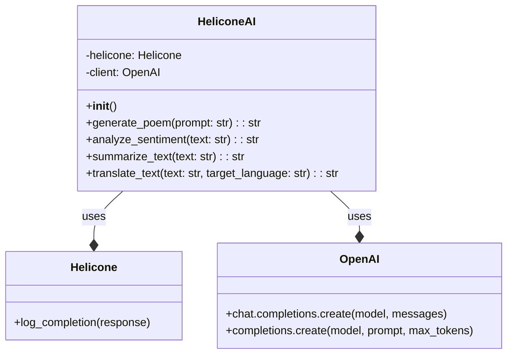

## ИНСТРУКЦИЯ:

Анализируй предоставленный код подробно и объясни его функциональность. Ответ должен включать три раздела:  

1. **<алгоритм>**: Опиши рабочий процесс в виде пошаговой блок-схемы, включая примеры для каждого логического блока, и проиллюстрируй поток данных между функциями, классами или методами.  
2. **<mermaid>**: Напиши код для диаграммы в формате `mermaid`, проанализируй и объясни все зависимости, 
    которые импортируются при создании диаграммы. 
    **ВАЖНО!** Убедитесь, что все имена переменных, используемые в диаграмме `mermaid`, 
    имеют осмысленные и описательные имена. Имена переменных вроде `A`, `B`, `C`, и т.д., не допускаются!  
    
    **Дополнительно**: Если в коде есть импорт `import header`, добавьте блок `mermaid` flowchart, объясняющий `header.py`:\
    ```mermaid\
    flowchart TD\
        Start --> Header[<code>header.py</code><br> Determine Project Root]\
    \
        Header --> import[Import Global Settings: <br><code>from src import gs</code>] \
    ```

3. **<объяснение>**: Предоставьте подробные объяснения:  
   - **Импорты**: Их назначение и взаимосвязь с другими пакетами `src.`.  
   - **Классы**: Их роль, атрибуты, методы и взаимодействие с другими компонентами проекта.  
   - **Функции**: Их аргументы, возвращаемые значения, назначение и примеры.  
   - **Переменные**: Их типы и использование.  
   - Выделите потенциальные ошибки или области для улучшения.  

Дополнительно, постройте цепочку взаимосвязей с другими частями проекта (если применимо).  

Это обеспечивает всесторонний и структурированный анализ кода.
## Формат ответа: `.md` (markdown)
**КОНЕЦ ИНСТРУКЦИИ**
```markdown
## <алгоритм>

### Общая схема работы `HeliconeAI`

1.  **Инициализация:**
    *   Создается экземпляр класса `HeliconeAI`.
        *   При этом создается экземпляр `Helicone` для логирования и экземпляр `OpenAI` для взаимодействия с моделями OpenAI.

2.  **Вызов методов:**
    *   Вызывается один из методов `HeliconeAI`: `generate_poem`, `analyze_sentiment`, `summarize_text` или `translate_text`.
        *   Метод формирует запрос к OpenAI API, используя модель `gpt-3.5-turbo` для генерации стихов и `text-davinci-003` для остальных задач.
        *   Пример запроса для `generate_poem`: `prompt="Напиши мне стихотворение про кота."`
        *   Пример запроса для `analyze_sentiment`: `prompt="Analyze the sentiment of the following text: Сегодня был отличный день!"`
        *   Пример запроса для `summarize_text`: `prompt="Summarize the following text: Длинный текст для изложения..."`
        *   Пример запроса для `translate_text`: `prompt="Translate the following text to русский: Hello, how are you?"`
    *   OpenAI API возвращает ответ.
    *   Полученный ответ логируется с помощью `helicone.log_completion(response)`.
    *   Из ответа извлекается и возвращается необходимая часть:
        *   Содержание сгенерированного стиха (для `generate_poem`).
        *   Результат анализа тональности (для `analyze_sentiment`).
        *   Краткое содержание текста (для `summarize_text`).
        *   Перевод текста (для `translate_text`).

3.  **Пример использования в `main()`:**
    *   Создается экземпляр `HeliconeAI`.
    *   Вызываются методы с примерами входных данных.
    *   Результаты работы методов выводятся в консоль.

### Блок-схема для каждого метода:

#### `generate_poem(prompt: str)`:

```mermaid
flowchart TD
    StartGeneratePoem[Start: generate_poem] --> PromptInput[Input Prompt]
    PromptInput --> CreateChatCompletion[Create Chat Completion:<br>model="gpt-3.5-turbo",<br>messages=[{"role": "user", "content": prompt}]]
    CreateChatCompletion --> LogCompletion[Log Completion: helicone.log_completion(response)]
    LogCompletion --> ExtractContent[Extract Poem Content]
    ExtractContent --> ReturnPoem[Return Poem Content]
    ReturnPoem --> EndGeneratePoem[End: generate_poem]
```

**Пример:**

*   `prompt`: "Напиши стихотворение про море."
*   `response.choices[0].message.content`: "Бескрайнее море, волны шумят..."

#### `analyze_sentiment(text: str)`:

```mermaid
flowchart TD
    StartAnalyzeSentiment[Start: analyze_sentiment] --> TextInput[Input Text]
    TextInput --> CreateCompletionSentiment[Create Completion:<br>model="text-davinci-003",<br>prompt="Analyze the sentiment of the following text: {text}",<br>max_tokens=50]
    CreateCompletionSentiment --> LogCompletionSentiment[Log Completion: helicone.log_completion(response)]
    LogCompletionSentiment --> ExtractSentiment[Extract Sentiment]
    ExtractSentiment --> ReturnSentiment[Return Sentiment]
    ReturnSentiment --> EndAnalyzeSentiment[End: analyze_sentiment]
```

**Пример:**

*   `text`: "Я очень рад!"
*   `response.choices[0].text.strip()`: "Positive."

#### `summarize_text(text: str)`:

```mermaid
flowchart TD
    StartSummarizeText[Start: summarize_text] --> TextInputSummary[Input Text]
    TextInputSummary --> CreateCompletionSummary[Create Completion:<br>model="text-davinci-003",<br>prompt="Summarize the following text: {text}",<br>max_tokens=100]
    CreateCompletionSummary --> LogCompletionSummary[Log Completion: helicone.log_completion(response)]
    LogCompletionSummary --> ExtractSummary[Extract Summary]
    ExtractSummary --> ReturnSummary[Return Summary]
    ReturnSummary --> EndSummarizeText[End: summarize_text]
```

**Пример:**

*   `text`: "Длинный текст о политике и экономике..."
*   `response.choices[0].text.strip()`: "Краткое изложение основных тезисов..."

#### `translate_text(text: str, target_language: str)`:

```mermaid
flowchart TD
    StartTranslateText[Start: translate_text] --> TextInputTranslate[Input Text and Target Language]
    TextInputTranslate --> CreateCompletionTranslate[Create Completion:<br>model="text-davinci-003",<br>prompt="Translate the following text to {target_language}: {text}",<br>max_tokens=200]
    CreateCompletionTranslate --> LogCompletionTranslate[Log Completion: helicone.log_completion(response)]
    LogCompletionTranslate --> ExtractTranslation[Extract Translation]
     ExtractTranslation --> ReturnTranslation[Return Translation]
    ReturnTranslation --> EndTranslateText[End: translate_text]
```

**Пример:**

*   `text`: "Good morning!"
*   `target_language`: "русский"
*   `response.choices[0].text.strip()`: "Доброе утро!"

## <mermaid>

### Анализ `mermaid` диаграммы

*   **`HeliconeAI`:**
    *   Класс `HeliconeAI` является центральным элементом, обеспечивающим интеграцию с Helicone и OpenAI.
    *   Имеет атрибуты `helicone` (экземпляр класса `Helicone`) и `client` (экземпляр класса `OpenAI`).
    *   Содержит методы для генерации стихов, анализа тональности, суммирования и перевода текста, каждый из которых использует API OpenAI и логирует завершения в Helicone.
*   **`Helicone`:**
    *   Класс `Helicone`, используется для логирования завершений вызовов OpenAI API.
    *   Содержит метод `log_completion(response)` для записи данных о запросах и ответах.
*  **`OpenAI`**
    *   Класс `OpenAI`, используется для взаимодействия с OpenAI API.
    *   Содержит методы `chat.completions.create()` (используется для генерации стихов) и `completions.create()` (используется для анализа тональности, суммирования и перевода текста).
*   **Отношения:**
    *   `HeliconeAI` использует (зависимость) `Helicone` для логирования, что показано связью `HeliconeAI --* Helicone : uses`.
    *   `HeliconeAI` использует (зависимость) `OpenAI` для взаимодействия с API, что показано связью `HeliconeAI --* OpenAI : uses`.

### Зависимости

В данной `mermaid` диаграмме показаны следующие зависимости:

1. **Импорты:**
   * Класс `HeliconeAI` зависит от импорта классов `Helicone` и `OpenAI`, которые представляют собой API для взаимодействия с Helicone и OpenAI соответственно.

2. **Взаимосвязи:**
   * Класс `HeliconeAI` использует экземпляры классов `Helicone` и `OpenAI` для выполнения своих задач, что показано связями `uses`.

## <объяснение>

### Импорты

*   `from helicone import Helicone`: Импортирует класс `Helicone` из библиотеки `helicone`. Этот класс используется для логирования результатов запросов к OpenAI API, что позволяет отслеживать и анализировать использование моделей.
*   `from openai import OpenAI`: Импортирует класс `OpenAI` из библиотеки `openai`. Этот класс используется для взаимодействия с API OpenAI, для доступа к таким моделям, как `gpt-3.5-turbo` и `text-davinci-003`.

### Классы

*   **`HeliconeAI`:**
    *   **Роль:** Основной класс для интеграции Helicone.ai и OpenAI. Предоставляет высокоуровневый интерфейс для работы с моделями OpenAI, логируя результаты с помощью Helicone.
    *   **Атрибуты:**
        *   `helicone: Helicone`: Экземпляр класса `Helicone` для логирования.
        *   `client: OpenAI`: Экземпляр класса `OpenAI` для взаимодействия с API.
    *   **Методы:**
        *   `__init__()`: Конструктор класса, инициализирует `helicone` и `client`.
        *   `generate_poem(prompt: str) -> str`: Генерирует стихотворение на основе заданного запроса, используя модель `gpt-3.5-turbo`. Возвращает сгенерированный текст.
        *   `analyze_sentiment(text: str) -> str`: Анализирует тональность текста, используя модель `text-davinci-003`. Возвращает результат анализа.
        *   `summarize_text(text: str) -> str`: Суммирует текст, используя модель `text-davinci-003`. Возвращает краткое содержание.
        *   `translate_text(text: str, target_language: str) -> str`: Переводит текст на заданный язык, используя модель `text-davinci-003`. Возвращает перевод.

### Функции

*   **`generate_poem(self, prompt: str) -> str`:**
    *   **Аргументы:**
        *   `prompt: str`: Текст запроса для генерации стиха.
    *   **Возвращаемое значение:**
        *   `str`: Сгенерированный текст стиха.
    *   **Назначение:** Использует `gpt-3.5-turbo` для создания стихов, логирует результат и возвращает сгенерированный текст.
    *   **Пример:** `helicone_ai.generate_poem("Напиши мне стих про осень")` вернет строку с текстом стихотворения.

*   **`analyze_sentiment(self, text: str) -> str`:**
    *   **Аргументы:**
        *   `text: str`: Текст для анализа тональности.
    *   **Возвращаемое значение:**
        *   `str`: Результат анализа тональности.
    *   **Назначение:** Анализирует тональность текста (`text-davinci-003`), логирует и возвращает результат.
    *   **Пример:** `helicone_ai.analyze_sentiment("У меня всё отлично!")` вернет строку, например, "Positive".

*   **`summarize_text(self, text: str) -> str`:**
    *   **Аргументы:**
        *   `text: str`: Текст для суммирования.
    *   **Возвращаемое значение:**
        *   `str`: Краткое содержание текста.
    *   **Назначение:** Суммирует текст (`text-davinci-003`), логирует и возвращает краткое содержание.
    *   **Пример:** `helicone_ai.summarize_text("Очень длинный текст...")` вернет строку с кратким изложением.

*   **`translate_text(self, text: str, target_language: str) -> str`:**
    *   **Аргументы:**
        *   `text: str`: Текст для перевода.
        *   `target_language: str`: Язык, на который нужно перевести текст.
    *   **Возвращаемое значение:**
        *   `str`: Переведенный текст.
    *   **Назначение:** Переводит текст на заданный язык (`text-davinci-003`), логирует и возвращает перевод.
    *   **Пример:** `helicone_ai.translate_text("Hello", "русский")` вернет строку "Привет".

*  **`main()`**
    *   **Назначение:** Функция для демонстрации работы класса `HeliconeAI`.
    *   **Логика:**
        *   Создает экземпляр класса `HeliconeAI`.
        *   Последовательно вызывает все методы `HeliconeAI` с примерами запросов и выводит результат в консоль.
        *   Пример: `helicone_ai.generate_poem("Напиши мне стих про кота")`

### Переменные

*   `self.helicone`: Экземпляр класса `Helicone` для логирования вызовов.
*   `self.client`: Экземпляр класса `OpenAI` для взаимодействия с API.
*   `prompt: str`: Входящий запрос (текст) для генерации стиха.
*   `text: str`: Входящий текст для анализа, суммирования или перевода.
*   `target_language: str`: Язык, на который нужно перевести текст.
*   `response`: Ответ от OpenAI API, который содержит результаты вызова модели.
*  `poem: str`, `sentiment: str`, `summary: str`, `translation: str` - переменные для хранения результатов работы методов `HeliconeAI`.

### Потенциальные ошибки и области для улучшения

1.  **Обработка ошибок:** Код не содержит обработки исключений, которые могут возникнуть при запросах к API OpenAI. Необходимо добавить `try-except` блоки для обработки ошибок.
2.  **Конфигурация моделей:** Модели (`gpt-3.5-turbo`, `text-davinci-003`) жестко заданы в коде. Можно сделать их конфигурацию более гибкой, например, передавая модель в качестве параметра или используя конфигурационный файл.
3.  **Параметры запросов:** Параметры `max_tokens` также заданы жестко. Можно сделать их настраиваемыми.
4.  **Асинхронность:** Запросы к API OpenAI выполняются синхронно, что может замедлить работу приложения. Рассмотреть возможность использования асинхронных запросов для повышения производительности.
5.  **Дополнительная логика:** Можно добавить логику для предобработки текста перед отправкой запроса и постобработки ответа.

### Взаимосвязи с другими частями проекта

*   **Модуль `src.ai.helicone`:** Данный код является частью модуля `src.ai.helicone`. Он предоставляет API для работы с Helicone.ai и OpenAI, что может использоваться другими частями проекта для генерации контента, анализа текста и других задач.
*   **Интеграция с другими модулями:** Этот модуль может использоваться в сочетании с другими модулями, например, для автоматического создания контента, анализа данных или интеграции с другими сервисами.
```