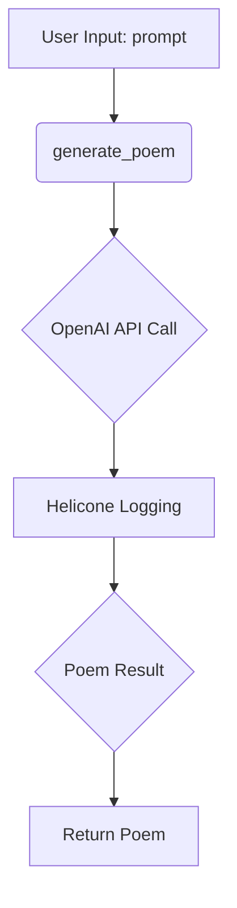
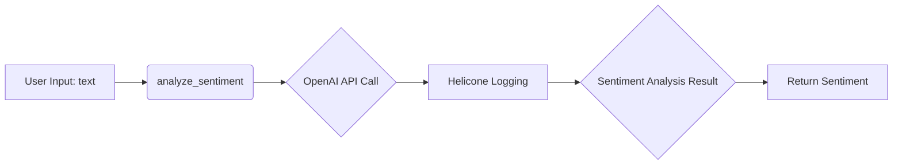
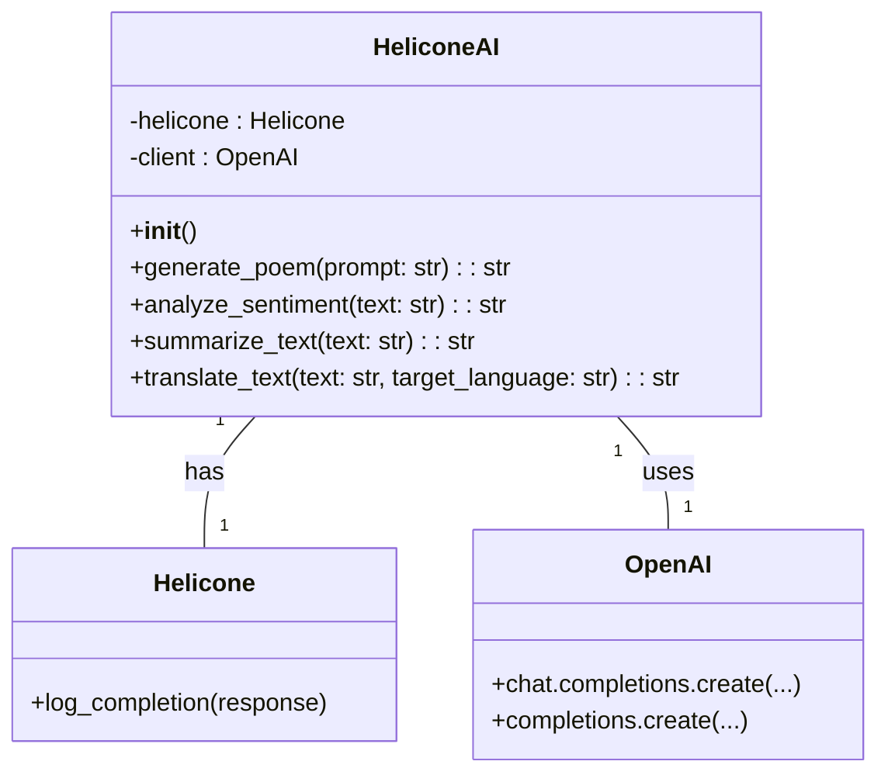

# <input code>

```rst
.. module: src.ai.helicone
```
[Русский](https://github.com/hypo69/hypo/blob/master/src/ai/helicone/readme.ru.md)
[About `helicone.ai`](https://github.com/hypo69/hypo/blob/master/src/ai/helicone/about.ru.md)
# HeliconeAI: Integration with Helicone.ai and OpenAI

## Overview

The `HeliconeAI` class is designed to facilitate interaction with Helicone.ai and OpenAI's models. This class provides methods for generating poems, analyzing sentiment, summarizing text, and translating text. It also includes logging of completions using Helicone.ai.

## Key Features

1. **Poem Generation**:
   - Generates a poem based on a given prompt using the `gpt-3.5-turbo` model.

2. **Sentiment Analysis**:
   - Analyzes the sentiment of a given text using the `text-davinci-003` model.

3. **Text Summarization**:
   - Summarizes a given text using the `text-davinci-003` model.

4. **Text Translation**:
   - Translates a given text to a specified target language using the `text-davinci-003` model.

5. **Completion Logging**:
   - Logs all completions using Helicone.ai for monitoring and analysis.

## Installation

To use the `HeliconeAI` class, ensure you have the necessary dependencies installed. You can install them using pip:

```bash
pip install openai helicone
```

## Usage

### Initialization

Initialize the `HeliconeAI` class:

```python
from helicone import Helicone
from openai import OpenAI

class HeliconeAI:
    def __init__(self):
        self.helicone = Helicone()
        self.client = OpenAI()
```

### Methods

#### Generate Poem

Generate a poem based on a given prompt:

```python
def generate_poem(self, prompt: str) -> str:
    response = self.client.chat.completions.create(
        model="gpt-3.5-turbo",
        messages=[
            {"role": "user", "content": prompt}
        ]
    )
    self.helicone.log_completion(response)
    return response.choices[0].message.content
```

#### Analyze Sentiment

Analyze the sentiment of a given text:

```python
def analyze_sentiment(self, text: str) -> str:
    response = self.client.completions.create(
        model="text-davinci-003",
        prompt=f"Analyze the sentiment of the following text: {text}",
        max_tokens=50
    )
    self.helicone.log_completion(response)
    return response.choices[0].text.strip()
```

... (other methods)

### Example Usage

```python
def main():
    helicone_ai = HeliconeAI()
    # ... (example calls to methods)
```

## Dependencies

- `helicone`
- `openai`

## License

This project is licensed under the MIT License. See the [LICENSE](LICENSE) file for details.

---
```

```markdown
# <algorithm>

The code defines a `HeliconeAI` class for interacting with Helicone.ai and OpenAI APIs.  The algorithm for each method is as follows:

1. **`__init__`**: Creates instances of `Helicone` and `OpenAI` client objects.
    * **Input:** None
    * **Output:** An initialized `HeliconeAI` object.

2. **`generate_poem`**:
    * **Input:** `prompt` (string).
    * **Action:** Sends a chat completion request to OpenAI's `gpt-3.5-turbo` model using the prompt. Logs the completion using the `helicone` object.
    * **Output:** The generated poem (string).


3. **`analyze_sentiment`**, `summarize_text`, `translate_text`:
    * **Input:** `text` (string) and optionally `target_language` (string).
    * **Action:** Sends a completion request to OpenAI's `text-davinci-003` model with a specific prompt related to sentiment analysis, summarization, or translation, respectively. Logs the completion.
    * **Output:** The sentiment analysis result, summary, or translation (string).

Example Data Flow:





# <mermaid>



This mermaid diagram shows the class structure. `HeliconeAI` uses `Helicone` and `OpenAI` for its functionality. `Helicone` is responsible for logging API calls, and `OpenAI` provides the AI models.

# <explanation>

- **Imports:**
    - `from helicone import Helicone`: Imports the `Helicone` class from the `helicone` package. This likely allows interaction with the Helicone.ai platform for logging API calls.  The `helicone` package is assumed to be a separate library installed.
    - `from openai import OpenAI`: Imports the `OpenAI` class from the `openai` package, used for interacting with OpenAI's API.  The `openai` package is assumed to be a separate library installed.
    The imports are crucial for initializing the necessary communication interfaces.


- **Classes:**
    - `HeliconeAI`: This class encapsulates the logic for interacting with the Helicone.ai and OpenAI APIs. It holds instances of both. It's a central point for managing the interaction.
    - `Helicone`:  Implements functionalities for logging API responses to Helicone.ai.
    - `OpenAI`:  Handles interactions with the OpenAI API.

- **Functions:**
    - `generate_poem(self, prompt: str) -> str`: Takes a prompt string, generates a poem using the OpenAI gpt-3.5-turbo model, logs the completion, and returns the generated poem.
    - `analyze_sentiment(self, text: str) -> str`: Takes input text and analyzes its sentiment using OpenAI's text-davinci-003 model. Logs the completion and returns the analyzed sentiment.
    - `summarize_text(self, text: str) -> str`: Summarizes the given text using OpenAI's text-davinci-003 model, logs, and returns the summary.
    - `translate_text(self, text: str, target_language: str) -> str`: Translates the input text to the specified target language using OpenAI's text-davinci-003 model, logs, and returns the translation.


- **Variables:**
    - `self.helicone`, `self.client`: These are instances of `Helicone` and `OpenAI` classes, respectively, used throughout the `HeliconeAI` class for interaction. They are initialized in the constructor.


- **Possible Errors/Improvements:**
    - **Error Handling:** The code lacks error handling.  If the OpenAI API call fails (e.g., rate limiting, invalid API key), the program will crash.  Adding `try...except` blocks to handle potential errors is highly recommended.
    - **Rate Limiting:**  OpenAI APIs have rate limits. The code should implement strategies to handle these limits, such as backoff mechanisms.
    - **Input Validation:** Input parameters (like `prompt` and `target_language`) should be validated for correctness to prevent unexpected behavior.
    - **Logging:** More comprehensive logging (including error details and timestamps) would help debug issues.


**Relationship with Other Parts of the Project:**

This `HeliconeAI` module acts as an interface for handling interactions with AI models. It connects with other parts of the project that need AI capabilities (e.g., poem generation, sentiment analysis, translation). The `helicone` and `openai` libraries are external dependencies. The `main` function in the example likely instantiates and uses the `HeliconeAI` class in a larger application context.