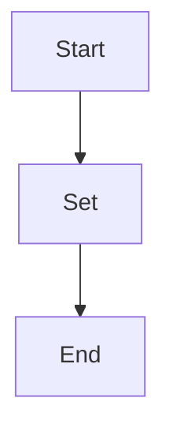

## АНАЛИЗ КОДА: `hypotez/src/ai/helicone/__init__.py`

### <алгоритм>

1. **Начало**: Запускается выполнение скрипта `__init__.py`.

2. **Установка `MODE`**: Определяется глобальная переменная `MODE` и устанавливается значение `'dev'`.
   *   Пример: ``

3. **Завершение**: Скрипт завершает выполнение.

### <mermaid>

**Описание зависимостей:**
- Нет внешних зависимостей, скрипт устанавливает внутреннюю переменную MODE.

### <объяснение>

**Импорты**:
- В данном коде отсутствуют явные импорты других модулей, что делает его независимым от других частей проекта с точки зрения импорта. Однако, если рассматривать этот файл как часть пакета `src.ai.helicone`, то он может зависеть от других частей этого пакета или глобальных настроек проекта через неявные механизмы, например, при инициализации, или если значение `MODE` используется в других частях кода.

**Классы**:
- В данном коде классы отсутствуют.

**Функции**:
- В данном коде отсутствуют функции.

**Переменные**:
- `MODE`: Глобальная переменная типа `str`, устанавливается в значение `'dev'`. Обычно используется для определения режима работы приложения (разработка, тестирование, продакшн). В данном случае, значение `'dev'` указывает на режим разработки.

**Потенциальные ошибки и области для улучшения**:
- Отсутствие комментариев к переменной `MODE` и ее предполагаемому использованию.
- Нет проверки окружения для определения значения `MODE`.
- Отсутствие явного объявления для чего используется этот пакет.

**Взаимосвязь с другими частями проекта**:
- Переменная `MODE` может использоваться другими модулями в проекте `hypotez` для определения поведения. Например, для включения отладочных сообщений в режиме разработки или выполнения каких-то действий только в режиме разработки. Это делает данный модуль важной точкой конфигурации, но его связь с другими частями проекта неявна, и нужно искать, где используется переменная `MODE`.