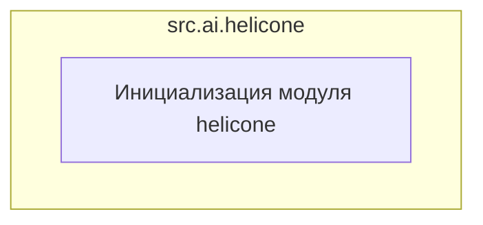

### **Анализ кода `hypotez/src/ai/helicone/__init__.py`**

#### **1. Алгоритм**

1.  **Инициализация модуля**:
    *   Модуль `src.ai.helicone` инициализируется.
    *   Указывается кодировка файла (`utf-8`).
    *   Определяется как модуль для платформ Windows и Unix.
    *   Добавляется общее описание модуля.
    *   В данном случае, код просто инициализирует модуль `helicone`, не выполняя никаких конкретных действий или операций. Это может быть использовано для импорта других модулей или инициализации переменных в дальнейшем.

#### **2. Mermaid**

В данном случае нет явных зависимостей или сложной логики для визуализации в виде диаграммы. Однако, если бы в этом файле были импорты или классы, мы бы представили их следующим образом:

**Объяснение зависимостей**:

*   В данном случае, код инициализирует модуль `helicone`, который пока что не имеет внешних зависимостей. Если бы были импорты, они были бы указаны здесь.

#### **3. Объяснение**

*   **Импорты**:
    *   В предоставленном коде отсутствуют явные импорты. Если бы они были, здесь было бы указано их назначение и взаимосвязь с другими пакетами `src`.
*   **Классы**:
    *   В предоставленном коде отсутствуют классы. Если бы они были, здесь было бы указано их роль, атрибуты, методы и взаимодействие с другими компонентами проекта.
*   **Функции**:
    *   В предоставленном коде отсутствуют функции. Если бы они были, здесь были бы указаны их аргументы, возвращаемые значения, назначение и примеры.
*   **Переменные**:
    *   В предоставленном коде отсутствуют переменные. Если бы они были, здесь было бы указано их типы и использование.

**Потенциальные области для улучшения**:

*   В текущем виде файл `__init__.py` пуст и выполняет только функцию инициализации модуля. Для реального использования модуля `helicone` необходимо добавить функциональность, например, импортировать другие модули или определять классы и функции.
*   Необходимо добавить документацию, описывающую назначение модуля `helicone` и его связь с другими частями проекта.