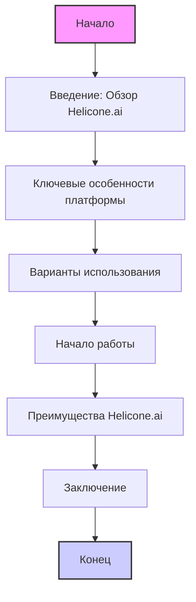

## Анализ файла `about.md`

### 1. <алгоритм>

Файл `about.md` представляет собой документ, описывающий платформу Helicone.ai.  Он не содержит исполняемого кода, поэтому не существует алгоритма в привычном понимании. Тем не менее, мы можем рассмотреть структуру файла как алгоритм представления информации:

1.  **Введение**: Файл начинается с краткого обзора Helicone.ai, определяя его как платформу, предоставляющую доступ к специализированным функциям искусственного интеллекта (ИИ).
    *   *Пример*: "Helicone.ai is a platform that provides access to specialized artificial intelligence (AI) functionalities."
2.  **Ключевые особенности**:  Затем,  описываются основные характеристики платформы.
    *   *Пример*: "AI Model Integration: Helicone.ai facilitates integration with a wide range of AI models..."
    *   *Пример*: "Custom Solutions: The platform provides tools for creating custom AI solutions."
    *   *Пример*: "API and SDK: Helicone.ai offers APIs and SDKs to simplify integration..."
    *   *Пример*: "Error Handling and Monitoring: The platform includes tools for error handling..."
    *   *Пример*: "Security and Privacy: Helicone.ai places a strong emphasis on data security..."
3.  **Варианты использования**:  Далее,  приводятся примеры, как Helicone.ai может быть использован.
    *   *Пример*: "Natural Language Processing: Helicone.ai can be used to create chatbots..."
    *   *Пример*: "Data Analysis: The platform can be used to analyze large volumes of data..."
    *   *Пример*: "Content Generation: Helicone.ai enables content generation, such as articles..."
4.  **Начало работы**: Предоставляется инструкция по началу работы с платформой.
    *   *Пример*: "Registration and API Key: Sign up on the Helicone.ai platform and obtain an API key..."
    *   *Пример*: "Integration with Your Project: Use the provided API key and SDK to integrate..."
    *   *Пример*: "Testing and Deployment: Test the integration in a test environment..."
5.  **Преимущества**:  Перечисляются основные преимущества использования Helicone.ai.
    *   *Пример*: "Flexibility: Ability to integrate with various AI models and create custom solutions."
    *   *Пример*: "Ease of Use: Accessible APIs and SDKs simplify integration and development."
    *   *Пример*: "Reliability: Error handling and monitoring tools ensure stable application operation."
    *   *Пример*: "Security: Strong emphasis on data protection and privacy."
6.  **Заключение**:  В конце файла подводится итог и делается вывод о платформе.
    *   *Пример*: "Helicone.ai is a powerful platform for developers and businesses looking to leverage artificial intelligence..."

### 2. <mermaid>

**Зависимости**:
-  В данном случае нет зависимостей, так как это просто описание платформы в текстовом формате. `mermaid` используется для визуального представления структуры.

### 3. <объяснение>

#### Импорты:
*  Файл `about.md` не содержит импортов, так как это текстовый файл, а не программный код.

#### Классы:
* Файл `about.md` не содержит классов, так как это текстовый файл, а не программный код.

#### Функции:
* Файл `about.md` не содержит функций, так как это текстовый файл, а не программный код.

#### Переменные:
* Файл `about.md` не содержит переменных в контексте программного кода. Все упоминания переменных в тексте являются обычными словами или понятиями, используемыми для описания платформы Helicone.ai.

#### Детальное объяснение:

*   **Назначение:** Файл `about.md` служит для предоставления общей информации о платформе Helicone.ai.  Это вводный документ для потенциальных пользователей, который рассказывает о возможностях, вариантах использования и преимуществах платформы.

*   **Использование:** Этот файл может быть использован для целей документации, маркетинга или в качестве справочного материала для разработчиков и компаний, рассматривающих возможность интеграции с Helicone.ai.

*   **Взаимодействие с другими частями проекта:** Файл `about.md` не взаимодействует напрямую с другими частями проекта в техническом плане. Он скорее представляет собой вводный материал и не зависит от каких-либо модулей или программных компонентов.

*   **Потенциальные ошибки и области для улучшения:**
    *   Файл не содержит технических ошибок.
    *   Возможные улучшения могут быть связаны с добавлением более подробных примеров использования, скриншотов или ссылок на конкретные ресурсы в документации.
    *   В будущем возможно добавление раздела с часто задаваемыми вопросами (FAQ).

#### Цепочка взаимосвязей:
*  `about.md` является частью документации проекта и может быть связан с другими документами, например, с `README.md` или другими файлами, описывающими технические детали. Также, он косвенно связан с кодовой базой, так как описывает функциональность платформы, реализуемой кодом.