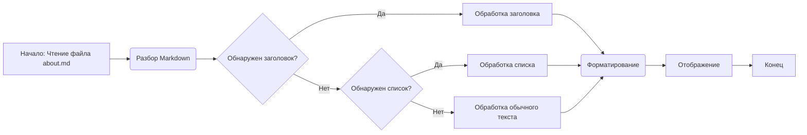

## Анализ файла `hypotez/src/ai/helicone/about.md`

### 1. <алгоритм>

Файл `about.md` представляет собой текстовый документ в формате Markdown, который описывает платформу Helicone.ai. Алгоритм его обработки можно представить следующим образом:

1. **Чтение файла:**
   - Программа читает содержимое файла `about.md` как текст.

2. **Анализ текста:**
   - Текст анализируется на наличие заголовков, списков и форматирования Markdown.
   - Например, заголовки (`##`, `###`) определяют структуру документа, списки (`-`) представляют перечисления.

3. **Представление:**
   - Информация из текста структурируется и представляется в читаемом виде.
   - Markdown разметка используется для форматирования текста (выделение жирным, курсив).

4. **Отображение:**
   - Отображается текст в соответствии с Markdown форматированием (например, в веб-браузере или в редакторе Markdown).

Пример обработки фрагмента текста:
   - **Вход:** `### What is Helicone.ai?`
   - **Обработка:** Заголовок третьего уровня, который должен быть отформатирован как небольшой заголовок.
   - **Выход:** Отображение заголовка "What is Helicone.ai?" с соответствующим форматированием.

### 2. <mermaid>

**Объяснение диаграммы:**

-   `A[Начало: Чтение файла about.md]`: Начальная точка процесса, где начинается чтение файла `about.md`.
-   `B(Разбор Markdown)`:  Блок, где выполняется разбор синтаксиса Markdown.
-   `C{Обнаружен заголовок?}`: Условный блок, который проверяет, является ли текущая строка заголовком.
-   `D[Обработка заголовка]`: Блок, который обрабатывает обнаруженный заголовок.
-   `E{Обнаружен список?}`: Условный блок, который проверяет, является ли текущая строка элементом списка.
-   `F[Обработка списка]`: Блок, который обрабатывает обнаруженный список.
-   `G[Обработка обычного текста]`: Блок, который обрабатывает обычный текст, не являющийся заголовком или списком.
-   `H(Форматирование)`: Блок, который применяет Markdown форматирование к тексту.
-   `I[Отображение]`: Блок, который отображает отформатированный текст.
-   `J[Конец]`: Конечная точка процесса.

Диаграмма не зависит от каких-либо внешних импортов или библиотек, поскольку она представляет собой концептуальную модель обработки Markdown, а не конкретный программный код.

### 3. <объяснение>

**Общее назначение файла:**

Файл `about.md` - это документационный файл, который предоставляет общее описание платформы Helicone.ai. Он предназначен для ознакомления разработчиков и бизнеса с основными возможностями и преимуществами платформы.

**Разделы файла:**

Файл содержит следующие основные разделы:

-   **`## Helicone.ai: Overview`**: Общее введение в платформу Helicone.ai.
-   **`### What is Helicone.ai?`**: Краткое описание того, чем является Helicone.ai.
-   **`### Key Features`**: Основные характеристики платформы:
    -   **AI Model Integration**: Интеграция с различными моделями ИИ.
    -   **Custom Solutions**: Возможность создавать пользовательские решения ИИ.
    -   **API and SDK**: Предоставление API и SDK для интеграции.
    -   **Error Handling and Monitoring**: Инструменты для обработки ошибок и мониторинга производительности.
    -   **Security and Privacy**: Акцент на безопасность и конфиденциальность данных.
-   **`### Use Cases`**: Примеры использования Helicone.ai:
    -   **Natural Language Processing**: Обработка естественного языка.
    -   **Data Analysis**: Анализ данных.
    -   **Content Generation**: Генерация контента.
-   **`### Getting Started with Helicone.ai`**: Инструкции по началу работы с платформой:
    -   **Registration and API Key**: Регистрация и получение API ключа.
    -   **Integration with Your Project**: Интеграция с проектом.
    -   **Testing and Deployment**: Тестирование и развертывание.
-   **`### Benefits of Helicone.ai`**: Преимущества использования Helicone.ai:
    -   **Flexibility**: Гибкость.
    -   **Ease of Use**: Простота использования.
    -   **Reliability**: Надежность.
    -   **Security**: Безопасность.
-   **`### Conclusion`**: Заключение, подчеркивающее ценность платформы.

**Импорты:**

Файл `about.md` не содержит импортов, поскольку это статический текстовый файл в формате Markdown, а не программный код.

**Классы, функции, переменные:**

Файл `about.md` не содержит классов, функций или переменных, поскольку это текстовый документ. Он описывает концепции и возможности платформы Helicone.ai, а не программную реализацию.

**Потенциальные ошибки и области для улучшения:**

-   **Обновление информации:** Документ может требовать регулярного обновления, чтобы соответствовать изменениям в платформе Helicone.ai.
-   **Ясность формулировок:** Некоторые формулировки можно сделать более ясными и конкретными для лучшего понимания пользователями.
-   **Связь с другими частями проекта**: Этот файл предоставляет общее описание Helicone.ai, и он связан с другими частями проекта, такими как документация, примеры кода и руководства пользователя, которые могут использовать эту информацию для более подробного описания платформы. Он также может ссылаться на другие файлы документации.

**Цепочка взаимосвязей:**

`about.md` -> `документация` -> `примеры кода` -> `руководства пользователя`

Этот файл служит отправной точкой для пользователей, чтобы понять, что такое Helicone.ai, и как они могут его использовать. Он является частью более широкой системы документации и примеров, предоставляемой для пользователей, и  взаимосвязан с другими частями проекта, которые опираются на его описания.