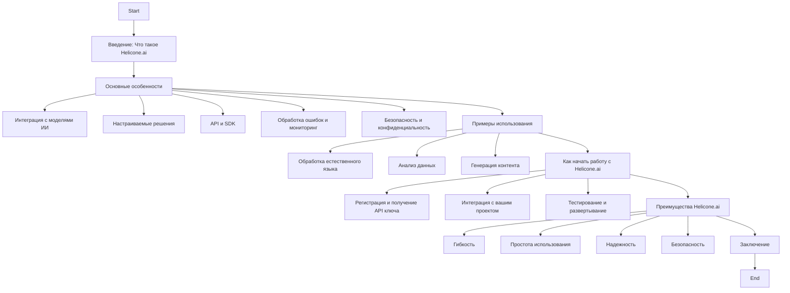
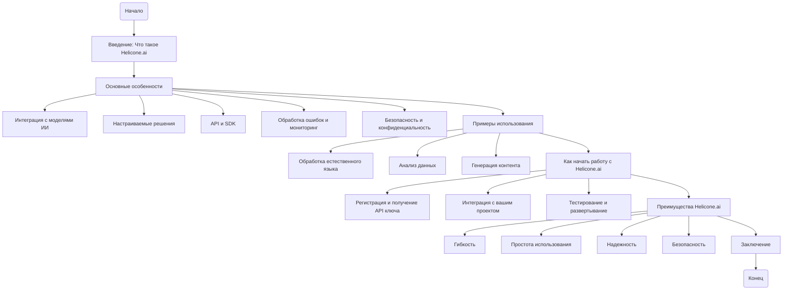

## Анализ файла `hypotez/src/ai/helicone/about.ru.md`

### 1. <алгоритм>

Файл `about.ru.md` не содержит исполняемого кода, а представляет собой текстовый документ в формате Markdown, который описывает платформу Helicone.ai. Поэтому блок-схема будет отражать структуру и содержание данного документа, а не алгоритм выполнения кода.

**Примеры для каждого блока:**

*   **Introduction**:  Представляет собой краткое описание Helicone.ai.
*   **Features**: Содержит общий обзор возможностей платформы.
*   **AI_Models**: Описывает поддержку различных моделей ИИ. Например, интеграция с OpenAI, Google.
*   **Custom_Solutions**: Описывает кастомизацию моделей ИИ под конкретные задачи.
*   **API_SDK**: Описывает наличие API и SDK для интеграции с языками программирования.
*   **Error_Monitoring**: Описывает инструменты для обработки ошибок и мониторинга производительности.
*   **Security**: Описывает средства обеспечения безопасности и конфиденциальности данных.
*   **Examples**: Приводит примеры использования платформы.
*   **NLP**: Пример использования Helicone.ai для создания чат-ботов.
*   **Data_Analysis**: Пример использования для анализа больших объемов данных.
*   **Content_Generation**: Пример использования для генерации текстов.
*   **Getting_Started**: Описывает шаги для начала работы с платформой.
*   **Registration**: Описывает процесс регистрации и получения API ключа.
*   **Integration**: Описывает процесс интеграции с проектом.
*   **Testing_Deployment**: Описывает тестирование и развертывание.
*   **Advantages**:  Перечисляет преимущества использования Helicone.ai.
*   **Flexibility**:  Возможность интеграции с различными моделями ИИ.
*   **Usability**:  Простота использования API и SDK.
*   **Reliability**:  Наличие инструментов для обеспечения стабильной работы.
*  **Security_Advantages**: Защита данных и конфиденциальности.
*   **Conclusion**: Заключительное резюме.

### 2. <mermaid>

**Объяснение зависимостей:**

*   Диаграмма представляет собой flowchart, описывающий структуру документа `about.ru.md`.
*   Зависимости в диаграмме отражают последовательность разделов документа. Каждый раздел ведет к следующему, формируя логическую структуру.
*   Каждый блок представляет раздел документа, описывающий определенную тему, связанную с Helicone.ai.
*   Стрелки показывают порядок следования информации в документе.

### 3. <объяснение>

Файл `about.ru.md` не содержит кода, а представляет собой текстовый документ в формате Markdown. Его основная цель – предоставить обзор платформы Helicone.ai на русском языке.

**Разделы документа:**

*   **Введение**: Представляет собой краткое описание платформы, рассказывая, что такое Helicone.ai и для каких целей она предназначена.
*   **Основные особенности**: Описывает ключевые функции и возможности Helicone.ai.  
    *   **Интеграция с моделями ИИ**: Говорится о поддержке моделей от разных провайдеров.
    *   **Настраиваемые решения**: Описывает возможность адаптации моделей под конкретные задачи.
    *   **API и SDK**: Подчеркивается наличие инструментов для легкой интеграции с приложениями.
    *   **Обработка ошибок и мониторинг**: Указывается на инструменты для обеспечения стабильности.
    *   **Безопасность и конфиденциальность**: Подчеркивает важность защиты пользовательских данных.
*   **Примеры использования**: Приводит несколько сценариев, где Helicone.ai может быть полезна.
    *   **Обработка естественного языка**:  Примеры использования для чат-ботов и анализа текста.
    *   **Анализ данных**: Примеры использования для анализа больших массивов данных.
    *   **Генерация контента**: Примеры генерации текста, описаний продуктов и т.д.
*   **Как начать работу с Helicone.ai**: Показывает шаги, которые необходимо выполнить для начала работы с платформой.
    *   **Регистрация и получение API ключа**:  Описывает процесс получения доступа к платформе.
    *   **Интеграция с вашим проектом**:  Подчеркивает наличие API и SDK для интеграции.
    *   **Тестирование и развертывание**:  Описывает процесс тестирования и запуска.
*   **Преимущества Helicone.ai**: Подводит итог, описывая основные плюсы использования платформы.
    *   **Гибкость**: Указывает на возможность адаптации и интеграции.
    *   **Простота использования**:  Указывает на простоту интеграции.
    *   **Надежность**: Указывает на инструменты для обеспечения стабильной работы.
    *   **Безопасность**: Подчеркивает важность защиты пользовательских данных.
*   **Заключение**: Подводит итог, подчеркивая, что Helicone.ai является мощным инструментом для разработчиков и бизнеса.

**Взаимосвязь с другими частями проекта:**

Этот файл является частью документации проекта Helicone.ai и предоставляет общее описание платформы. Он может быть использован как вводный материал для пользователей и разработчиков, интересующихся возможностями и преимуществами Helicone.ai. Этот файл не имеет прямой зависимости от каких-либо других частей кода, так как представляет собой текстовую документацию.

**Потенциальные ошибки и улучшения:**

*   **Ошибки:** В этом файле нет потенциальных ошибок, так как он не содержит исполняемый код, а является текстовым документом.
*   **Улучшения:** Документ может быть дополнен более конкретными примерами использования и ссылками на конкретные разделы API или документации, чтобы сделать его более полезным для пользователей. Можно добавить разделы, отвечающие на часто задаваемые вопросы. Можно добавить визуальный материал, например, скриншоты или демонстрационные видео.

В заключение, `about.ru.md` представляет собой информативный документ, предоставляющий обзор платформы Helicone.ai, ее возможностей и преимуществ. Он является важной частью документации проекта, обеспечивая пользователям понимание его предназначения и функциональности.