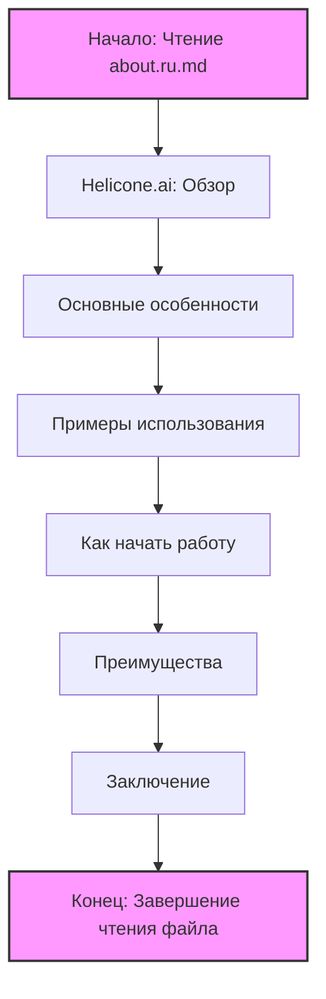

## Анализ файла `hypotez/src/ai/helicone/about.ru.md`

### 1. <алгоритм>

Этот файл представляет собой текст в формате Markdown, который описывает платформу Helicone.ai. Он не содержит исполняемого кода, поэтому пошаговый алгоритм здесь не применим. Однако мы можем рассмотреть структуру файла, как если бы это был процесс чтения и обработки информации:

1.  **Начало**: Чтение файла `about.ru.md`.
2.  **Раздел "Helicone.ai: Обзор"**: 
    -   Представление платформы Helicone.ai как платформы для ИИ.
3.  **Раздел "Основные особенности"**:
    -  Перечисление ключевых возможностей платформы, включая:
        - Интеграцию с различными моделями ИИ.
        - Настраиваемые решения.
        - API и SDK для интеграции.
        - Инструменты для обработки ошибок и мониторинга.
        - Меры безопасности и конфиденциальности.
4.  **Раздел "Примеры использования"**:
    -   Примеры применения платформы:
        - Обработка естественного языка.
        - Анализ данных.
        - Генерация контента.
5.  **Раздел "Как начать работу с Helicone.ai"**:
    -   Шаги для начала работы с платформой:
        -   Регистрация и получение API ключа.
        -   Интеграция с проектом.
        -   Тестирование и развертывание.
6.  **Раздел "Преимущества Helicone.ai"**:
    -   Перечисление основных преимуществ:
        -   Гибкость.
        -   Простота использования.
        -   Надежность.
        -   Безопасность.
7. **Раздел "Заключение"**:
    -   Обобщение преимуществ и позиционирование Helicone.ai.
8.  **Конец**: Завершение чтения файла.

### 2. <mermaid>

**Объяснение `mermaid` диаграммы:**

Данная диаграмма представляет собой блок-схему процесса анализа markdown файла `about.ru.md`. Блоки представляют собой основные разделы документа.

-   **Start**: Начало процесса, представляющее чтение файла `about.ru.md`.
-   **Introduction**: Вводный раздел, краткий обзор Helicone.ai.
-   **Features**: Основные особенности платформы, включая интеграцию, настройку и т.д.
-   **UseCases**: Примеры использования Helicone.ai.
-   **GettingStarted**:  Руководство по началу работы с платформой.
-   **Advantages**: Перечисление преимуществ использования Helicone.ai.
-  **Conclusion**: Завершение документа.
-   **End**: Конец процесса, указывающий на завершение анализа файла.

### 3. <объяснение>

**Общее назначение файла:**

Файл `about.ru.md` — это информационный документ, предоставляющий обзор платформы Helicone.ai на русском языке. Он предназначен для ознакомления потенциальных пользователей с возможностями, преимуществами и основными принципами работы этой платформы.

**Содержание файла:**

-   **Helicone.ai: Обзор**:
    -   Представляет Helicone.ai как платформу, предоставляющую доступ к специализированным функциям ИИ.
-   **Основные особенности**:
    -   Перечисляет ключевые особенности платформы:
        -   **Интеграция с моделями ИИ**:  Обеспечивает интеграцию с различными моделями ИИ от OpenAI, Google и других провайдеров. Это позволяет разработчикам выбирать модели, наиболее подходящие для их задач.
        -   **Настраиваемые решения**: Позволяет разработчикам адаптировать модели под свои специфические потребности.
        -   **API и SDK**:  Упрощают интеграцию с различными языками программирования, позволяя разработчикам быстро внедрять функции ИИ в свои приложения.
        -   **Обработка ошибок и мониторинг**:  Предоставляет инструменты для отслеживания производительности моделей и выявления ошибок, что помогает обеспечивать стабильную работу приложений.
        -   **Безопасность и конфиденциальность**:  Подчеркивает важность защиты данных пользователей и предоставляет инструменты для шифрования данных и управления доступом.
-   **Примеры использования**:
    -   Приводит примеры применения Helicone.ai:
        -   **Обработка естественного языка**: Создание чат-ботов и систем анализа тональности текста.
        -   **Анализ данных**:  Анализ больших объемов данных и выявление закономерностей.
        -   **Генерация контента**: Генерация статей, описаний продуктов и другого контента.
-   **Как начать работу с Helicone.ai**:
    -   Описывает шаги для начала работы с платформой:
        -   **Регистрация и получение API ключа**: Пользователи должны зарегистрироваться на платформе и получить API-ключ.
        -   **Интеграция с вашим проектом**: Использование API-ключа и SDK для интеграции Helicone.ai с проектом.
        -   **Тестирование и развертывание**:  Проверка интеграции в тестовой среде и развертывание решения после успешного тестирования.
-   **Преимущества Helicone.ai**:
    -   Перечисляет ключевые преимущества платформы:
        -   **Гибкость**: Интеграция с различными моделями ИИ и создание настраиваемых решений.
        -   **Простота использования**: Доступные API и SDK.
        -   **Надежность**: Инструменты для обработки ошибок и мониторинга.
        -   **Безопасность**: Защита данных и конфиденциальности.
-   **Заключение**:
    -   Подводит итог, подчеркивая, что Helicone.ai — это мощная платформа для разработчиков и бизнесов, которые хотят использовать ИИ для создания инновационных решений.

**Взаимосвязь с другими частями проекта**:

Этот файл, как правило, является частью документации проекта, и не имеет прямых связей с исполняемым кодом. Он предназначен для информирования потенциальных пользователей и не влияет на работу самого проекта.

**Потенциальные ошибки и области для улучшения:**
-   **Файл является статичным текстом**, поэтому не подвержен ошибкам в коде. Однако, если в будущем будут обновляться возможности платформы, информация в файле потребует корректировки.
-   **Не хватает ссылок на документацию**, было бы полезно добавить ссылки на официальную документацию, примеры кода и т.д.