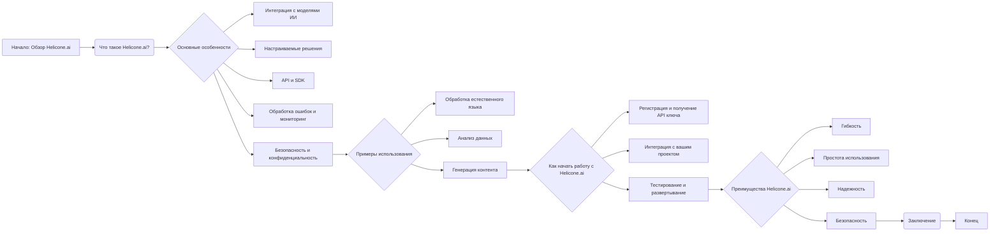

## Анализ файла `hypotez/src/ai/helicone/about.ru.md`

### 1. <алгоритм>

**Описание файла:**
Файл `about.ru.md` представляет собой текстовый документ в формате Markdown, предназначенный для ознакомления пользователей с платформой Helicone.ai. Он содержит описание основных возможностей, преимуществ и примеров использования Helicone.ai. Этот файл не содержит исполняемого кода, поэтому его «алгоритм» представляет собой структуру контента.

**Структура контента (блок-схема):**

1. **Заголовок**: `## Helicone.ai: Обзор`
   - _Описание_: Начинает документ, представляя тему.
2. **Введение**: `### Что такое Helicone.ai?`
   - _Описание_: Краткое определение и предназначение платформы.
3. **Раздел "Основные особенности"**: `### Основные особенности`
   -  _Список_:
     1. **Интеграция с моделями ИИ**: 
        - _Описание_: Поддержка различных моделей от разных провайдеров.
        - _Пример_: Использование моделей OpenAI, Google.
     2. **Настраиваемые решения**: 
        - _Описание_: Возможность адаптации моделей под конкретные нужды.
        - _Пример_: Настройка модели обработки естественного языка.
     3. **API и SDK**:
        - _Описание_: Наличие инструментов для упрощения интеграции.
        - _Пример_: Использование Python SDK.
     4. **Обработка ошибок и мониторинг**:
        - _Описание_: Инструменты для контроля за работой моделей.
        - _Пример_: Логирование ошибок API.
     5. **Безопасность и конфиденциальность**:
        - _Описание_: Меры по защите данных пользователей.
        - _Пример_: Шифрование данных.
4. **Раздел "Примеры использования"**: `### Примеры использования`
   -  _Список_:
     1. **Обработка естественного языка**:
        - _Описание_: Создание чат-ботов и анализа тональности.
        - _Пример_: Чат-бот для поддержки клиентов.
     2. **Анализ данных**:
        - _Описание_: Выявление закономерностей и предоставление данных для решений.
        - _Пример_: Анализ продаж.
     3. **Генерация контента**:
        - _Описание_: Создание статей и описаний продуктов.
        - _Пример_: Генерация рекламных текстов.
5. **Раздел "Как начать работу с Helicone.ai"**: `### Как начать работу с Helicone.ai`
    - _Список_:
       1. **Регистрация и получение API ключа**:
          - _Описание_: Процесс получения доступа к платформе.
          - _Пример_: Регистрация на сайте и получение ключа.
       2. **Интеграция с вашим проектом**:
           - _Описание_: Использование API и SDK.
           - _Пример_: Интеграция Python SDK.
       3. **Тестирование и развертывание**:
           - _Описание_: Проверка и запуск решения.
           - _Пример_: Тестирование в среде разработки.
6. **Раздел "Преимущества Helicone.ai"**: `### Преимущества Helicone.ai`
   - _Список_:
      - **Гибкость**:
         - _Описание_: Адаптация под различные модели и нужды.
      - **Простота использования**:
         - _Описание_: Легкая интеграция благодаря API и SDK.
      - **Надежность**:
         - _Описание_: Инструменты для стабильной работы.
      - **Безопасность**:
         - _Описание_: Защита данных пользователей.
7. **Заключение**: `### Заключение`
   - _Описание_: Общий итог о Helicone.ai.

### 2. <mermaid>

**Анализ `mermaid` диаграммы:**
Диаграмма представляет собой блок-схему, описывающую структуру файла `about.ru.md`. Она начинается с блока `Начало: Обзор Helicone.ai`, который ведет к блоку `Что такое Helicone.ai?`. Далее следует блок `Основные особенности`, который ветвится на пять основных характеристик платформы. После этого блок `Примеры использования` показывает три основных варианта применения. Затем блок `Как начать работу с Helicone.ai` детализирует процесс начала работы с платформой. Блок `Преимущества Helicone.ai` перечисляет четыре ключевых плюса.  Завершается диаграмма блоком `Заключение` и `Конец`.  Каждый блок представляет собой раздел документа.

### 3. <объяснение>

**Импорты:**
Файл `about.ru.md` не содержит импортов, поскольку это текстовый файл в формате Markdown, а не код на Python или другом языке программирования. Он предназначен для описания, а не для выполнения каких-либо операций.

**Классы:**
В файле `about.ru.md` нет классов, так как он не является исполняемым кодом.

**Функции:**
Аналогично классам, файл не содержит функций, так как он является информационным документом.

**Переменные:**
Файл `about.ru.md` не содержит переменных в контексте кода. Он содержит текстовые переменные в формате Markdown, которые используются для форматирования и структурирования текста.

**Подробное объяснение:**

- **Файл `about.ru.md`**:
  - **Назначение**: Описание платформы Helicone.ai для русскоязычной аудитории.
  - **Содержание**: Файл предоставляет обзор основных возможностей, преимуществ и примеров использования Helicone.ai. Он предназначен для ознакомления пользователей с платформой, а также для привлечения новых разработчиков и бизнесов.
  - **Структура**: Текст структурирован с помощью заголовков и списков, что делает его легким для чтения и понимания.
  - **Связи**: Файл `about.ru.md` является частью документации Helicone.ai. Он может быть связан с другими файлами документации, веб-сайтом проекта и другими ресурсами для пользователей.

**Потенциальные ошибки и области для улучшения:**
- **Актуальность**: Информация в файле должна регулярно обновляться, чтобы соответствовать текущему состоянию платформы Helicone.ai.
- **Детализация**: В некоторых разделах, таких как "Примеры использования", можно добавить более конкретные примеры.
- **Ссылки**: Включение ссылок на документацию, репозитории и другие ресурсы.
- **Локализация**: Убедиться, что все переводы корректны и соответствуют контексту.
- **SEO**: Оптимизировать текст для поисковых систем.

**Цепочка взаимосвязей с другими частями проекта:**
- **Документация**: Файл `about.ru.md` является частью документации проекта Helicone.ai.
- **Веб-сайт**: Содержание файла может быть использовано на веб-сайте проекта для предоставления информации о платформе.
- **Маркетинговые материалы**: Информация из файла может использоваться в маркетинговых материалах для привлечения новых пользователей.
- **Другие файлы**: Файл может быть связан с другими файлами в директории `hypotez/src/ai/helicone/` для предоставления полного набора информации о проекте.

В заключение, файл `about.ru.md` является важной частью документации проекта Helicone.ai, предоставляя основную информацию о платформе для русскоязычных пользователей. Его структура и содержание позволяют пользователям быстро ознакомиться с возможностями и преимуществами Helicone.ai.