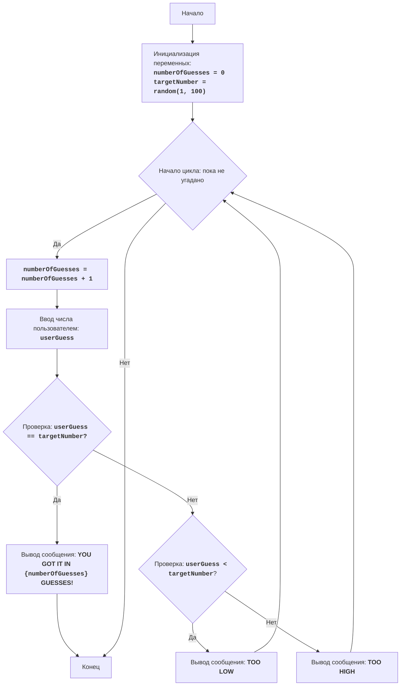

## Анализ кода: Игра "Угадай число"

### <алгоритм>

1.  **Начало**: Игра начинается с инициализации переменных.
    *   Пример: `numberOfGuesses = 0`, `targetNumber = 42` (случайное число от 1 до 100).
2.  **Инициализация переменных**: Устанавливаются начальные значения:
    *   `numberOfGuesses`: счётчик попыток, изначально 0.
    *   `targetNumber`: случайное целое число в диапазоне от 1 до 100, которое нужно угадать.
3.  **Начало цикла**: Начинается цикл, который продолжается до тех пор, пока пользователь не угадает число.
    *   Условие: `userGuess != targetNumber`.
4.  **Увеличение количества попыток**: При каждой итерации цикла, прежде чем получить ввод от пользователя, счётчик попыток увеличивается на 1.
    *   Пример: `numberOfGuesses` увеличивается от 0 до 1, 2, 3, и т.д.
5.  **Ввод числа пользователем**: Пользователь вводит своё предположение (целое число).
    *   Пример: `userGuess = 50`
6.  **Проверка**: Сравнивается число, введённое пользователем (`userGuess`), с загаданным числом (`targetNumber`).
    *   Если `userGuess == targetNumber`, то переходим к блоку вывода сообщения о выигрыше.
    *   Иначе переходим к проверке, меньше ли `userGuess` чем `targetNumber`
7.  **Вывод сообщения о выигрыше**: Если `userGuess == targetNumber`, то выводится сообщение о том, что пользователь угадал число, с указанием количества попыток.
    *   Пример: Вывод сообщения: "YOU GOT IT IN 3 GUESSES!".
8.  **Конец**: Игра завершается.
9.  **Проверка на "Меньше"**: Если `userGuess != targetNumber`, то выполняется проверка, меньше ли `userGuess` чем `targetNumber`.
    *   Если `userGuess < targetNumber`, то выводится сообщение "TOO LOW".
    *   Иначе переходим к блоку вывода сообщения "TOO HIGH".
10. **Вывод сообщения "TOO LOW"**: Если `userGuess` меньше, чем `targetNumber`, выводится сообщение "TOO LOW", и программа переходит к началу цикла.
11. **Вывод сообщения "TOO HIGH"**: Если `userGuess` больше, чем `targetNumber`, выводится сообщение "TOO HIGH", и программа переходит к началу цикла.
12. **Конец цикла**: Если пользователь не угадал число и игра завершается, то переходим в конец.
    *   Обычно в играх, таких как "Угадай число", цикл продолжается, пока не выполнится условие `userGuess == targetNumber`

### <mermaid>

**Объяснение диаграммы:**

*   `Start`: Начало игры.
*   `InitializeVariables`: Инициализация переменных `numberOfGuesses` (счетчик попыток) и `targetNumber` (случайное число, которое нужно угадать).
*   `LoopStart`: Начало цикла, который повторяется, пока число не будет угадано.
*   `IncreaseGuesses`: Увеличение счетчика попыток на 1.
*   `InputGuess`: Получение ввода от пользователя (предполагаемое число).
*   `CheckGuess`: Проверка, угадал ли пользователь число. Если `userGuess == targetNumber`, переходим к блоку `OutputWin`, иначе к блоку `CheckLow`.
*   `OutputWin`: Вывод сообщения о победе с количеством попыток.
*   `End`: Конец игры.
*   `CheckLow`: Проверка, является ли введенное число меньше загаданного. Если `userGuess < targetNumber`, переходим к `OutputLow`, иначе к `OutputHigh`.
*    `OutputLow`: Вывод сообщения "TOO LOW".
*   `OutputHigh`: Вывод сообщения "TOO HIGH".
*   `LoopStart -- Нет --> End`: Если цикл завершился, программа переходит к концу.

### <объяснение>

**Импорты**:
В данном коде нет импортов, так как это не исполняемый код на Python, а визуальное представление алгоритма в формате Mermaid. В реальной реализации на Python, для генерации случайного числа потребовался бы импорт модуля `random`, например `import random`.

**Классы**:
В данном примере классов нет.

**Функции**:
*   `random(1, 100)`: функция, которая возвращает случайное целое число в диапазоне от 1 до 100. В реальном Python коде была бы вызвана как `random.randint(1, 100)`.

**Переменные**:
*   `numberOfGuesses` (целое число): счётчик количества попыток пользователя. Начинается с 0 и увеличивается на 1 при каждой попытке.
*   `targetNumber` (целое число): случайное целое число, загаданное компьютером, которое нужно угадать пользователю.
*   `userGuess` (целое число): число, которое вводит пользователь.

**Потенциальные ошибки и улучшения:**

1.  **Обработка ошибок ввода:**  Код не обрабатывает некорректный ввод пользователя (например, ввод нечислового значения). В реальной реализации нужно было бы добавить проверку на валидность ввода.
2.  **Ограничение количества попыток:** Код не ограничивает количество попыток. Можно добавить ограничение на количество попыток, после которого игра заканчивается поражением.
3.  **Интерфейс пользователя:** Код не предоставляет никакого пользовательского интерфейса, он лишь описывает алгоритм игры. В реальном приложении потребовался бы ввод и вывод данных через консоль или графический интерфейс.
4. **Ограничение ввода:** Код не проверяет корректность введённого числа пользователем, например, что число входит в диапазон от 1 до 100. В реальной реализации требуется добавить проверку.

**Взаимосвязь с другими частями проекта:**

Этот код является базовым алгоритмом игры "Угадай число". Он может быть частью более крупного проекта, например, сборника простых игр. В таком случае, он будет взаимодействовать с модулями для управления игровым процессом, ввода данных и вывода результатов.

**Цепочка взаимосвязей:**

1.  **`1_acedu.mmd`**: Этот файл содержит диаграмму Mermaid, описывающую алгоритм игры "Угадай число".
2.  **`game_logic.py` (Предполагаемый файл):**  Предполагается существование файла `game_logic.py`, который будет использовать этот алгоритм. Он будет импортировать необходимые функции и классы для генерации случайных чисел, обработки ввода пользователя и проверки условий игры.
3.  **`ui.py` (Предполагаемый файл):**  Файл `ui.py` будет содержать код для взаимодействия с пользователем. Он будет выводить подсказки, получать ввод пользователя и отображать результаты игры.
4.  **`main.py` (Предполагаемый файл):**  Главный файл проекта, который будет импортировать `game_logic.py` и `ui.py` для запуска игры и обработки результатов.

Таким образом, алгоритм, представленный в `1_acedu.mmd`, является концептуальной основой для реальной реализации игры, которая будет включать в себя логику игры, пользовательский интерфейс и главный исполняемый файл.