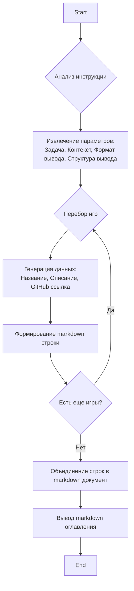

## ИНСТРУКЦИЯ:

Анализируй предоставленный код подробно и объясни его функциональность. Ответ должен включать три раздела:  

1. **<алгоритм>**: Опиши рабочий процесс в виде пошаговой блок-схемы, включая примеры для каждого логического блока, и проиллюстрируй поток данных между функциями, классами или методами.  
2. **<mermaid>**: Напиши код для диаграммы в формате `mermaid`, проанализируй и объясни все зависимости, 
    которые импортируются при создании диаграммы. 
    **ВАЖНО!** Убедитесь, что все имена переменных, используемые в диаграмме `mermaid`, 
    имеют осмысленные и описательные имена. Имена переменных вроде `A`, `B`, `C`, и т.д., не допускаются!  
    
    **Дополнительно**: Если в коде есть импорт `import header`, добавьте блок `mermaid` flowchart, объясняющий `header.py`:\
    ```mermaid
    flowchart TD
        Start --> Header[<code>header.py</code><br> Determine Project Root]
    
        Header --> import[Import Global Settings: <br><code>from src import gs</code>] 
    ```

3. **<объяснение>**: Предоставьте подробные объяснения:  
   - **Импорты**: Их назначение и взаимосвязь с другими пакетами `src.`.  
   - **Классы**: Их роль, атрибуты, методы и взаимодействие с другими компонентами проекта.  
   - **Функции**: Их аргументы, возвращаемые значения, назначение и примеры.  
   - **Переменные**: Их типы и использование.  
   - Выделите потенциальные ошибки или области для улучшения.  

Дополнительно, постройте цепочку взаимосвязей с другими частями проекта (если применимо).  

Это обеспечивает всесторонний и структурированный анализ кода.
## Формат ответа: `.md` (markdown)
**КОНЕЦ ИНСТРУКЦИИ**
```markdown
## Анализ кода

### <алгоритм>
1. **Начало**: Получаем текст инструкции, который содержит описание задачи.
2. **Извлечение информации**: Анализируем текст инструкции для определения следующих параметров:
    -  **Задача**: Создание оглавления для книги "More Basic Computer Games".
    -  **Контекст**: Книга содержит 101 игру, написанную на BASIC.
    -  **Формат вывода**: `markdown`
    -  **Структура вывода**: Название игры, краткое описание (Brief) и ссылка на GitHub.
    -  **Формат ссылки**: `https://github.com/hypo69/hypo/blob/master/src/endpoints/ai_games/101_basic_computer_games/he/<GAME>/<filename>.py`
3. **Построение оглавления**:
    -  **Перебор игр**: Проходим по всем 101 играм (в данной задаче это не показано, предполагается, что есть список игр).
    -  **Генерация данных для каждой игры**:
        -   **Название игры**: Берем название игры из списка.
        -   **Описание (Brief)**:  Краткое описание игры (не предоставлено, его нужно генерировать или получать из файла).
        -   **Ссылка на GitHub**: Формируем ссылку, подставляя название игры и имя файла в заданный шаблон.
    -  **Формирование `markdown`**: Создаем строку `markdown` для каждой игры, содержащую название, описание и ссылку.
4. **Вывод**: Объединяем все строки в единый `markdown` документ, представляющий оглавление.
5. **Завершение**.

**Пример работы для гипотетической игры "TEST_GAME":**

- **Название игры**: TEST_GAME
- **Описание (Brief)**: "Это тестовая игра для демонстрации работы алгоритма."
- **Ссылка на GitHub**: https://github.com/hypo69/hypo/blob/master/src/endpoints/ai_games/101_basic_computer_games/he/TEST_GAME/test_game.py
- **Строка `markdown`**:
```markdown
## TEST_GAME
Это тестовая игра для демонстрации работы алгоритма.
[GitHub](https://github.com/hypo69/hypo/blob/master/src/endpoints/ai_games/101_basic_computer_games/he/TEST_GAME/test_game.py)
```

### <mermaid>


**Объяснение зависимостей:**
- Диаграмма начинается с **Start**, представляя начало процесса.
- **Анализ инструкции** определяет, что нужно сделать, из входного текста.
- **Извлечение параметров** извлекает детали, необходимые для создания оглавления.
- **Перебор игр** подразумевает цикл, в котором каждая игра обрабатывается отдельно.
- **Генерация данных** создаёт данные (название, описание, ссылка) для каждой игры.
- **Формирование `markdown` строки** форматирует выходные данные в `markdown`.
- **Объединение строк в `markdown` документ** собирает все сформированные строки вместе.
- **Вывод `markdown` оглавления** выводит готовый документ `markdown`.
- **End** завершает процесс.
- Диаграмма не имеет импортов, так как код предоставлен только в виде инструкции, а не исполняемого скрипта.

### <объяснение>

**Общее описание:**
Представленный "код" - это фактически инструкция на иврите для создания оглавления на основе списка игр из книги "More Basic Computer Games". Инструкция описывает процесс генерации `markdown`-документа, содержащего список игр, их краткое описание и ссылки на GitHub.

**Импорты**:
В этом фрагменте кода нет импортов, так как это не исполняемый код, а инструкция.

**Классы**:
В данном коде нет классов.

**Функции**:
В этом фрагменте кода нет функций.

**Переменные**:
Переменные в этом коде не определены явно. Но в процессе выполнения (если бы это был исполняемый код) можно было бы выделить следующие типы переменных:
-   `game_name` (строка) - название игры.
-   `game_description` (строка) - краткое описание игры.
-   `github_link` (строка) - ссылка на репозиторий GitHub.
-   `markdown_string` (строка) - строка `markdown` для одной игры.
-   `toc_markdown` (строка) - весь `markdown` документ оглавления.

**Детали выполнения и взаимосвязи:**
- Инструкция определяет, что нужно создать оглавление для книги "More Basic Computer Games".
- Оглавление должно быть в формате `markdown`.
- Для каждой игры необходимо включить название, описание и ссылку на GitHub.
- Ссылка на GitHub формируется динамически, подставляя название игры и имя файла в шаблон.
- В реальном исполняемом коде предполагается цикл для обработки каждой игры из списка.
- Эта инструкция явно зависит от структуры каталогов проекта, в частности пути к файлам игр на GitHub.

**Потенциальные ошибки и области для улучшения:**

-   **Описание игр**: Инструкция не содержит информации о том, откуда брать описания игр. Их придется загружать откуда-то, возможно из файла или базы данных, что является потенциальным местом ошибки.
-   **Обработка ошибок**: Отсутствует обработка ошибок, например, если файл игры не найден или если возникнет проблема при формировании `markdown` строки.
-   **Обобщение**: Код жестко закодирован для конкретного набора игр и пути к файлам. Возможность обобщения кода и его переиспользования будет полезна.
-   **Отсутствует код**:  Не существует кода, который можно было бы запустить, поэтому его нельзя протестировать.

**Взаимосвязи с другими частями проекта:**

-  Эта инструкция, при ее реализации в виде кода, будет взаимодействовать с файловой структурой проекта, в частности каталогом `/src/endpoints/ai_games/101_basic_computer_games/he/`.
- Также вероятно взаимодействие с другими частями проекта, которые хранят список игр и их описания.

В целом, это хороший пример инструкции, которая, будучи реализованной в коде, позволит создать автоматизированное оглавление для книги с играми.
```