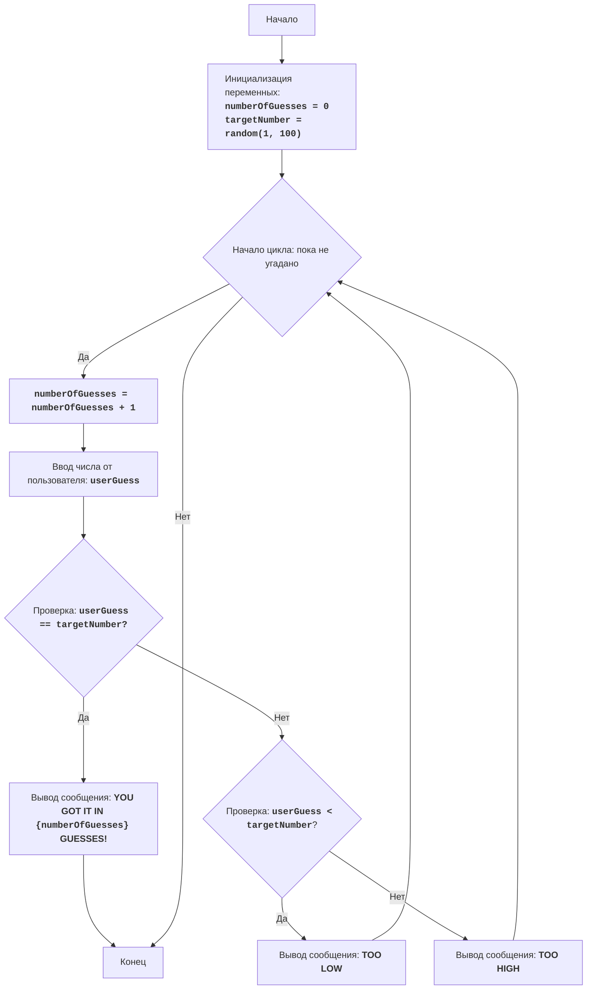

## ИНСТРУКЦИЯ:

Анализируй предоставленный код подробно и объясни его функциональность. Ответ должен включать три раздела:  

1. **<алгоритм>**: Опиши рабочий процесс в виде пошаговой блок-схемы, включая примеры для каждого логического блока, и проиллюстрируй поток данных между функциями, классами или методами.  
2. **<mermaid>**: Напиши код для диаграммы в формате `mermaid`, проанализируй и объясни все зависимости, 
    которые импортируются при создании диаграммы. 
    **ВАЖНО!** Убедитесь, что все имена переменных, используемые в диаграмме `mermaid`, 
    имеют осмысленные и описательные имена. Имена переменных вроде `A`, `B`, `C`, и т.д., не допускаются!  
    
    **Дополнительно**: Если в коде есть импорт `import header`, добавьте блок `mermaid` flowchart, объясняющий `header.py`:\
    ```mermaid
    flowchart TD
        Start --> Header[<code>header.py</code><br> Determine Project Root]
    
        Header --> import[Import Global Settings: <br><code>from src import gs</code>] 
    ```

3. **<объяснение>**: Предоставьте подробные объяснения:  
   - **Импорты**: Их назначение и взаимосвязь с другими пакетами `src.`.  
   - **Классы**: Их роль, атрибуты, методы и взаимодействие с другими компонентами проекта.  
   - **Функции**: Их аргументы, возвращаемые значения, назначение и примеры.  
   - **Переменные**: Их типы и использование.  
   - Выделите потенциальные ошибки или области для улучшения.  

Дополнительно, постройте цепочку взаимосвязей с другими частями проекта (если применимо).  

Это обеспечивает всесторонний и структурированный анализ кода.
## Формат ответа: `.md` (markdown)
**КОНЕЦ ИНСТРУКЦИИ**

# BATNUM:
=================
קושי: 3
-----------------
Игра "Угадай число" - это классическая игра, в которой компьютер выбирает случайное число в диапазоне от 1 до 100, а игрок должен угадать это число, получая подсказки "слишком низко" или "слишком высоко" после каждой попытки.
Игра продолжается до тех пор, пока игрок не угадает число.

Правила игры:
1. Компьютер выбирает случайное целое число от 1 до 100.
2. Игрок вводит свои предположения о выбранном числе.
3. После каждой попытки компьютер сообщает, было ли введенное число слишком низким, слишком высоким или угадано.
4. Игра продолжается до тех пор, пока игрок не угадает выбранное число.
-----------------
Алгоритм:
1.  Установить количество попыток в 0.
2.  Создать случайное число в диапазоне от 1 до 100.
3.  Начать цикл "пока число не угадано":
    3.1 Увеличить количество попыток на 1.
    3.2 Попросить игрока ввести число.
    3.3 Если введенное число равно выбранному числу, перейти к шагу 4.
    3.4 Если введенное число меньше выбранного числа, вывести сообщение "TOO LOW".
    3.5 Если введенное число больше выбранного числа, вывести сообщение "TOO HIGH".
4.  Вывести сообщение "YOU GOT IT IN {количество попыток} GUESSES!"
5.  Конец игры.
-----------------
Диаграмма потока:


**Легенда:**
    Start - Начало программы.
    InitializeVariables - Инициализация переменных: numberOfGuesses (количество попыток) устанавливается в 0, и targetNumber (загаданное число) создается случайно между 1 и 100.
    LoopStart - Начало цикла, который продолжается до тех пор, пока число не угадано.
    IncreaseGuesses - Увеличение счетчика попыток на 1.
    InputGuess - Ввод числа от пользователя и сохранение его в переменной userGuess.
    CheckGuess - Проверка, равно ли введенное число загаданному числу.
    OutputWin - Вывод сообщения о победе, если число угадано, с указанием количества попыток.
    End - Конец программы.
    CheckLow - Проверка, меньше ли введенное число загаданного числа.
    OutputLow - Вывод сообщения "TOO LOW", если введенное число меньше загаданного числа.
    OutputHigh - Вывод сообщения "TOO HIGH", если введенное число больше загаданного числа.
```
__author__ = 'hypo69 (hypo69@davidka.net)'
```
"""
Объяснения:<здесь вы даете подробное объяснение кода>
licence:MIT(../licence)
"""
import random

# Инициализация счетчика попыток
numberOfGuesses = 0
# Создание случайного числа от 1 до 100
targetNumber = random.randint(1, 100)

# Основной игровой цикл
while True:
    # Увеличение счетчика попыток
    numberOfGuesses += 1
    # Запрос ввода числа от пользователя
    try:
        userGuess = int(input("Угадайте число от 1 до 100: "))
    except ValueError:
        print("Пожалуйста, введите целое число.")
        continue

    # Проверка, угадано ли число
    if userGuess == targetNumber:
        print(f"Поздравляю! Вы угадали число за {numberOfGuesses} попыток!")
        break  # Завершение цикла, если число угадано
    elif userGuess < targetNumber:
        print("Слишком низко")  # Сообщение, что загаданное число больше
    else:
        print("Слишком высоко")  # Сообщение, что загаданное число меньше

"""
Объяснение кода:
1.  **Импорт модуля `random`**:
    - `import random`: Импорт модуля `random`, который используется для генерации случайного числа.
2.  **Переменная `numberOfGuesses`**:
    - `numberOfGuesses = 0`: Инициализация переменной `numberOfGuesses` для отслеживания количества попыток, начальное значение 0.
3. **Переменная `targetNumber`**:
   - `targetNumber = random.randint(1, 100)`: Генерация случайного целого числа между 1 и 100 включительно, сохранение его в переменной `targetNumber`.
4.  **Основной игровой цикл `while True:`**:
    - Бесконечный цикл, продолжается, пока пользователь не угадает число (инструкция `break` завершит цикл).
    - `numberOfGuesses += 1`: Увеличение счетчика попыток на 1 при каждой итерации цикла.
    - **Блок обработки ввода пользователя**:\
        - `try...except ValueError`: Блок try-except используется для обработки возможных ошибок ввода. Если пользователь введет что-то, что не является целым числом, будет выведено сообщение об ошибке и цикл продолжится.
        - `userGuess = int(input("Введите ваше предположение: "))`: Запрос числа от пользователя и преобразование его в целое число, сохранение его в переменной `userGuess`.
    - **Условие победы**:
        - `if userGuess == targetNumber:`: Проверка, равно ли введенное число загаданному числу.
        - `print(f"Поздравляю! Вы угадали число за {numberOfGuesses} попыток!")`: Вывод сообщения о победе с указанием количества попыток.
        - `break`: Завершение цикла (и игры) если число угадано.
    - **Подсказки**:
        - `elif userGuess < targetNumber:`: Проверка, меньше ли введенное число загаданного числа.
        - `print("Слишком низко!")`: Вывод подсказки, что нужно угадать большее число.
        - `else:`: Если число не угадано и не меньше загаданного, то оно больше.
        - `print("Слишком высоко!")`: Вывод подсказки, что нужно угадать меньшее число.
"""
```

### <алгоритм>

1.  **Начало:**
    -   Программа начинает выполнение.
    -   Инициализируется счетчик попыток `numberOfGuesses` значением 0.
    -   Генерируется случайное целое число `targetNumber` в диапазоне от 1 до 100.
    *Пример:* `numberOfGuesses = 0`, `targetNumber = 42`.

2.  **Начало цикла (пока не угадано):**
    -   Начинается бесконечный цикл `while True`, который будет выполняться до тех пор, пока игрок не угадает число.
    *Пример:* Цикл начинается.

3.  **Увеличение счетчика попыток:**
    -   Значение `numberOfGuesses` увеличивается на 1.
    *Пример:* `numberOfGuesses = 1`.

4.  **Ввод числа от пользователя:**
    -   Пользователю предлагается ввести число.
    -   Ввод преобразуется в целое число и сохраняется в переменную `userGuess`.
    -  Если пользователь ввел не целое число, будет выведено сообщение "Пожалуйста, введите целое число" и программа перейдет к началу цикла.
    *Пример:* Пользователь вводит 50, `userGuess = 50`.

5.  **Проверка на совпадение:**
    -   Проверяется условие `userGuess == targetNumber`.
        -   Если условие истинно, выводится сообщение о победе, и цикл завершается.
        *Пример:* Если `userGuess = 42` и `targetNumber = 42`, выводится сообщение "Поздравляю! Вы угадали число за 1 попыток!" и цикл завершается.
        -  Если условие ложно, программа переходит к следующему шагу.

6.  **Проверка "слишком низко":**
    -   Проверяется условие `userGuess < targetNumber`.
        -   Если условие истинно, выводится сообщение "Слишком низко", и программа возвращается к началу цикла.
        *Пример:* Если `userGuess = 30` и `targetNumber = 42`, выводится сообщение "Слишком низко" и цикл продолжается.
        -   Если условие ложно, программа переходит к следующему шагу.

7.  **Проверка "слишком высоко":**
    -   Выводится сообщение "Слишком высоко", и программа возвращается к началу цикла.
    *Пример:* Если `userGuess = 60` и `targetNumber = 42`, выводится сообщение "Слишком высоко" и цикл продолжается.

8.  **Конец:**
    -   Если цикл завершился (число было угадано), программа завершает выполнение.

### <mermaid>


**Анализ зависимостей в `mermaid`:**

-   `Start`: Указывает на начало выполнения программы.
-   `InitializeVariables`: Инициализирует переменные `numberOfGuesses` (количество попыток) и `targetNumber` (загаданное число).
-   `LoopStart`: Начало цикла, который продолжается до тех пор, пока число не будет угадано.
-  `IncreaseGuesses`: Увеличивает значение `numberOfGuesses` на 1.
-   `InputGuess`: Запрашивает ввод числа от пользователя и сохраняет его в `userGuess`.
-   `CheckGuess`: Проверяет, равно ли введенное число (`userGuess`) загаданному (`targetNumber`).
-   `OutputWin`: Выводит сообщение о победе, если `userGuess == targetNumber`.
-   `End`: Указывает на конец выполнения программы.
-   `CheckLow`: Проверяет, меньше ли введенное число `userGuess` загаданного `targetNumber`.
-   `OutputLow`: Выводит сообщение "TOO LOW", если `userGuess < targetNumber`.
-   `OutputHigh`: Выводит сообщение "TOO HIGH", если `userGuess > targetNumber`.

Все имена переменных в диаграмме (`numberOfGuesses`, `targetNumber`, `userGuess`) имеют осмысленные и описательные имена, что делает диаграмму понятной.

### <объяснение>

**Импорты:**

-   `import random`: Импортирует модуль `random`, который предоставляет функции для генерации случайных чисел. В данном коде используется `random.randint(1, 100)` для генерации случайного целого числа в диапазоне от 1 до 100 включительно. Этот модуль является стандартной библиотекой Python и не имеет зависимостей от других частей проекта.

**Переменные:**

-   `numberOfGuesses`:
    -   Тип: `int`.
    -   Используется как счетчик количества попыток пользователя.
    -   Инициализируется значением `0` перед началом игры и увеличивается на 1 при каждой новой попытке в цикле.
-   `targetNumber`:
    -   Тип: `int`.
    -   Хранит случайное целое число, которое пользователь должен угадать.
    -   Получает значение с помощью `random.randint(1, 100)` в начале игры и не меняется в процессе игры.
-   `userGuess`:
    -   Тип: `int`.
    -   Хранит число, введенное пользователем.
    -   Получает значение с помощью `input()` и преобразуется к типу `int`.

**Функции:**

-   В данном коде нет отдельных пользовательских функций, используется встроенная функция `input()` для получения ввода от пользователя и функция `print()` для вывода сообщений.
- `random.randint(1, 100)`: Функция из модуля `random` для генерации случайного целого числа в заданном диапазоне.

**Логика кода:**

1.  **Инициализация:** Устанавливаются начальные значения переменных.
2.  **Цикл игры:** Начинается бесконечный цикл `while True`, в котором выполняются следующие действия:
    -   Увеличение количества попыток.
    -   Запрос ввода числа от пользователя.
    -   Проверка, угадано ли число. Если да, выводится сообщение о победе, и цикл завершается.
    -   Если число не угадано, выводится сообщение "Слишком низко" или "Слишком высоко" в зависимости от введенного числа, и цикл продолжается.
3.  **Завершение:** Цикл завершается, когда пользователь угадывает число.

**Потенциальные ошибки и области для улучшения:**

-   **Обработка нечислового ввода:** Код обрабатывает исключение `ValueError`, которое возникает при вводе пользователем нечисловых данных. В этом случае пользователю сообщается о необходимости ввести целое число.
-   **Диапазон ввода:** Код никак не ограничивает ввод пользователя. Можно добавить проверку на ввод числа в диапазоне от 1 до 100.
-   **Простота кода:** Код достаточно прост и понятен, подходит для начинающих.
-  **Вывод результатов:** Код выводит только победу. Можно добавить вывод количества попыток, а также угаданное число.

**Взаимосвязь с другими частями проекта:**

-   Этот код является самодостаточным примером игры "Угадай число" и не имеет прямых связей с другими частями проекта, указанными в инструкции. Он может быть легко интегрирован в более крупное приложение, но пока этого не происходит.