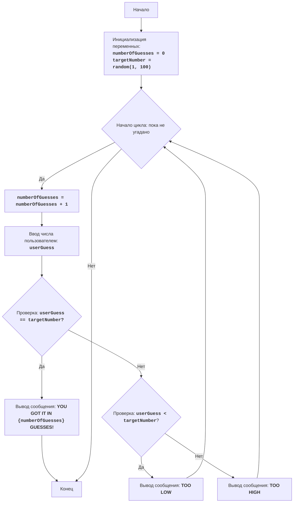

## ИНСТРУКЦИЯ:

Анализируй предоставленный код подробно и объясни его функциональность. Ответ должен включать три раздела:  

1. **<алгоритм>**: Опиши рабочий процесс в виде пошаговой блок-схемы, включая примеры для каждого логического блока, и проиллюстрируй поток данных между функциями, классами или методами.  
2. **<mermaid>**: Напиши код для диаграммы в формате `mermaid`, проанализируй и объясни все зависимости, 
    которые импортируются при создании диаграммы. 
    **ВАЖНО!** Убедитесь, что все имена переменных, используемые в диаграмме `mermaid`, 
    имеют осмысленные и описательные имена. Имена переменных вроде `A`, `B`, `C`, и т.д., не допускаются!  
    
    **Дополнительно**: Если в коде есть импорт `import header`, добавьте блок `mermaid` flowchart, объясняющий `header.py`:\
    ```mermaid
    flowchart TD
        Start --> Header[<code>header.py</code><br> Determine Project Root]
    
        Header --> import[Import Global Settings: <br><code>from src import gs</code>] 
    ```

3. **<объяснение>**: Предоставьте подробные объяснения:  
   - **Импорты**: Их назначение и взаимосвязь с другими пакетами `src.`.  
   - **Классы**: Их роль, атрибуты, методы и взаимодействие с другими компонентами проекта.  
   - **Функции**: Их аргументы, возвращаемые значения, назначение и примеры.  
   - **Переменные**: Их типы и использование.  
   - Выделите потенциальные ошибки или области для улучшения.  

Дополнительно, постройте цепочку взаимосвязей с другими частями проекта (если применимо).  

Это обеспечивает всесторонний и структурированный анализ кода.
## Формат ответа: `.md` (markdown)
**КОНЕЦ ИНСТРУКЦИИ**
```

### BATNUM
1. **Краткое описание игры**:
   Игра "Угадай число" - это классическая игра, в которой компьютер загадывает случайное число в диапазоне от 1 до 100, а игрок пытается его угадать. После каждой попытки игроку сообщается, является ли его предположение слишком низким или слишком высоким. Игра продолжается до тех пор, пока игрок не угадает число.

2. **Правила игры**:
    1. Компьютер генерирует случайное целое число в диапазоне от 1 до 100.
    2. Игрок вводит свое предположение о загаданном числе.
    3. После каждой попытки компьютер сообщает игроку, является ли его предположение слишком низким, слишком высоким или правильным.
    4. Игра продолжается до тех пор, пока игрок не угадает загаданное число.

3. **Алгоритм игры**:
    1.  Инициализировать счетчик попыток (numberOfGuesses) значением 0.
    2.  Сгенерировать случайное целое число (targetNumber) в диапазоне от 1 до 100.
    3.  Начать цикл "пока число не угадано":
        3.1 Увеличить счетчик попыток (numberOfGuesses) на 1.
        3.2 Запросить у игрока ввод числа (userGuess).
        3.3 Если введенное число (userGuess) равно загаданному числу (targetNumber), перейти к шагу 4.
        3.4 Если введенное число (userGuess) меньше загаданного числа (targetNumber), вывести сообщение "TOO LOW".
        3.5 Если введенное число (userGuess) больше загаданного числа (targetNumber), вывести сообщение "TOO HIGH".
    4.  Вывести сообщение "YOU GOT IT IN {numberOfGuesses} GUESSES!"
    5.  Завершить игру.

4. **Блок-схема**:


**Legenda**:
   * **Start** - Начало выполнения программы.
   * **InitializeVariables** - Инициализация переменных: `numberOfGuesses` (счетчик попыток) устанавливается в 0, а `targetNumber` (загаданное число) генерируется случайным образом в диапазоне от 1 до 100.
   * **LoopStart** - Начало цикла, который продолжается до тех пор, пока число не будет угадано.
   * **IncreaseGuesses** - Увеличение счетчика попыток (`numberOfGuesses`) на 1.
   * **InputGuess** - Запрос ввода числа у пользователя и сохранение его в переменной `userGuess`.
   * **CheckGuess** - Проверка, равно ли введенное пользователем число `userGuess` загаданному числу `targetNumber`.
   * **OutputWin** - Вывод сообщения о победе, если числа равны, и указание количества попыток.
   * **End** - Конец выполнения программы.
   * **CheckLow** - Проверка, меньше ли введенное пользователем число `userGuess` загаданного числа `targetNumber`.
   * **OutputLow** - Вывод сообщения "TOO LOW", если введенное число меньше загаданного.
   * **OutputHigh** - Вывод сообщения "TOO HIGH", если введенное число больше загаданного.

5. **Реализация игры на Python**:

```python
"""
BATNUM:
=================
Сложность: 3
-----------------
Игра "Угадай число" - это классическая игра, в которой компьютер выбирает случайное число в диапазоне от 1 до 100, а игрок должен угадать это число, получая подсказки "слишком низко" или "слишком высоко" после каждой попытки. 
Игра продолжается до тех пор, пока игрок не угадает число.

Правила игры:
1. Компьютер выбирает случайное целое число от 1 до 100.
2. Игрок вводит свои предположения о загаданном числе.
3. После каждой попытки компьютер сообщает, было ли введенное число слишком низким, слишком высоким или угадано.
4. Игра продолжается до тех пор, пока игрок не угадает загаданное число.
-----------------
Алгоритм:
1.  Установить число попыток в 0.
2.  Сгенерировать случайное число в диапазоне от 1 до 100.
3.  Начать цикл "пока число не угадано":
    3.1 Увеличить число попыток на 1.
    3.2 Запросить у игрока ввод числа.
    3.3 Если введенное число равно загаданному числу, перейти к шагу 4.
    3.4 Если введенное число меньше загаданного числа, вывести сообщение "TOO LOW".
    3.5 Если введенное число больше загаданного числа, вывести сообщение "TOO HIGH".
4. Вывести сообщение "YOU GOT IT IN {число попыток} GUESSES!"
5. Конец игры.
-----------------
Блок-схема:


Legenda:
    Start - Начало программы.
    InitializeVariables - Инициализация переменных: numberOfGuesses (количество попыток) устанавливается в 0, а targetNumber (загаданное число) генерируется случайным образом от 1 до 100.
    LoopStart - Начало цикла, который продолжается, пока число не угадано.
    IncreaseGuesses - Увеличение счетчика количества попыток на 1.
    InputGuess - Запрос у пользователя ввода числа и сохранение его в переменной userGuess.
    CheckGuess - Проверка, равно ли введенное число userGuess загаданному числу targetNumber.
    OutputWin - Вывод сообщения о победе, если числа равны, с указанием количества попыток.
    End - Конец программы.
    CheckLow - Проверка, меньше ли введенное число userGuess загаданного числа targetNumber.
    OutputLow - Вывод сообщения "TOO LOW", если введенное число меньше загаданного.
    OutputHigh - Вывод сообщения "TOO HIGH", если введенное число больше загаданного.
"""
__author__ = 'hypo69 (hypo69@davidka.net)'

import random

# Инициализация счетчика попыток
numberOfGuesses = 0
# Генерируем случайное число от 1 до 100
targetNumber = random.randint(1, 100)

# Основной игровой цикл
while True:
    # Увеличиваем количество попыток
    numberOfGuesses += 1
    # Запрашиваем ввод числа у пользователя
    try:
        userGuess = int(input("Угадай число от 1 до 100: "))
    except ValueError:
        print("Пожалуйста, введите целое число.")
        continue

    # Проверяем, угадано ли число
    if userGuess == targetNumber:
        print(f"ПОЗДРАВЛЯЮ! Вы угадали число за {numberOfGuesses} попыток!")
        break  # Завершаем цикл, если число угадано
    elif userGuess < targetNumber:
        print("Слишком низко")  # Сообщаем, что загаданное число больше
    else:
        print("Слишком высоко")  # Сообщаем, что загаданное число меньше

"""
Пояснения:
1.  **Импорт модуля `random`**:
   -  `import random`: Импортирует модуль `random`, который используется для генерации случайного числа.
2.  **Переменные**:
    -   `numberOfGuesses`: Инициализируется значением `0` для подсчета попыток игрока.
    -   `targetNumber`:  Генерируется случайное целое число в диапазоне от 1 до 100 и сохраняется.
3.  **Основной цикл `while True:`**:
    -   Бесконечный цикл, который продолжается до тех пор, пока игрок не угадает число (не выполнится команда `break`).
    -   `numberOfGuesses += 1`: Увеличивает счетчик попыток на 1 при каждой итерации цикла.
    -   **Ввод данных**:\
        -   `try...except ValueError`: Блок try-except обрабатывает возможные ошибки ввода. Если пользователь введет не целое число, то выводится сообщение об ошибке.
        -   `userGuess = int(input("Угадай число от 1 до 100: "))`: Запрашивает у пользователя число и преобразует его в целое число, сохраняя результат в `userGuess`.
    -   **Условие победы**:\
        -   `if userGuess == targetNumber:`: Проверяет, равно ли введенное число загаданному числу.
        -   `print(f"ПОЗДРАВЛЯЮ! Вы угадали число за {numberOfGuesses} попыток!")`: Выводит сообщение о победе и количестве попыток.
        -   `break`: Завершает цикл (игру), если число угадано.
    -  **Подсказки**:\
        - `elif userGuess < targetNumber:`: Проверяет, если введенное число меньше загаданного.
        - `print("Слишком низко")`: Выводит подсказку, что нужно ввести число больше.
        - `else:`: Если число не угадано и не меньше загаданного, то оно больше.
        - `print("Слишком высоко")`: Выводит подсказку, что нужно ввести число меньше.
licence:[MIT](../../licence)
"""
```

### <объяснение>

**Импорты**:
- `import random`: Этот модуль используется для генерации случайного целого числа, которое компьютер "загадывает" в начале игры.

**Переменные**:
- `numberOfGuesses` (int):  Счетчик, который отслеживает количество попыток пользователя. Изначально равен `0`, увеличивается на 1 с каждой попыткой.
- `targetNumber` (int): Случайное целое число, загаданное компьютером, в диапазоне от 1 до 100.
- `userGuess` (int):  Целое число, которое пользователь вводит в качестве своего предположения.

**Функции**:
- В коде явно определены только действия в главном блоке кода и нет отдельной функции, но можно выделить следующие логические блоки, выполняющие функции:
   -  **Инициализация игры**:
      -   `numberOfGuesses = 0`:  Устанавливает начальное количество попыток.
      -   `targetNumber = random.randint(1, 100)`: Генерирует случайное число от 1 до 100.
   -  **Игровой цикл**:
      -   `while True:`:  Бесконечный цикл, который продолжается, пока игрок не угадает число.
      -   `numberOfGuesses += 1`: Увеличивает количество попыток.
      -   `input()`: Запрашивает ввод числа у пользователя.
      -   `int()`: Преобразует ввод пользователя в целое число.
      -  **Проверка условий и вывод**:
          -   `if userGuess == targetNumber`: Проверка на совпадение введенного числа и загаданного. Выводит поздравление и прерывает цикл при успехе.
          -   `elif userGuess < targetNumber`: Выводит "Слишком низко", если число меньше загаданного.
          -   `else`: Выводит "Слишком высоко", если число больше загаданного.
- **Обработка ошибок**:
    -  `try...except ValueError`: Блок try-except обрабатывает возможные ошибки, если пользователь введет не целое число.

**Объяснение кода**:
1.  Код начинается с импорта модуля `random` для генерации случайных чисел.
2.  Инициализируются переменные `numberOfGuesses` и `targetNumber`.
3.  Основной игровой цикл `while True` запускается, который продолжается, пока игрок не угадает число.
4.  Внутри цикла:
    -  Счетчик `numberOfGuesses` увеличивается на 1.
    -  Пользователю предлагается ввести число, которое преобразуется в целое число с помощью `int()`.
    -  Используется блок `try...except`, чтобы перехватить ошибку `ValueError`, которая может возникнуть, если пользователь введет не число.
    -  Проверяется, равно ли введенное число `userGuess` загаданному числу `targetNumber`.
        -   Если числа равны, выводится сообщение о победе и игра завершается (`break`).
        -   Если введенное число меньше, выводится "Слишком низко".
        -   Иначе выводится "Слишком высоко".

**Потенциальные ошибки и области для улучшения**:
1.  **Обработка нечислового ввода**: Код уже включает базовую обработку нечислового ввода, но можно добавить более информативное сообщение об ошибке.
2.  **Диапазон ввода**: В данный момент игра предполагает, что пользователь вводит целые числа. Можно добавить проверку на ввод чисел вне диапазона от 1 до 100.
3.  **Реиграбельность**: Можно добавить возможность сыграть еще раз после завершения игры.
4.  **Уровень сложности**: Можно добавить возможность выбора диапазона чисел для угадывания, чтобы увеличить или уменьшить сложность игры.

**Взаимосвязь с другими частями проекта**:
В представленном коде нет явной взаимосвязи с другими частями проекта, так как это автономная игра. Но, если этот код является частью более крупного проекта (например, сборник игр), то игра будет интегрирована в общую структуру с помощью main файла.