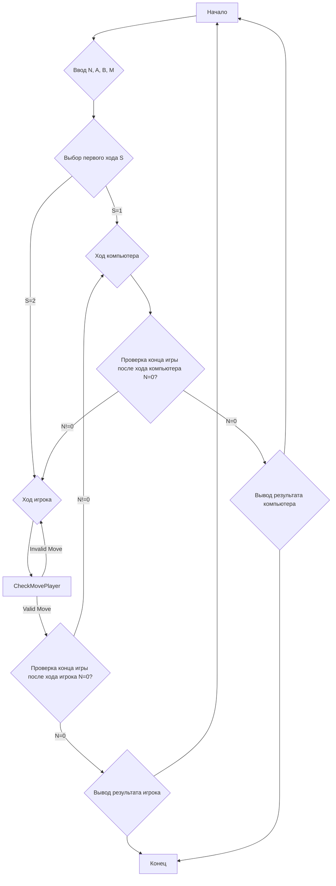

## <алгоритм>

1. **Начало**: Программа начинает с вывода текста, описывающего правила игры и инструкции для пользователя.

2. **Получение начальных данных**: Программа ожидает ввода от пользователя – числа `N`, которое указывает на количество строк (или кучек) спичек.  Далее, программа запрашивает у пользователя значения минимума `A` и максимума `B` спичек, которые можно взять за один ход, а также параметр `M`, определяющий, кто должен брать последнюю спичку (1 – берущий последнюю проигрывает, 2 – берущий последнюю выигрывает).

    *Пример*: Пользователь вводит `N = 23`, `A = 1`, `B = 3`, `M = 2`.

3. **Выбор первого хода**:
   - Если пользователь выбирает ход компьютера первым (`S=1`), то компьютер выполняет свой ход, используя алгоритм выбора спичек.
   - Если пользователь выбирает свой ход первым (`S=2`), то программа переходит к шагу 4.

   *Пример*: Пользователь вводит `S=2`, поэтому ход передаётся игроку.

4. **Ход игрока**: Программа выводит строку `"YOUR MOVE: "` и ожидает ввода пользователя – количества спичек `P`, которые он хочет взять.

    *Пример*: Пользователь вводит `P=3`.

5. **Проверка хода игрока**:
   - Если ход игрока некорректен (не в диапазоне от `A` до `B`, не целое число, или больше, чем осталось), то программа выводит сообщение об ошибке и просит сделать ход снова.
   - В противном случае количество спичек в куче уменьшается на `P`, и программа переходит к следующему шагу.
   *Пример*: В куче было 23 спички, теперь стало `N=23-3=20`.

6. **Проверка конца игры после хода игрока**:
   - Если спичек не осталось (`N=0`), то программа выводит сообщение о выигрыше или проигрыше пользователя (в зависимости от параметра `M`) и переходит к началу игры или завершает её.
   - В противном случае программа переходит к шагу 7.

   *Пример*: В куче 20 спичек, игра продолжается.

7. **Ход компьютера**: Компьютер выполняет ход, используя стратегию, которая определяется значением остатка от деления количества спичек на `A+B`. Количество спичек в куче уменьшается.

    *Пример*: Компьютер берет 1 спичку, остается `N=20-1=19` спичек.

8. **Проверка конца игры после хода компьютера**:
   - Если спичек не осталось (`N=0`), то программа выводит сообщение о выигрыше или проигрыше компьютера и переходит к началу игры или завершает её.
   - В противном случае программа возвращается к шагу 4.

9. **Повторение**: Игра продолжается до тех пор, пока либо не закончатся спички (`N=0`), либо пользователь не прервёт игру.

## <mermaid>

*   `Start`: Начало программы.
*   `InputData`: Ввод пользователем начальных значений для игры (общее число спичек, минимальное и максимальное количество спичек за ход, условие победы).
*   `FirstMove`: Определение, кто ходит первым (пользователь или компьютер).
*   `ComputerMove`: Ход компьютера.
*   `PlayerMove`: Ход пользователя.
*  `CheckMovePlayer`: Проверка корректности ввода пользователя.
*   `CheckEndGameP`: Проверка, закончилась ли игра после хода игрока.
*   `CheckEndGameC`: Проверка, закончилась ли игра после хода компьютера.
*  `EndGameP`: Вывод сообщения о выигрыше или проигрыше игрока.
*   `EndGameC`: Вывод сообщения о выигрыше или проигрыше компьютера.
*   `End`: Конец программы.

Зависимости, используемые в диаграмме:

*   `flowchart TD`: Зависимость для создания диаграммы типа "блок-схема" в формате Mermaid.

## <объяснение>

### Импорты

В данном коде нет явных импортов.

### Классы

В данном коде нет классов.

### Функции

В данном коде нет функций.

### Переменные

*   `N` (`int`): Начальное количество спичек в куче.
*   `A` (`int`): Минимальное количество спичек, которые можно взять за один ход.
*   `B` (`int`): Максимальное количество спичек, которые можно взять за один ход.
*   `M` (`int`): Параметр, определяющий, кто выигрывает, беря последнюю спичку.
*   `S` (`int`): Параметр, определяющий, кто ходит первым (1 – компьютер, 2 – игрок).
*   `P` (`int`): Количество спичек, которые берёт игрок за один ход.
*   `C` (`int`): Переменная для вычисления хода компьютера.
*   `W` (`int`): Индикатор выигрыша/проигрыша.
*  `G` (`int`): Копия N

### Объяснения

*   **Импорты**: В коде отсутствуют явные импорты, поскольку он представляет собой автономный блок кода на языке BASIC, не требующий внешних библиотек.
*   **Классы**: В коде нет классов, поскольку BASIC, как правило, не является объектно-ориентированным языком.
*   **Функции**: В коде нет явно объявленных функций. Подпрограммы используются через `GOSUB`.
*  **Переменные**:
    *   `N`: Целочисленная переменная, представляющая начальное количество спичек.
    *   `A`, `B`: Целочисленные переменные, представляющие минимальное и максимальное количество спичек для хода.
    *   `M`: Целочисленная переменная, определяющая условие выигрыша (взявший последнюю спичку или избежавший этого).
    *   `S`: Целочисленная переменная, определяющая, кто ходит первым (игрок или компьютер).
    *  `P`: Целочисленная переменная, представляющая ход игрока.
    *   `C`: Целочисленная переменная, используемая в логике хода компьютера.
    *   `W`: Целочисленная переменная, представляющая состояние выигрыша или проигрыша.
*   **Функциональность**: Код реализует игровую логику для игры в спички, где игрок и компьютер поочередно берут спички из кучи. Компьютер использует простую стратегию на основе остатка от деления числа спичек. Игрок должен следовать правилам и может выиграть, если будет играть тактически верно. Код содержит проверку на правильность ввода игрока (целое число, в диапазоне) и проверку на окончание игры (отсутствие спичек в куче).
*   **Потенциальные ошибки и улучшения**:
    *   Обработка ошибок: В коде есть базовые проверки на корректность ввода пользователя, но их можно расширить. Например, можно добавить проверку на ввод не числовых значений.
    *  Стратегия компьютера: Компьютер использует довольно простую стратегию. Эту стратегию можно сделать более сложной и адаптивной.
    *   Интерфейс: Можно сделать более дружелюбный интерфейс, возможно, с графическим отображением.
    *  Логика игры: Можно добавить вариативность в начальное состояние игры (разное количество спичек и т.д.) и в правила.
*   **Взаимосвязи с другими частями проекта**: Поскольку код является автономным, он не имеет явных зависимостей от других частей проекта.

В целом, код представляет собой простую, но функциональную реализацию игры в спички с простым компьютерным противником. Основные улучшения можно сделать в части логики ходов компьютера, добавления дополнительных параметров для настройки игры и более дружелюбного пользовательского интерфейса.