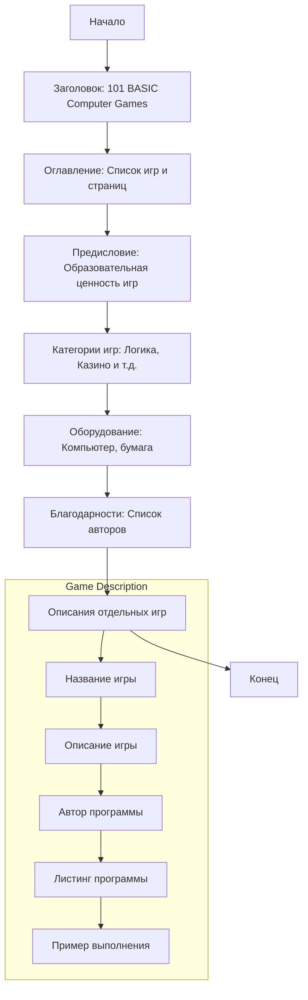

## ИНСТРУКЦИЯ:

Анализируй предоставленный код подробно и объясни его функциональность. Ответ должен включать три раздела:

1.  **<алгоритм>**: Опиши рабочий процесс в виде пошаговой блок-схемы, включая примеры для каждого логического блока, и проиллюстрируй поток данных между функциями, классами или методами.
2.  **<mermaid>**: Напиши код для диаграммы в формате `mermaid`, проанализируй и объясни все зависимости,
    которые импортируются при создании диаграммы.
    **ВАЖНО!** Убедитесь, что все имена переменных, используемые в диаграмме `mermaid`,
    имеют осмысленные и описательные имена. Имена переменных вроде `A`, `B`, `C`, и т.д., не допускаются!

    **Дополнительно**: Если в коде есть импорт `import header`, добавьте блок `mermaid` flowchart, объясняющий `header.py`:
    ```mermaid
    flowchart TD
        Start --> Header[<code>header.py</code><br> Determine Project Root]

        Header --> import[Import Global Settings: <br><code>from src import gs</code>]
    ```

3.  **<объяснение>**: Предоставьте подробные объяснения:
    *   **Импорты**: Их назначение и взаимосвязь с другими пакетами `src.`.
    *   **Классы**: Их роль, атрибуты, методы и взаимодействие с другими компонентами проекта.
    *   **Функции**: Их аргументы, возвращаемые значения, назначение и примеры.
    *   **Переменные**: Их типы и использование.
    *   Выделите потенциальные ошибки или области для улучшения.

Дополнительно, постройте цепочку взаимосвязей с другими частями проекта (если применимо).

Это обеспечивает всесторонний и структурированный анализ кода.
## Формат ответа: `.md` (markdown)
**КОНЕЦ ИНСТРУКЦИИ**

## Анализ файла `raw.md`

Этот файл содержит текст, который представляет собой сборник инструкций и описаний к 101 базовой компьютерной игре, изданный Digital Equipment Corporation.

### <алгоритм>

1.  **Начало**: Текст представляет собой руководство пользователя.
2.  **Оглавление**: Включает список игр, их краткое описание и номера страниц.
3.  **Предисловие**: Обсуждаются образовательная ценность игр и их использование как инструмента обучения.
4.  **Категории игр**: Игры распределены по категориям (например, угадывание числа или буквы, работа с кучками объектов).
5.  **Указания к использованию**: Замечания о необходимом оборудовании и совместимости с различными системами.
6.  **Благодарности**: Список людей, внесших вклад в создание сборника.
7.  **Описания отдельных игр**: Каждая игра имеет свое название, описание, листинг программы и пример выполнения.
8.  **Конец**: Завершение сборника.

Примеры логических блоков:

*   **Оглавление**:  Строки текста вида `ACEYDU  Play acey-ducey with the computer 13` представляют собой пример блока данных, где есть название игры и номер страницы.
*   **Предисловие**: Текст, описывающий образовательную ценность игр, является примером текстового блока.
*   **Описания игр**:
    *   `Description`: Текстовый блок, содержащий объяснение механики игры.
    *   `Program Author`:  Текстовый блок, указывающий автора программы.
    *   `Program Listing`: Листинг кода программы для конкретной игры.
    *   `Sample Run`: Примеры работы программы для конкретной игры.
*   **Оборудование**: Раздел, содержащий перечень оборудования (компьютер, бумага для матричных игр).

Поток данных в основном текстовый:

*   Оглавление -> Предисловие -> Описания игр -> Конец

### <mermaid>


**Описание зависимостей `mermaid`:**

*   `flowchart TD`: Объявляет тип диаграммы - блок-схема с направлением сверху вниз.
*   `Start`, `Title`, `Contents` и т.д.: Узлы диаграммы, представляющие отдельные разделы файла.
*   `-->`: Стрелки, указывающие на последовательность и поток данных между разделами.
*   `subgraph Game Description`:  Подграф, представляющий подробную структуру описания каждой игры.

### <объяснение>

**Общее назначение:** Этот файл служит руководством пользователя и каталогом для сборника из 101 базовой компьютерной игры. Он предназначен для ознакомления пользователей с доступными играми, их правилами, и необходимой информацией для их запуска.

**Структура:** Файл условно разделен на несколько частей:
*  **Заголовок:** Представление названия и общей информации о документе.
*   **Оглавление:** Список игр с кратким описанием и ссылкой на соответствующие страницы.
*   **Предисловие:** Описание целей, которые преследует сборник, а также рассуждения о роли игр в обучении.
*   **Разделы с играми:** Основная часть, содержащая подробные описания каждой игры, ее кода и примеры работы.
*  **Приложения:** Содержат вспомогательную информацию, например, схематические изображения.

**Объяснение отдельных разделов:**
*   **Оглавление**:
    *   Используется для быстрого перехода к нужной игре.
    *   Отображает все названия игр и их краткое описание.
*   **Предисловие**:
    *   Описывает цели, стоявшие перед авторами сборника.
    *   Обсуждает образовательную ценность компьютерных игр.
    *   Содержит замечания по различным аспектам игр, включая их создание и использование как обучающих инструментов.
*  **Раздел "семьи игр"**:  Классификация игр по различным категориям (логические, азартные, спортивные и др.).
*  **Раздел "оборудование"**: Предоставляет пользователю информацию о необходимом оборудовании для воспроизведения игр.
*  **Раздел "описания отдельных игр"**:
    *   `Description`: Описание правил и механики каждой игры.
    *   `Program Author`: Указывает автора, который разработал или адаптировал программу игры.
    *   `Program Listing`: Приводит исходный код игры на языке BASIC.
    *   `Sample Run`: Показывает пример того, как игра может выглядеть и как она работает.
*   **Благодарности**:
    *   Отдает должное всем, кто помогал в создании сборника.
*  **Приложения**:
    *   Содержат вспомогательную информацию, такую как шаблоны полей для игр.

**Переменные и их использование:**
*   В основном, в файле нет переменных как таковых, так как он представляет собой текстовый документ. Однако, косвенно, можно рассматривать как переменные:
    *   Название игры (текст).
    *   Номер страницы (число).
    *   Описание игры (текст).
    *   Листинг кода (текст).
    *   Пример выполнения (текст).

**Потенциальные ошибки и области для улучшения:**
*   Файл представляет собой просто текст, поэтому как таковых ошибок нет. Однако его можно было бы преобразовать в более структурированный формат (например, JSON или YAML) для облегчения обработки и анализа.
*  Содержащиеся описания игр можно было бы обогатить дополнительными сведениями, например, иллюстрациями или схемами.
* Файл можно было бы дополнить метаданными (автор, дата создания, версия).

**Цепочка взаимосвязей с другими частями проекта:**
*   Данный файл, предположительно, является частью более крупного проекта, включающего сами программы игр. Он служит руководством для пользователей этих программ. Он представляет собой документацию для набора игр, которые предположительно существуют в виде отдельных файлов (исходных кодов).

В заключение, файл `raw.md` является хорошо структурированным и информативным руководством пользователя для сборника компьютерных игр. Его основным назначением является объяснение правил, механики и особенностей каждой игры, а также предоставление необходимых инструкций для запуска и использования программ.