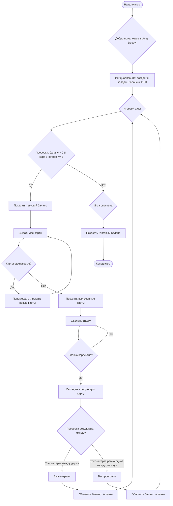

## АНАЛИЗ КОДА

### <алгоритм>

**Блок-схема игры Acey Ducey:**

1.  **Начало игры:** Игра начинается с вывода приветственного сообщения.
    *   Пример: `Выводится сообщение "Добро пожаловать в Acey Ducey!"`

2.  **Инициализация:**
    *   Создается колода карт (стандартная 52-карточная колода).
    *   Начальный баланс игрока устанавливается в $100.
    *   Пример: `deck = create_deck(), balance = 100`

3.  **Игровой цикл:**
    *   Игра продолжается, пока у игрока есть деньги и в колоде достаточно карт (минимум 3).
    *   Пример: `while balance > 0 and len(deck) >= 3`

4.  **Проверка баланса и колоды:**
    *   Проверяется, что баланс игрока больше нуля и в колоде есть не менее трех карт.
    *   Если условия не выполнены, игра заканчивается.
    *   Пример: `if balance <= 0 or len(deck) < 3: break`

5.  **Отображение баланса:**
    *   Текущий баланс игрока выводится на экран.
    *   Пример: `print(f"Ваш баланс: ${balance}")`

6.  **Выдача двух карт:**
    *   Из колоды вынимаются две карты.
    *   Пример: `card1 = deck.pop(), card2 = deck.pop()`

7.  **Проверка одинаковых карт:**
    *   Проверяется, являются ли две выданные карты одинаковыми.
        *   Если карты одинаковы, они возвращаются в колоду, колода перемешивается и сдаются новые карты.
        *   Пример: `if card1 == card2: shuffle(deck), card1 = deck.pop(), card2 = deck.pop()`

8.  **Отображение карт:**
    *   Игроку показываются две выданные карты.
    *   Пример: `print(f"Первая карта: {card1}, вторая карта: {card2}")`

9.  **Сделать ставку:**
    *   Игрок вводит ставку.
    *   Пример: `bet = int(input("Введите вашу ставку: "))`

10. **Проверка ставки:**
    *   Проверяется, что ставка является целым числом и не превышает текущий баланс игрока.
    *   Если ставка некорректна, запрашивается ввод новой ставки.
    *   Пример: `while not isinstance(bet, int) or bet > balance: bet = int(input("Некорректная ставка. Повторите ввод: "))`

11. **Выдача следующей карты:**
    *   Из колоды вынимается еще одна карта.
    *   Пример: `card3 = deck.pop()`

12. **Проверка результата:**
    *   Проверяется, является ли третья карта "между" первой и второй по значению.
        *   Если третья карта попадает в интервал (не включая границы) между первой и второй картами, игрок выигрывает.
        *   Если третья карта равна одной из первых двух или является тузом, игрок проигрывает.
    *   Пример: `if min(card1.value, card2.value) < card3.value < max(card1.value, card2.value): win = True else: win = False`

13. **Обновление баланса:**
    *   Если игрок выиграл, к балансу добавляется размер ставки.
    *   Если игрок проиграл, из баланса вычитается размер ставки.
    *   Пример: `if win: balance += bet else: balance -= bet`

14. **Переход к игровому циклу:**
    *   Игра возвращается к началу игрового цикла.

15. **Конец игры:**
    *   Игра заканчивается, если у игрока нет денег или в колоде меньше трех карт.
    *   Выводится итоговый баланс.
    *   Пример: `print(f"Игра окончена. Ваш итоговый баланс: ${balance}")`

### <mermaid>

**Объяснение зависимостей:**

*   `Start`: Начало программы, не зависит от других компонентов.
*   `Welcome`: Выводит приветственное сообщение. Зависимостей нет.
*   `Initialize`: Инициализирует игру, создаёт колоду и устанавливает начальный баланс. Не зависит от внешних компонентов.
*   `GameLoop`: Управляет потоком игры, повторяя игровой цикл. Зависит от условий `CheckBalance`.
*   `CheckBalance`: Проверяет условия продолжения игры (наличие баланса и карт в колоде). Зависит от `GameLoop` для принятия решения.
*   `DisplayBalance`: Отображает текущий баланс игрока, зависит от текущего значения баланса.
*   `DealCards`: Выдает две карты из колоды. Зависит от состояния колоды.
*   `CheckSameCards`: Проверяет, являются ли выданные карты одинаковыми. Зависит от значений карт.
*   `RedrawCards`: Перемешивает колоду и заново выдает карты. Зависит от `CheckSameCards` если карты одинаковые.
*   `DisplayCards`: Отображает выданные карты игроку. Зависит от значений карт.
*   `MakeBet`: Запрашивает ставку у игрока. Зависит от ввода пользователя.
*   `ValidateBet`: Проверяет корректность ставки. Зависит от введенной ставки и баланса игрока.
*   `DrawNextCard`: Выдает третью карту из колоды. Зависит от состояния колоды.
*   `CheckResult`: Проверяет, выиграл ли игрок, на основе значений карт. Зависит от значений трех карт.
*   `Win`: Переход к состоянию победы. Зависит от результата `CheckResult`.
*   `Lose`: Переход к состоянию проигрыша. Зависит от результата `CheckResult`.
*   `UpdateBalanceWin`: Обновляет баланс игрока при выигрыше. Зависит от текущего баланса и ставки.
*   `UpdateBalanceLose`: Обновляет баланс игрока при проигрыше. Зависит от текущего баланса и ставки.
*   `EndGame`: Завершает игру, если условия не соблюдены. Зависит от `CheckBalance`.
*   `DisplayFinalBalance`: Отображает итоговый баланс. Зависит от итогового значения баланса.
*   `Finish`: Завершает выполнение программы. Зависимости отсутствуют.

### <объяснение>

**Импорты:**

В данном коде отсутствуют импорты. Предполагается, что все необходимые функции для работы с колодой, такие как `create_deck`, `shuffle`, и классы для представления карт, уже определены в рамках текущего файла или доступны через глобальные переменные.

**Классы:**

В данном коде нет определения каких-либо классов. Логика игры реализована с использованием функций и управляющих конструкций.

**Функции:**

В коде используется ряд функций, которые не определены в данном фрагменте, но подразумеваются.

1.  **`create_deck()`**:
    *   **Аргументы:** Нет.
    *   **Возвращаемое значение:** Список, представляющий колоду карт.
    *   **Назначение:** Создает стандартную 52-карточную колоду.
    *   **Пример:** `deck = create_deck()`

2.  **`shuffle(deck)`**:
    *   **Аргументы:** `deck` (список, представляющий колоду карт).
    *   **Возвращаемое значение:** Нет.
    *   **Назначение:** Перемешивает карты в колоде случайным образом.
    *   **Пример:** `shuffle(deck)`

3.  **Методы для сравнения карт:**
    *   В коде предполагается, что у объектов карт есть свойство `value` (значение карты) и их можно сравнивать с помощью операций `==`, `<`, `>`.

**Переменные:**

*   `balance` (int): Текущий баланс игрока. Инициализируется значением 100, изменяется во время игры в зависимости от результатов.
*   `deck` (list): Список, представляющий текущую колоду карт. Используется для раздачи карт.
*   `card1`, `card2`, `card3`: Переменные для хранения значений карт, выданных игроку.
*   `bet` (int): Сумма ставки, сделанная игроком.

**Потенциальные ошибки и области для улучшения:**

1.  **Отсутствие явных определений функций:** Код предполагает наличие функций `create_deck` и `shuffle`, а также реализацию сравнения карт. Их отсутствие может привести к ошибкам. Необходимо их явно определить или импортировать.
2.  **Обработка ввода пользователя:** Ввод ставки может вызвать ошибки, если пользователь введёт не числовое значение или нецелое. Необходимо добавить обработку исключений для таких случаев.
3.  **Представление карт:**  Отсутствует описание структуры карт. Необходимо явно определить как карты хранятся (например, использовать классы).
4.  **Вывод сообщений:** Сообщения об игре и результатах могут быть улучшены для более понятного отображения.
5.  **Логика проверки результата:** Проверка "между" не учитывает случай, когда карты могут быть тузом, что в некоторых вариантах игры может считаться как выигрыш.
6.  **Реализация с помощью классов:** Можно перевести игру в объектно-ориентированную парадигму для большей структурированности.

**Цепочка взаимосвязей с другими частями проекта:**

Этот фрагмент является автономным представлением логики игры Acey Ducey. Взаимодействие с другими частями проекта может происходить через:

*   **Ввод/вывод**: Взаимодействие с пользователем для ввода ставки и вывода информации о состоянии игры и результатах.
*   **Функции для работы с колодой**: Взаимодействие с компонентами, ответственными за создание и перемешивание колоды, а также за представление карт.

**Дополнительно:**

*   Код является наглядным примером реализации простой карточной игры.
*   Отсутствие классов и явных импортов делает код более абстрактным и менее переиспользуемым.
*   Дополнительная реализация обработки ввода и улучшение структуры данных для карт повысит надежность и расширяемость кода.