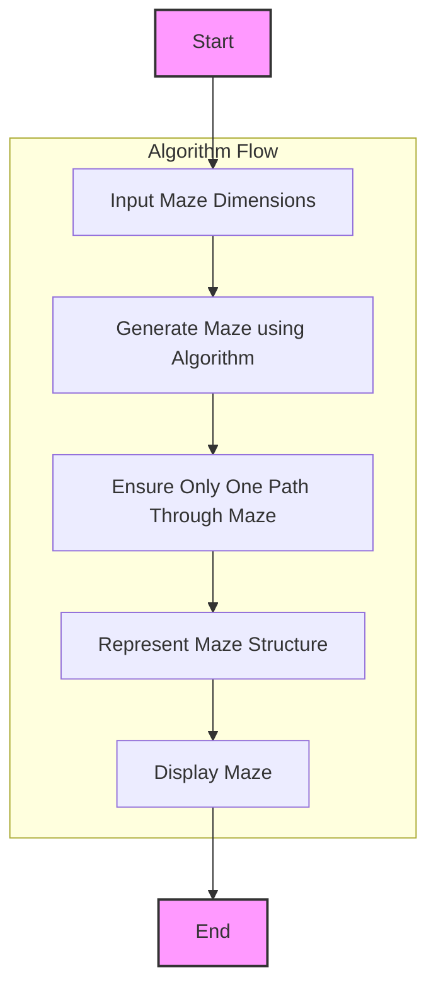

## АНАЛИЗ КОДА

### <алгоритм>

Представленный код является описанием программы "AMAZIN", которая генерирует лабиринт. Он не содержит исполняемого кода на Python, но описывает программу, которая, вероятно, будет использовать алгоритмы генерации лабиринтов.

**Блок-схема:**

1. **Начало**:
   - Запуск программы AMAZIN.

2. **Выбор параметров**:
   - Запрос у пользователя размеров лабиринта (ширина и длина).
   - Пример: Пользователь вводит "ширина=10, длина=15".

3. **Генерация лабиринта**:
    - Использование алгоритма генерации лабиринта (например, алгоритм Прима или рекурсивный бэктрекинг).
    - Создание внутреннего представления лабиринта (массив или матрица).
    - Пример: Формируется двумерный массив, где `1` — стена, а `0` — проход.

4. **Обеспечение единственного пути**:
   - Алгоритм генерации гарантирует, что в лабиринте будет только один путь от начала до конца.

5. **Вывод лабиринта**:
   - Преобразование внутреннего представления в текстовое отображение (например, с использованием символов `#` для стен и ` ` для проходов).
   - Вывод текстового представления лабиринта на экран.
   - Пример: 
        ```
        ##########
        #        #
        # ###### #
        #   #    #
        ##########
        ```

6. **Конец**:
    - Завершение работы программы.

### <mermaid>



**Объяснение диаграммы `mermaid`:**

Диаграмма представляет собой блок-схему, описывающую поток выполнения программы AMAZIN.

- `Start`: Начальная точка выполнения программы.
- `InputDimensions`: Блок, отвечающий за ввод пользователем размеров лабиринта.
- `GenerateMaze`: Блок, где происходит генерация лабиринта с использованием определенного алгоритма.
- `EnsureSinglePath`: Блок, где гарантируется наличие единственного пути через лабиринт.
- `RepresentMaze`: Блок, в котором внутреннее представление лабиринта (массив или матрица) создается и обрабатывается.
- `DisplayMaze`: Блок, отвечающий за вывод текстового представления лабиринта на экран.
- `End`: Конечная точка выполнения программы.

### <объяснение>

**Общее описание:**

Представленное описание программы AMAZIN,  не содержит фактического кода на Python, а лишь является высокоуровневым описанием функциональности программы.  Оно указывает на то, что программа генерирует лабиринты заданного размера и гарантирует наличие только одного пути через него.  Программа взаимодействует с пользователем, запрашивая размеры лабиринта, и затем выводит текстовое представление сгенерированного лабиринта.

**Детали:**

- **Размеры лабиринта**:  Программа принимает на вход два параметра от пользователя: ширину и длину лабиринта. Эти значения используются для создания внутреннего представления лабиринта.
- **Алгоритм генерации**:  В описании не указан конкретный алгоритм, но он  должен гарантировать создание лабиринта с единственным путем.  Возможные алгоритмы:
   - Алгоритм Прима: Начинает со случайной ячейки и добавляет случайные соседние ячейки, пока весь лабиринт не будет сгенерирован.
   - Рекурсивный бэктрекинг: Генерирует путь, углубляясь, а затем возвращается и исследует другие пути.
- **Представление лабиринта**:   Внутреннее представление лабиринта может быть представлено в виде двумерного массива (матрицы), где, например, `1` означает стену, а `0` - проход.
- **Вывод**:  В текстовом представлении лабиринта могут использоваться символы, например `#` для стен и ` ` для проходов.

**Потенциальные области для улучшения:**

- **Выбор алгоритма**: Необходимо конкретизировать алгоритм генерации лабиринта.
- **Оптимизация**:  Производительность алгоритмов генерации лабиринтов может варьироваться в зависимости от их реализации.  Следует рассмотреть различные оптимизации.
- **Визуализация**: Вместо текстового вывода, лабиринт можно было бы визуализировать графически (с использованием, например, библиотеки `pygame` или `tkinter`).
- **Настройки**: Можно добавить опции для настройки параметров генерации лабиринта (например, плотность стен, типы проходов и т.д.).
- **Обработка ошибок**: Необходимо добавить проверки на корректность ввода размеров лабиринта (например, на не отрицательные и целые значения).
- **Сохранение и загрузка**:  Было бы полезно добавить возможность сохранения сгенерированного лабиринта в файл и последующей загрузки.

**Цепочка взаимосвязей с другими частями проекта:**

Поскольку представленный код является описанием, то он не зависит от других частей проекта. Однако, при реализации, программа могла бы использовать:

-  `src.ai.helicone.ai_games.101_basic_computer_games.en.AMAZIN`:  Это путь к директории, где может размещаться фактический код программы.
-  `src.gs`: если требуется доступ к глобальным настройкам, они могут быть использованы из `gs`.

**Заключение:**
Это подробное описание программы генератора лабиринтов. Чтобы его превратить в исполняемый код потребуется имплементировать алгоритм генерации, а также добавить обработку ввода и вывод.