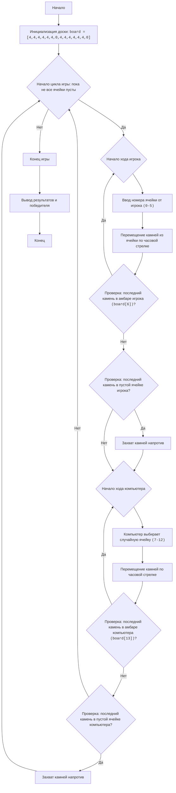
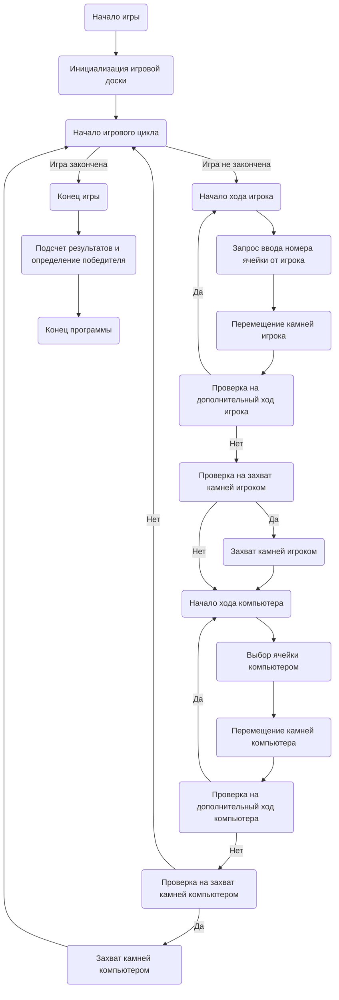

## АНАЛИЗ КОДА: AWARI

### 1. <алгоритм>

**Блок-схема:**

**Описание Блок-схемы:**

1.  **Start**: Начало игры.
2.  **InitializeBoard**: Инициализация игровой доски `board`, представляющей собой список из 14 элементов, где первые 6 и последние 6 - это ячейки с камнями, а 6 и 13 - амбары игроков, инициализированные значениями 4 и 0 соответственно.
    *   Пример: `board = [4, 4, 4, 4, 4, 4, 0, 4, 4, 4, 4, 4, 4, 0]`
3.  **GameLoopStart**: Начало игрового цикла. Цикл выполняется, пока игра не закончится (пока все ячейки с камнями не станут пустыми).
4.  **PlayerTurnStart**: Начало хода игрока.
5.  **PlayerInputCell**: Запрос номера ячейки у игрока.
    *   Пример: Игрок вводит `3`.
6.  **PlayerMoveStones**: Перемещение камней из выбранной ячейки по часовой стрелке.
    *   Пример: если выбрана ячейка `3`, то значение `board[3]` уменьшается на количество камней, а затем эти камни распределяются по одной в каждую следующую ячейку.
7.  **PlayerCheckExtraTurn**: Проверка, попал ли последний камень в амбар игрока (ячейка `6`).
    *   Пример: если последний камень попал в `board[6]`, то игрок получает дополнительный ход.
8.  **PlayerCheckCapture**: Проверка, попал ли последний камень в пустую ячейку на стороне игрока.
    *   Пример: если последний камень попал в пустую ячейку на стороне игрока, происходит захват камней.
9.  **PlayerCaptureStones**: Захват камней из противоположной ячейки, если это возможно.
    *   Пример: если последний камень попал в ячейку `2` (и там 1 камень), а в противоположной ячейке `10` есть камни, то захват камней происходит в амбар игрока `board[6]`.
10. **ComputerTurnStart**: Начало хода компьютера.
11. **ComputerSelectCell**: Выбор компьютером случайной ячейки для хода (в диапазоне от `7` до `12`).
    *   Пример: компьютер выбирает ячейку `9`.
12. **ComputerMoveStones**: Перемещение камней компьютером по часовой стрелке.
    *   Пример: если выбрана ячейка `9`, то значение `board[9]` уменьшается на количество камней, а затем эти камни распределяются по одной в каждую следующую ячейку.
13. **ComputerCheckExtraTurn**: Проверка, попал ли последний камень в амбар компьютера (ячейка `13`).
    *   Пример: если последний камень попал в `board[13]`, то компьютер получает дополнительный ход.
14. **ComputerCheckCapture**: Проверка, попал ли последний камень в пустую ячейку на стороне компьютера.
    *   Пример: если последний камень попал в пустую ячейку на стороне компьютера, происходит захват камней.
15. **ComputerCaptureStones**: Захват камней из противоположной ячейки, если это возможно.
    *   Пример: если последний камень попал в ячейку `10` (и там 1 камень), а в противоположной ячейке `2` есть камни, то захват камней происходит в амбар компьютера `board[13]`.
16. **EndGame**: Конец игры, когда все ячейки с камнями опустеют.
17. **OutputResult**: Вывод результатов (очков) и определение победителя.
18. **End**: Конец программы.

### 2. <mermaid>

**Описание `mermaid` диаграммы:**
    
*   **Start**: Начало программы.
*   **InitializeBoard**: Инициализирует игровую доску (список `board`).
*   **GameLoopStart**: Начало цикла игры, продолжается пока игра не закончится.
*   **PlayerTurnStart**: Начало хода игрока.
*   **GetPlayerInput**: Запрашивает ввод ячейки у игрока.
*   **MovePlayerStones**: Перемещает камни игрока.
*   **CheckPlayerExtraTurn**: Проверяет, имеет ли игрок дополнительный ход.
*   **CheckPlayerCapture**: Проверяет, может ли игрок захватить камни.
*   **CapturePlayerStones**: Захватывает камни игроком, если это возможно.
*    **ComputerTurnStart**: Начало хода компьютера.
*   **SelectComputerCell**: Выбирает ячейку для хода компьютера.
*   **MoveComputerStones**: Перемещает камни компьютера.
*   **CheckComputerExtraTurn**: Проверяет, имеет ли компьютер дополнительный ход.
*   **CheckComputerCapture**: Проверяет, может ли компьютер захватить камни.
*   **CaptureComputerStones**: Захватывает камни компьютером, если это возможно.
*   **EndGame**: Завершение игры.
*   **CalculateWinner**: Подсчет очков и определение победителя.
*   **End**: Завершение программы.

**Зависимости:**

*   **Нет внешних импортов, кроме `random`**.  `random` используется для выбора случайной ячейки при ходе компьютера.

### 3. <объяснение>

**Импорты:**

*   `import random`: Этот модуль используется для генерации псевдослучайных чисел. Он необходим для того, чтобы компьютер выбирал случайную ячейку во время своего хода.

**Переменные:**

*   `board` (list): Список, представляющий игровую доску. Инициализируется значениями `[4, 4, 4, 4, 4, 4, 0, 4, 4, 4, 4, 4, 4, 0]`, где первые 6 ячеек и последние 6 - это ячейки для камней, а 7 и 14 являются амбарами.
*   `cell` (int): Используется для хранения номера ячейки, выбранной игроком или компьютером.
*   `stones` (int): Количество камней, которые перемещаются из выбранной ячейки.
*   `current_cell` (int): Индекс текущей ячейки во время распределения камней по доске.
*   `opposite_cell` (int): Индекс противоположной ячейки, используемый для захвата камней.
*   `player_score` (int): Количество очков игрока, хранится в `board[6]`.
*   `computer_score` (int): Количество очков компьютера, хранится в `board[13]`.
*   `possible_moves` (list): Список возможных ходов компьютера.

**Функции:**

1.  **`display_board()`**:
    *   Назначение: Выводит текущее состояние доски в консоль, для наглядности игры.
    *   Аргументы: Нет.
    *   Возвращаемое значение: Нет (выводит состояние доски в консоль).
    *   Пример: выводит текущее состояние доски на экран с отображением камней в каждой ячейке.

2.  **`player_turn()`**:
    *   Назначение: Обрабатывает ход игрока.
    *   Аргументы: Нет.
    *   Возвращаемое значение: Нет.
    *   Пример:
        *   Запрашивает у игрока номер ячейки (0-5).
        *   Перемещает камни из этой ячейки по часовой стрелке, добавляя по одному камню в каждую ячейку.
        *   Если последний камень попал в амбар игрока, то вызывается функция `player_turn()` рекурсивно, давая игроку еще один ход.
        *   Если последний камень попадает в пустую ячейку на стороне игрока, то происходит захват камней из противоположной ячейки, если там есть камни.

3.  **`computer_turn()`**:
    *   Назначение: Обрабатывает ход компьютера.
    *   Аргументы: Нет.
    *   Возвращаемое значение: Нет.
    *   Пример:
        *   Выбирает случайную ячейку (7-12) для хода.
        *   Перемещает камни из этой ячейки по часовой стрелке.
        *   Если последний камень попал в амбар компьютера, то вызывается функция `computer_turn()` рекурсивно, давая компьютеру еще один ход.
        *   Если последний камень попадает в пустую ячейку на стороне компьютера, то происходит захват камней из противоположной ячейки, если там есть камни.

4.  **`is_game_over()`**:
    *   Назначение: Проверяет, закончилась ли игра.
    *   Аргументы: Нет.
    *   Возвращаемое значение: `True`, если игра закончена, `False` в противном случае.
    *   Пример: Возвращает `True`, если все ячейки с камнями на стороне игрока или компьютера пустые, иначе `False`.

5.  **`calculate_winner()`**:
    *   Назначение: Выводит результаты игры и определяет победителя.
    *   Аргументы: Нет.
    *   Возвращаемое значение: Нет (выводит результаты и имя победителя).
    *   Пример:
        *   Выводит количество очков игрока и компьютера.
        *   Определяет, кто победил (или ничья), и выводит сообщение об этом.

**Классы:**
    
* В данном коде классы не используются.

**Потенциальные ошибки и области для улучшения:**

*   **Рекурсия в `player_turn` и `computer_turn`:** Рекурсивные вызовы функций могут привести к ошибке переполнения стека, если игрок или компьютер получают слишком много дополнительных ходов подряд. Лучше использовать цикл while для обработки дополнительных ходов.
*   **Обработка ввода пользователя:** Ввод пользователя в функции `player_turn` обрабатывается через `try-except` блоки, но стоит добавить проверку, не пустая ли строка была введена.
*   **Улучшение ИИ компьютера:** Компьютер делает случайные ходы, можно улучшить его стратегию для более интересной игры.
*   **Не выводится сообщение о захвате камней:** В функции `computer_turn` нет вывода сообщения о захвате камней.

**Цепочка взаимосвязей:**

1.  **`random`**: Используется функцией `computer_turn` для выбора случайной ячейки.
2.  **Игровая логика**:
    *   `player_turn`, `computer_turn`: управляют ходами игроков и изменением состояния доски.
    *   `display_board`: выводит текущее состояние доски.
    *   `is_game_over`: проверяет, не завершилась ли игра.
    *   `calculate_winner`: определяет победителя и выводит результаты.
3. **Основной цикл**: `while True`: основной цикл, вызывающий все функции, управляет игровым процессом.

Этот анализ предоставляет всестороннее представление о коде, включая его функциональность, структуру и потенциальные области для улучшения.